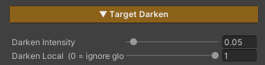

# Target Darken FX Runtime

**Dim the whole scene to make one target stand out** — a character casting a skill, a boss making its entrance, a cutscene, or any moment where the player should be looking at one thing.

Unlike the features in the Environment Shader section, **this one is driven from game code at runtime** rather than set once in a material and left. The material carries only two values; everything else is a call from script.

And it covers **the ground, the grass and the water together**, because all three shaders read the same value. The whole scene dims in one go, rather than the ground going dark while the grass stays lit.

## Showcase Target Darken


---

## Concept — Two Layers to Understand First

Control is split into two layers, and once those are clear the rest follows.

| Layer | Where it lives | What it does |
|---|---|---|
| **Global** | script / the scene's Manager | switches dimming on for **the whole scene** — `0` = normal, `1` = fully dimmed |
| **Local** | each material | whether this surface **follows or ignores** the Global value |

Put simply: **Global turns the mode on, Local picks who is exempt.**

The two multiply together — a surface dims only when Global is on **and** its own Local is `1`.

> **Local defaults to `1`**, meaning every surface follows the scene by default, and that is what it should be left at. Leaving it at `0` makes the feature look broken: Global switches on and nothing happens.

---

## Setup

### 1. On the materials
Turn on the **Target Darken** feature in the Features grid. The **Target Darken** section appears. Do this on every material that should dim — ground, grass, water.

### 2. In the scene
Add the **`ZLZ_Env Darken Manager`** component, from `Add Component > ZLZ > Environment Shader > ZLZ_Env Darken Manager`.

It owns the Global value and animates the dim-in and the restore.

### 3. On anything you want exempt
Objects that should stay bright while the scene dims need a **`ZLZ_EnvVFX`** component, then a call to `Darken.Exclude()` from code.

---

## Parameters



- **Darken Intensity** (`0–1`, default `0.05`) — how dark this surface goes when Global is at full. **Lower is darker** (`0` = black, `1` = no dimming at all)
- **Darken Local** (`0–1`, default `1`) — whether this surface follows the scene. `1` = follows, `0` = stays bright

> **Keep Darken Intensity the same across every material** — ground, grass, water, and ZLZ Anime Shader's character materials too. They all read the one Global value but each carries its own Intensity, so mismatched values make things dim by different amounts and it reads as a bug.

The Global value itself **does not appear in the Inspector**, because it is a scene-level value written by the Manager or by script.

---

## Working Alongside ZLZ Anime Shader

This part matters, and it is deliberate — **both packages write the same Global value**.

That is exactly why a character and the ground it stands on dim together from a single call, with nothing to coordinate. It also means game code written against one package drives the other, because the API is identical on both sides.

But two controllers writing one value would fight and flicker, so:

> **If ZLZ Anime Shader's `ZLZ_DarkenManager` is already in the scene, the Env one stands down** and lets that one drive. Check the state with `IsDeferred`.

In that case just call `ZLZ_DarkenManager.Instance.Darken()` on the Anime side — the ground, grass and water dim along with it.

---

## Scripting

### Driving the whole scene

```csharp
// Animated (recommended) — plays Intro → Loop → Outro
ZLZ_EnvDarkenManager.Instance.Darken();
ZLZ_EnvDarkenManager.Instance.Restore();
ZLZ_EnvDarkenManager.Instance.ToggleDarken();

// Direct value, no animation
ZLZ_EnvDarkenManager.Instance.SetInstant(0.5f);

// Check state
bool active   = ZLZ_EnvDarkenManager.Instance.IsActive();
bool deferred = ZLZ_EnvDarkenManager.Instance.IsDeferred;   // true = the Anime side is driving
```

> A `ZLZ_Env Darken Manager` has to be in the scene before you call `Instance`, or it comes back null.

### Exempting individual objects

```csharp
// Stay bright while the scene dims (local = 0)
vfx.Darken.Exclude();

// Follow the scene again
vfx.Darken.Include();

// Set it with a bool
vfx.Darken.SetExcluded(true);

// Check state
bool excluded = vfx.Darken.IsExcluded;
```

### Example — spotlight a boss entrance

```csharp
void OnBossAppear(GameObject bossStage)
{
    // The platform the boss stands on should not dim
    bossStage.GetComponent<ZLZ_EnvVFX>()?.Darken.Exclude();
    ZLZ_EnvDarkenManager.Instance.Darken();
}

void OnBossDefeated(GameObject bossStage)
{
    ZLZ_EnvDarkenManager.Instance.Restore();
    bossStage.GetComponent<ZLZ_EnvVFX>()?.Darken.Include();
}
```

### Driving it without the Manager

If you would rather not use the component at all, write the Global value directly — you just do not get the animated transitions.

```csharp
Shader.SetGlobalFloat("_TargetDarkenGlobal", 1f);   // 0 = normal, 1 = fully dimmed
```

---

## Animation Timing

The Manager plays in three stages — **Intro → Loop → Outro** — tuned through a **`ZLZ_EnvDarkenSettings`** asset, created from `Create > ZLZ > FX Settings > Env Darken Settings` and dropped into the Manager's Settings field.

Both the duration and the curve of each stage are adjustable, along with the number of loop repeats.

**The Settings field can be left empty.** With nothing assigned, the Manager falls back to identical values built into it.

One asset can be shared by every scene, so a game with twenty levels tunes the dim once. It has the same shape as the Anime side's `ZLZ_DarkenSettings`, so values copy straight across.

---

## Limits

- **The feature has to be enabled on every material you want dimmed.** A material without it stays lit; nothing dims automatically
- **One Manager per scene.** Add a second and the first one registered stays active while the rest are ignored, with a warning
- **A Global above `1` does not dim further.** The material's Intensity is the floor, and the value is clamped to it
- **It multiplies the surface's brightness down.** This is not real lighting, so there is no shadow or direction to the dimming
- **Water computes it slightly differently from the ground.** Water's colour already contains the refracted scene, which that scene's own shader has dimmed once already, so dimming the finished colour again would darken it twice. Water applies the factor to the light reaching its surface instead — handled for you, with nothing to configure
