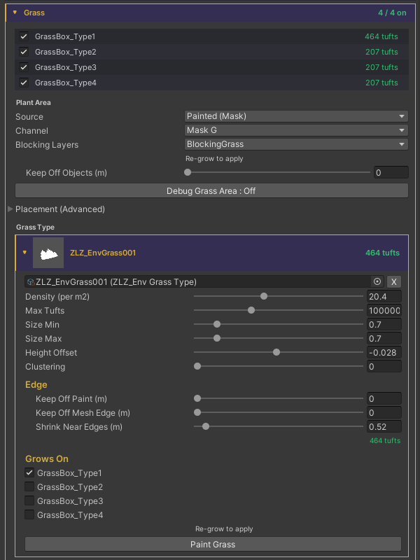

# Grass Edges

The core idea: grass can be kept from growing in three places — objects in the scene, the mesh edge, and areas painted over with another texture/color — and instead of cutting the grass on a hard straight line, all three use the same technique: **gradually shrinking the grass shorter until it fades out as it nears the edge**, so the transition looks smooth and natural with no sharp edges.

## Blocking Layers
Keeps grass off objects in the scene — a house, a rock, a crate. Set on the `ZLZ Env Dashboard`, in the Plant Area section.



- **Blocking Layers** — choose the Layers of the objects that keep grass out (only those with a Collider). Nothing = grass ignores objects entirely. Sampled at Grow, so Re-grow to apply
- **Keep Off Objects (m)** — how far grass stays away from those objects, tuned live in real time (0–2 m). Higher widens the bald ring around each object

## Mesh Edge
Keeps grass in from the surface edge so blades don't poke past it. Set per Grass Type (on the Grass Type card's Edge section).



- **Keep Off Mesh Edge (m)** — how far grass stays in from the surface edge, so blades don't poke past it. 0 = off

## Keep Off Paint
Keeps grass out of areas painted over with another texture/color. Set per Grass Type (on the Grass Type card's Edge section).



- **Keep Off Paint (m)** — how far grass stays away from the painted ground. 0 = stops exactly where the paint takes over

## Shrink Near Edges — the shared technique
Instead of ending on a hard line, blades taper down to nothing over the last stretch near any edge. This is the heart of the system — it makes all three cases above blend the same, smooth way.

- **Shrink Near Edges (m)** — the last stretch (in metres) over which blades taper down instead of ending on a hard line. It applies to every edge at once (paint, mesh edge, objects, and erased holes). 0 = hard cut

## Debug
- **Debug Grass Area** — toggles an overlay to check the result: green = full grass, amber = inside the Shrink zone (grass, but shorter), red = no grass
