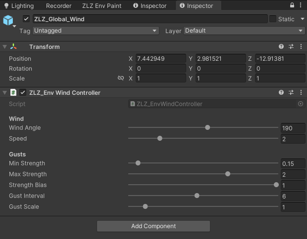

# Grass Global Wind (ZLZ_Env Wind Controller)

`ZLZ_Global_Wind` is the object that holds the **ZLZ_Env Wind Controller** component — it acts as the single, scene-wide wind source. Any grass material (or tree/bush material) whose **Wind Source** is set to **Global** pulls all of its wind from here: direction, strength, speed, and gust timing. Tune the whole scene's wind from one place.

## Showcase


---

## Setup ZLZ Global Wind

Done in a single step — right-click in the Hierarchy > ZLZ > Setup ZLZ Global.

---

## How It Works

- Every value is **pushed to the shader each frame**, and it runs in **Edit Mode** too (ExecuteAlways) — the wind animates while you build the scene, no need to press Play.
- **Keep one per scene.** If there are several, the one enabled most recently drives the scene.
- If **no controller** is present, any material set to Global **falls back to its own Local values** (the wind never freezes or dies) — and the material inspector warns when it is set to Global but no controller is found.
- The object's **position / rotation / scale have no effect on the wind** — they only anchor the gizmo arrow (blue) that shows the wind direction so you can adjust it by eye.
- The wind runs in the vertex stage of **every pass** (ForwardLit / ShadowCaster / DepthOnly / DepthNormals), so shadows, depth, and SSAO move with the blades instead of lagging a frame behind.

---

## Parameters

### Wind
- **Wind Angle** (`0–360°`, default `190`) — the wind heading on the ground plane, a single angle. The whole scene's wind points this way (check the direction with the gizmo arrow).
- **Speed** (`0–10`, default `2`) — how fast the wind drifts across the scene (the rolling main sway). The fast leaf **shimmer** is a separate value, set per material (Leaf Flutter Speed).

### Gusts
The strength here is a **range, not a single level** — the whole scene "breathes" up and down between **Min ↔ Max together** over time (every blade at the same strength at a given moment), so the wind visibly rises to a gust and falls back to calm across the whole field as one, rather than some blades being strong while others are gentle.

- **Min Strength** (`0–3`, default `0.15`) — the wind strength when calm (the low end of the breathe). Each material catches this scaled by its own **Wind Weight**.
- **Max Strength** (`0–3`, default `2`) — the wind strength at the gust peak (the high end). Set **Min = Max** for a steady, constant wind (no breathe).
- **Strength Bias** (`0–1`, default `1`) — which end the wind spends more time at: **low** = mostly calm (Min) with the odd strong burst, **high** = mostly strong (Max) with brief calm spells, **0.5** = an even swing.
- **Gust Interval** (`1–12` seconds, default `6`) — the time per breathe cycle (the gust interval): **low** = frequent swings between calm and strong, **high** = long calm stretches then a swell. The swing is irregular like real wind, not a metronome.
- **Gust Scale** (`0–10`, default `1`) — the size of the gust patches on the ground = the **noise the whole scene shares**. Higher = smaller, tighter patches. Every Global material reads this one value, so the noise is identical across the whole scene — and it is the **same noise** that bends the blades **and** creates the Wind Gust Wave highlight band, so where the grass leans always matches where the ground brightens.
