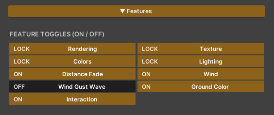
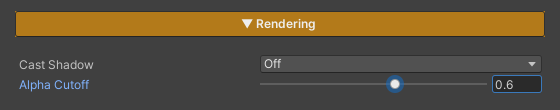
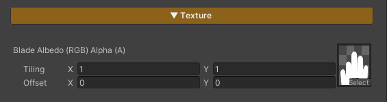
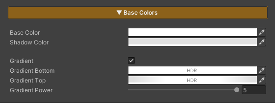
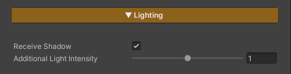
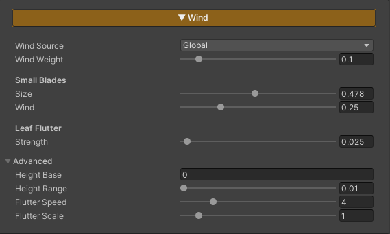
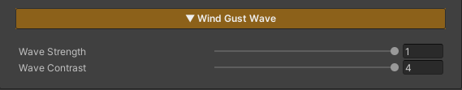
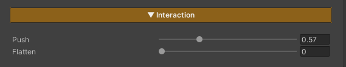
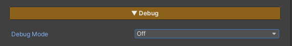

# Grass Material

Material ของหญ้าคือที่ที่คุมหน้าตาทั้งหมดของใบหญ้า ตั้งแต่สี การไล่เฉด แสงเงา ไปจนถึงเงาที่ทอดลงพื้น ทุกอย่างจัดเป็น section เปิด/ปิดได้ผ่านตาราง Feature ด้านบนสุด เปิดเฉพาะสิ่งที่ใช้เพื่อให้เบาที่สุด

## Showcase
youtube.com/watch?v=A264URW3CvA&feature=youtu.be

## Features

- **Rendering** — ปรับ Cast Shadow + Alpha Cutoff (สถานะ Lock ไม่สามารถเปิด/ปิดได้)
- **Texture** — ใส่ Texture (สถานะ Lock ไม่สามารถเปิด/ปิดได้)
- **Colors** — ปรับค่าสี (สถานะ Lock ไม่สามารถเปิด/ปิดได้)
- **Lighting** — ปรับแสงและเงาของหญ้า (สถานะ Lock ไม่สามารถเปิด/ปิดได้)
- **Wind** — ปรับการเคลื่อนที่ของหญ้าตามแรงลม (สามารถเปิด/ปิดได้)
- **Wind Gust Wave** — เกืด Highlight แสงบนหญ้าตามแรงลม (สามารถเปิด/ปิดได้)
- **Ground Color** — รับค่าสีจากกล้อง เพื่อให้เป็นสีเดียวกับ Terrain (สามารถเปิด/ปิดได้)
- **Interaction** — หญ้าเกิดการเคลื่อนไหวตามตัวละคร (สามารถเปิด/ปิดได้)

---

## Rendering

- **Cast Shadow** — ให้ใบหญ้าทอดเงาลงพื้นหรือไม่ ปิดได้เพื่อประหยัดในฉากที่มีหญ้าหนาแน่นมาก
- **Alpha Cutoff** — ค่าตัดขอบรูปทรงใบ (ค่าเริ่มต้น `0.6`) ตั้งไว้สูงกว่า 0.5 เล็กน้อยโดยตั้งใจ เพราะเมื่อมี mipmap ขอบ alpha ของใบจะเฉลี่ยเข้าใกล้ 0.5 ทำให้หญ้าไกลๆ กะพริบ การยกไปที่ 0.6 ช่วยตัดอาการกะพริบนั้นออก

---

## Texture

เลือกได้ 2 โหมดผ่านแท็บ:

- **Blade Albedo** — `Blade Albedo (RGB) Alpha (A)` เป็นรูปทรงและสีของใบหญ้าตามปกติ (ส่วนใหญ่ใช้แค่ช่อง alpha เป็นทรงใบ แล้วปล่อยให้ Height Gradient เป็นตัวให้สี)

---

## Base Colors

- **Base Color** — สีหลักของใบหญ้าในส่วนที่โดนแสง
- **Shadow Color** — สีของใบหญ้าในส่วนที่อยู่ในเงา

ไล่สีใบจากโคนถึงปลายตามความสูงของใบ (ปิดได้ด้วยการตั้งสองสีให้เหมือนกัน) การตั้งค่าหญ้าแบบมาตรฐานมักใช้แค่ alpha ของใบ + gradient นี้ในการให้สี จึงไม่ต้องใช้ albedo texture

- **Gradient** — เปิด/ปิดการไล่เฉดตามความสูง
- **Gradient Bottom** — สีที่โคนใบ (รองรับ HDR)
- **Gradient Top** — สีที่ปลายใบ (รองรับ HDR)
- **Gradient Power** — ความโค้งของการไล่สี ค่าต่ำ = ไล่นุ่มทั่วใบ, ค่าสูง = สีปลายเด่นเฉพาะช่วงยอด

---

## Lighting

- **Receive Shadow** — ให้ใบหญ้ารับเงาจากวัตถุอื่นหรือไม่
- **Additional Light Intensity** — น้ำหนักที่หญ้ารับจากไฟดวงอื่นๆ (Point/Spot) นอกเหนือจากไฟหลัก

> หมายเหตุ: หญ้า **ไม่รับ** Screen-Space AO โดยตั้งใจ เพราะทุ่งหญ้า alpha-tested หนาแน่นจะกลายเป็นรอยเปื้อนสกปรกใต้ SSAO ใบจึงคงการไล่แสงแบบ toon ที่สะอาดให้เข้าชุดกับ character shader

---

## Wind

หญ้าไหวตามลมได้โดยอ่านทิศ/แรงลมจากระบบ `ZLZ_Global_Wind` ของฉากโดยตรง เปิด/ปิดทั้งชุดได้ที่ feature toggle **Wind**

- **Wind Source** — เลือกแหล่งของค่าลม
  - **Global** — ใช้ค่าลมกลางจาก Wind Controller ในฉาก (ทิศ / แรง / ความเร็ว / gust คุมจากที่เดียว หญ้าทุกผืนจึงไหวสอดคล้องกัน) เหลือให้ปรับแค่ **Wind Weight** = น้ำหนักที่หญ้าผืนนี้รับลมกลาง (0 = นิ่ง, 1 = รับเต็ม)
  - **Local** — ตั้งลมเฉพาะ material นี้เอง จะโชว์ค่าให้ปรับเพิ่ม:
    - **Wind Strength** — แรงลม (ระยะที่ปลายใบโยกไป)
    - **Wind Speed** — ความเร็วของการไหว
    - **Wind Direction (deg)** — ทิศลม `0–360°`
    - **Wind Gust Scale** — ขนาดของก้อน gust (คลื่นลมแรง-เบาที่กวาดผ่านทุ่ง) ค่าใหญ่ = ก้อนลมกว้าง

### Small Blades
แยกให้ใบเล็กไหวต่างจากใบใหญ่ เพื่อความเป็นธรรมชาติ
- **Size** — ใบที่สูงไม่เกินสัดส่วนนี้ของใบโตเต็มวัยจะถือเป็น "ใบเล็ก"
- **Wind** — ปริมาณลมที่ใบเล็กรับ (`0` = นิ่งสนิท, `1` = รับเท่าหญ้าปกติ)

### Leaf Flutter
- **Strength** — ความแรงของการกระพือปลายใบแบบถี่ๆ ที่ซ้อนอยู่บนการโยกหลัก

### Advanced
ตั้งค่ามาถูกสำหรับหญ้ามาตรฐานแล้ว (UV ใบแนวตั้ง `0..1`) เปิดเฉพาะเมื่อใช้ mesh หรือทรงใบที่ต่างออกไป
- **Height Base / Height Range** — ช่วงความสูงของใบที่ให้ลมมีผล ลมจะเริ่มจาก Base แล้วไล่แรงขึ้นจนเต็มที่ตลอดช่วง Range (โคนใบนิ่ง ปลายใบไหวมากสุด)
- **Flutter Speed / Flutter Scale** — ความเร็วและความถี่ของการกระพือปลายใบ

---

## Wind Gust Wave

แถบไฮไลต์สว่างที่กวาดผ่านทุ่งไปตามลม เพื่อให้เห็น "คลื่นลม" วิ่งบนพื้นหญ้า ใช้ noise ก้อนเดียวกับที่ทำให้ใบโยก (แถบสว่าง = จุดที่หญ้ากำลังถูกลมดัน) เปิด/ปิดได้ที่ feature toggle **Wind Gust Wave**

- **Wave Strength** — ความสว่างของแถบ gust ที่กวาดผ่าน
- **Wave Contrast** — ค่าสูง = แถบสว่างคมชัดเป็นหย่อมๆ, ค่าต่ำ = จางนุ่มทั่วทั้งผืน (ขนาด / ทิศ / ความเร็วของ noise ถูกคุมจาก Wind Controller ในฉาก)

---

## Interaction

ใบหญ้าเอนหลบเมื่อมีตัวละครหรือวัตถุเดินผ่าน แล้วดีดกลับเมื่อพ้นไป ทำงานบน GPU ไม่ต้องมี collider รายใบ เปิด/ปิดได้ที่ feature toggle **Interaction** — ตัวที่กำหนดว่าอะไรดันหญ้าคือ component `ZLZ_Env Grass Interactor` (ดูวิธีตั้งค่าเต็มๆ ที่หน้า [Grass Interaction]({{ '/env/grass/grass-interaction/' | relative_url }}))

- **Push** — ระยะที่ปลายใบสไลด์หลบออกจาก interactor
- **Flatten** — ความแรงที่ใบถูกกดราบลงภายในรัศมีของ interactor

---

## Debug

**Debug Mode** — dropdown เลือกมุมมองตรวจสอบ โดยข้าม shading จริงเพื่อดูค่าดิบของแต่ละขั้น ตั้งเป็น `Off` เสมอเมื่อใช้งานจริง

- **Off** — โหมดใช้งานจริง แสดงผลปกติ
- **Wind Mask** — โชว์ช่วงความสูงของใบที่ลมมีผล (ขาว = ปลายใบที่ไหวเต็มที่, ดำ = โคนใบที่นิ่ง)
- **Ground Color** — โชว์สีที่ดึงจาก Ground Color Map ตรงๆ ใช้เช็คว่า texture ผูกถูกและ world UV ตรงไหม (ขาวล้วน = ไม่มี texture ผูกอยู่, เห็นภาพพื้น = ผูกถูก) ทำงานแม้ปิด toggle Ground Color
- **Shadow** — ค่าเงาจากไฟหลักดิบๆ (ขาว = โดนแสงเต็ม, ดำ = อยู่ในเงา) ถ้าขาวตลอดทั้งที่มีเงาทับ แปลว่า shadowmap ไม่ถูก sample
- **Interaction** — จุดที่อยู่ในรัศมี interactor (ขาว = โดนดัน) อ่าน list interactor กลางโดยตรง จึงใช้ไล่ปัญหาได้แม้ปิด toggle — ดำล้วน = ไม่มี interactor ส่งข้อมูลถึง shader, เห็นวงขาวรอบตัวละคร = ข้อมูลปกติ ปัญหาอยู่ที่แรง Push/Flatten หรือรัศมี
- **Gust Wave** — noise ลม gust ก้อนเดียวกับที่ใบใช้โยกจริง (ขาว = หย่อมลมแรง) ทำงานแม้ปิด feature จึงใช้จูน Gust Scale ของ Wind Controller ด้วยตาได้
- **Wind Response** — ปริมาณลมที่แต่ละใบรับ ตามขนาดใบเทียบกับตอนโตเต็มวัย (ไล่เฉดเขียว: มืด = ใบเล็กที่แทบไม่ขยับ, สว่าง = ใบเต็มขนาดรับลม 100%) ขอบ Edge Falloff รอบ mask หรือวัตถุที่หญ้าหลบควรอ่านค่ามืด

---
