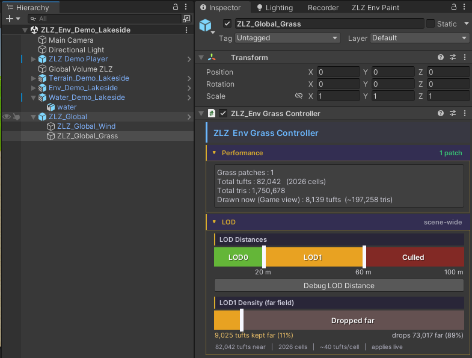

# Grass Material

Material ของหญ้าคือที่ที่คุมหน้าตาทั้งหมดของใบหญ้า ตั้งแต่สี การไล่เฉด แสงเงา ไปจนถึงเงาที่ทอดลงพื้น ทุกอย่างจัดเป็น section เปิด/ปิดได้ผ่านตาราง Feature ด้านบนสุด เปิดเฉพาะสิ่งที่ใช้เพื่อให้เบาที่สุด

จุดเด่น: หญ้าทั่วไป **ไม่จำเป็นต้องมี Albedo Texture เลย** — ใช้แค่รูปทรงใบ (alpha) บวกกับ Height Gradient ก็ได้สีที่ไล่จากโคนถึงปลายสวยงามและเบามาก

## Showcase
<!-- TODO: ใส่วิดีโอ/รูปตัวอย่าง material ของหญ้า -->

## Features

ด้านบนสุดของ material เป็นตารางสวิตช์เปิด/ปิดแต่ละความสามารถ (Distance Fade, Wind, Wind Gust Wave, Ground Color, Interaction ฯลฯ) — feature ที่ปิดจะถูกตัดออกจากการคำนวณจริง จึงไม่มีต้นทุน เปิดเฉพาะที่ใช้

> **Distance Fade** เป็นสวิตช์เปิด/ปิดล้วนๆ ไม่มีค่าให้ปรับในตัว material — เมื่อเปิด หญ้าจะค่อยๆ จางลงผ่าน dither เมื่อเข้าใกล้ขอบระยะวาด (จางเนียน ไม่ใช่ตัดเป็นวงแข็ง) ระยะจริงถูกกำหนดจาก Grass Global ให้ตรงกับระยะ Cull เสมอ จึงตั้งมาให้แล้วไม่ต้องปรับเอง — ดูรายละเอียดที่หน้า [Grass LOD]({{ '/env/grass/grass-lod/' | relative_url }})

## Rendering

- **Cast Shadow** — ให้ใบหญ้าทอดเงาลงพื้นหรือไม่ ปิดได้เพื่อประหยัดในฉากที่มีหญ้าหนาแน่นมาก
- **Alpha Cutoff** — ค่าตัดขอบรูปทรงใบ (ค่าเริ่มต้น `0.6`) ตั้งไว้สูงกว่า 0.5 เล็กน้อยโดยตั้งใจ เพราะเมื่อมี mipmap ขอบ alpha ของใบจะเฉลี่ยเข้าใกล้ 0.5 ทำให้หญ้าไกลๆ กะพริบ การยกไปที่ 0.6 ช่วยตัดอาการกะพริบนั้นออก (ถ้า texture ของคุณต่างออกไปสามารถปรับลดเองได้)

## Texture

เลือกได้ 2 โหมดผ่านแท็บ:

- **Grass Mode** — ใช้ `Blade Albedo (RGB) Alpha (A)` เป็นรูปทรงและสีของใบหญ้าตามปกติ (ส่วนใหญ่ใช้แค่ช่อง alpha เป็นทรงใบ แล้วปล่อยให้ Height Gradient เป็นตัวให้สี)
- **Flower Mode (2D Array)** — สลับใบไปใช้ **หนึ่งสไลซ์**จาก Flower Texture2DArray แทน เพื่อให้ดอกไม้หลายแบบใช้ material และ texture binding ร่วมกันได้ที่ความละเอียดเต็ม
  - **Flower Array (2D Array)** — ใส่ array เดียวกันให้ทุก material ดอกไม้
  - **Flower Slice Index** — แต่ละ material เลือก index สไลซ์ของตัวเอง

## Base Colors

- **Base Color** — สีหลักของใบหญ้าในส่วนที่โดนแสง
- **Shadow Color** — สีของใบหญ้าในส่วนที่อยู่ในเงา

ไล่สีใบจากโคนถึงปลายตามความสูงของใบ (ปิดได้ด้วยการตั้งสองสีให้เหมือนกัน) การตั้งค่าหญ้าแบบมาตรฐานมักใช้แค่ alpha ของใบ + gradient นี้ในการให้สี จึงไม่ต้องใช้ albedo texture

- **Gradient** — เปิด/ปิดการไล่เฉดตามความสูง
- **Gradient Bottom** — สีที่โคนใบ (รองรับ HDR)
- **Gradient Top** — สีที่ปลายใบ (รองรับ HDR)
- **Gradient Power** — ความโค้งของการไล่สี ค่าต่ำ = ไล่นุ่มทั่วใบ, ค่าสูง = สีปลายเด่นเฉพาะช่วงยอด

## Lighting

- **Receive Shadow** — ให้ใบหญ้ารับเงาจากวัตถุอื่นหรือไม่
- **Shadow Edge Softness** — ความนุ่มของขอบเงาบนใบ ค่าต่ำ = ขอบเงาคมแบบ toon, ค่าสูง = ไล่นุ่ม
- **Additional Light Intensity** — น้ำหนักที่หญ้ารับจากไฟดวงอื่นๆ (Point/Spot) นอกเหนือจากไฟหลัก

> หมายเหตุ: หญ้า **ไม่รับ** Screen-Space AO โดยตั้งใจ เพราะทุ่งหญ้า alpha-tested หนาแน่นจะกลายเป็นรอยเปื้อนสกปรกใต้ SSAO ใบจึงคงการไล่แสงแบบ toon ที่สะอาดให้เข้าชุดกับ character shader

## Wind

หญ้าไหวตามลมได้โดยอ่านทิศ/แรงลมจากระบบ `ZLZ_Global_Wind` ของฉากโดยตรง เปิด/ปิดทั้งชุดได้ที่ feature toggle **Wind**

- **Wind Source** — เลือกแหล่งของค่าลม
  - **Global** — ใช้ค่าลมกลางจาก Wind Controller ในฉาก (ทิศ / แรง / ความเร็ว / gust คุมจากที่เดียว หญ้าทุกผืนจึงไหวสอดคล้องกัน) เหลือให้ปรับแค่ **Wind Weight** = น้ำหนักที่หญ้าผืนนี้รับลมกลาง (0 = นิ่ง, 1 = รับเต็ม)
  - **Local** — ตั้งลมเฉพาะ material นี้เอง จะโชว์ค่าให้ปรับเพิ่ม:
    - **Wind Strength** — แรงลม (ระยะที่ปลายใบโยกไป)
    - **Wind Speed** — ความเร็วของการไหว
    - **Wind Direction (deg)** — ทิศลม `0–360°`
    - **Wind Gust Scale** — ขนาดของก้อน gust (คลื่นลมแรง-เบาที่กวาดผ่านทุ่ง) ค่าใหญ่ = ก้อนลมกว้าง

### Small Blades
แยกให้ใบเล็กไหวต่างจากใบใหญ่ เพื่อความเป็นธรรมชาติ
- **Size** — ใบที่สูงไม่เกินสัดส่วนนี้ของใบโตเต็มวัยจะถือเป็น "ใบเล็ก"
- **Wind** — ปริมาณลมที่ใบเล็กรับ (`0` = นิ่งสนิท, `1` = รับเท่าหญ้าปกติ)

### Leaf Flutter
- **Strength** — ความแรงของการกระพือปลายใบแบบถี่ๆ ที่ซ้อนอยู่บนการโยกหลัก

### Advanced
ตั้งค่ามาถูกสำหรับหญ้ามาตรฐานแล้ว (UV ใบแนวตั้ง `0..1`) เปิดเฉพาะเมื่อใช้ mesh หรือทรงใบที่ต่างออกไป
- **Height Base / Height Range** — ช่วงความสูงของใบที่ให้ลมมีผล ลมจะเริ่มจาก Base แล้วไล่แรงขึ้นจนเต็มที่ตลอดช่วง Range (โคนใบนิ่ง ปลายใบไหวมากสุด)
- **Flutter Speed / Flutter Scale** — ความเร็วและความถี่ของการกระพือปลายใบ

## Wind Gust Wave
แถบไฮไลต์สว่างที่กวาดผ่านทุ่งไปตามลม เพื่อให้เห็น "คลื่นลม" วิ่งบนพื้นหญ้า ใช้ noise ก้อนเดียวกับที่ทำให้ใบโยก (แถบสว่าง = จุดที่หญ้ากำลังถูกลมดัน) เปิด/ปิดได้ที่ feature toggle **Wind Gust Wave**

- **Wave Strength** — ความสว่างของแถบ gust ที่กวาดผ่าน
- **Wave Contrast** — ค่าสูง = แถบสว่างคมชัดเป็นหย่อมๆ, ค่าต่ำ = จางนุ่มทั่วทั้งผืน (ขนาด / ทิศ / ความเร็วของ noise ถูกคุมจาก Wind Controller ในฉาก)

## Interaction

ใบหญ้าเอนหลบเมื่อมีตัวละครหรือวัตถุเดินผ่าน แล้วดีดกลับเมื่อพ้นไป ทำงานบน GPU ไม่ต้องมี collider รายใบ เปิด/ปิดได้ที่ feature toggle **Interaction** — ตัวที่กำหนดว่าอะไรดันหญ้าคือ component `ZLZ_Env Grass Interactor` (ดูวิธีตั้งค่าเต็มๆ ที่หน้า [Grass Interaction]({{ '/env/grass/grass-interaction/' | relative_url }}))

- **Push** — ระยะที่ปลายใบสไลด์หลบออกจาก interactor
- **Flatten** — ความแรงที่ใบถูกกดราบลงภายในรัศมีของ interactor

## Debug

- **Debug Mode** — ข้ามการ shading เพื่อตรวจแต่ละขั้น มีโหมด: `Off`, `Wind Mask` (ช่วงที่ลมมีผลตามความสูงใบ), `Fade` (พื้นที่ที่โดน Distance Fade), `NdotL` (ค่าไฟหลักดิบๆ), `Ground Color`, `Shadow`, `Interaction` (จุดที่ interactor ดันหญ้าอยู่), `Perf Floor`, `Gust Wave` (noise ของ Wind Gust Wave ล้วนๆ), `Wind Response` (ปริมาณลมที่แต่ละใบรับหลังคิด Small Blades) — ตั้งเป็น `Off` เมื่อใช้งานจริง

---

**ดูเพิ่มเติม:** [Grass Setup]({{ '/env/grass/grass-setup/' | relative_url }}) · [Grass Color Camera]({{ '/env/grass/grass-color-camera/' | relative_url }}) · [Grass Edges]({{ '/env/grass/grass-edges/' | relative_url }}) · [Grass Interaction]({{ '/env/grass/grass-interaction/' | relative_url }}) · [Grass LOD]({{ '/env/grass/grass-lod/' | relative_url }})
