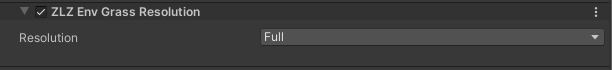

# Grass Optimized

## Showcase — Texture vs Mesh (Render Scale 1)


## Showcase — Texture vs Mesh (Render Scale 2)


---

## ZLZ Grass Mesh Baker



A grass card + a texture with alpha: most of the card's area is transparent pixels, yet the GPU still has to process every one of them (fetch texture → test alpha clip → discard the pixel). That is what causes Overdraw — and ZLZ Grass Mesh Baker fixes it.

**What you get**
- No Texture fetch
- No Alpha Clip
- No Overdraw from transparent pixels
- Height Gradient + Wind still work exactly the same (the UVs are preserved)
- No mesh modelling needed — just have the grass shape you want, press Bake, and the mesh is ready to use

### How to open
Window > ZLZ > Grass Mesh Baker

### How it works — 3 steps

- **Trace** — reads the texture's alpha channel and traces the outline of each blade, reducing the point count to the vertex budget you set
- **Layout** — reads a reference mesh (the card-group mesh the grass uses now) card by card, and replaces every card with the traced shape at the exact same position / rotation / scale (it copies the existing layout, it never invents a new one)
- **UV** — keeps texture-space UVs (x across, y base 0 → tip 1), so Height Gradient and Wind keep working exactly as before

### Settings
- **Grass Texture** — the source texture to take the shape from (only the alpha channel is read)
- **Layout Mesh** — the existing card-group mesh the grass uses (e.g. `SM_Grass_Group1`); every card in it is replaced by the traced shape
- **Alpha Cutoff** (`0.05–0.95`) — the alpha level counted as solid grass. Match it to the **material's Alpha Cutoff** so the mesh edge lands where the clipped edge used to be
- **Simplify** (`0.5–8` pixels) — the outline tolerance. Higher = fewer points / coarser edge / lighter, lower = a tighter edge / more points
- **Bend Segments** (`1–12`) — the horizontal vertex rows from base to tip. The wind bends the mesh per vertex, so more rows = a smoother lean, fewer rows = lighter but stiffer
- The Preview shows the traced outline (gold) and the Bend Segments guide lines, plus the Cards / Verts / Tris stats before you press **Bake Mesh**

> After baking: the mesh can be used directly with a material that has its Texture feature turned off. See the Demo for an example.

---

## ZLZ Env Grass Resolution

Renders the grass color into a downsampled buffer and composites it back — paying the remaining overdraw at only a fraction of the pixels.

### Setup ZLZ Env Grass Resolution
- Add Renderer Feature > **ZLZ Env Grass Resolution** to the main URP renderer used to render the image
- **Depth Texture** must be enabled on the URP Asset

### Resolution

- **Full** — renders at native resolution (the feature idles, grass draws its own color) → highest quality / sharpest edges, but no saving
- **Half** — half per axis (= 1/4 of the pixels) → much faster, edges soften slightly; the best value for most cases
- **Quarter** — a quarter per axis (= 1/16 of the pixels) → fastest, softest edges; good for mobile or very dense grass fields
