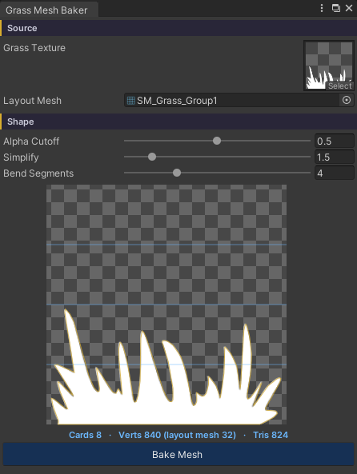

# Grass Optimized

หญ้าได้รับการ Optimized จากหลากหลายส่วนด้วยกัน

## Showcase เปรียบเทียบ Texture VS Mesh ( Render Scale 1 )


## Showcase เปรียบเทียบ Texture VS Mesh ( Render Scale 2 )


## ZLZ Env Grass Resolution

### Setup ZLZ Env Grass Resolution
- Add Feature > ZLZ Env Grass Resolution ลงใน URP หลักที่ใช้ Render ภาพ
- ต้องเปิด Depth Texture ใน URP Asset

### Resolution

- Full :  เรนเดอร์เต็มความละเอียด (feature จะพักการทำงาน หญ้าวาดสีของตัวเอง) → คุณภาพสูงสุด/ขอบคมสุด แต่ไม่ประหยัด
- Half — เรนเดอร์สีหญ้าที่ครึ่งหนึ่งต่อแกน (= 1/4 ของจำนวนพิกเซล) → เร็วขึ้นมาก ขอบใบนุ่มลงเล็กน้อย เป็นตัวเลือกที่คุ้มที่สุดสำหรับส่วนใหญ่
- Quarter — 1/4 ต่อแกน (= 1/16 ของพิกเซล) → เร็วที่สุด ขอบนุ่มที่สุด เหมาะกับ mobile หรือฉากที่หญ้าหนาแน่นจัดๆ

---

## ZLZ Grass Mesh Baker

Mesh + Texture ที่มี Alpha  พื้นที่ส่วนใหญ่เป็นพิกเซลโปร่งใส  แต่ GPU ต้องประมวลผลทุกพิกเซล (fetch texture → ทดสอบ alpha clip → ทิ้งพิกเซล)
ดังนั้นจึงทำให้เกิด Overdraw แต่ ZLZ Grass Mesh Baker จะมาแก้ไขสิ่งนี้

- ผู้ใช้งานไม่ต้องปั้น Mesh  แค่มีรูปทรงหญ้าที่ต้องการ  เมื่อกด Bake คุณจะได้ Mesh ทันทีพร้อมใช้งาน
- ทำให้หญ้าไม่มี Aplha Clip, ไม่มี Overdraw, ไม่มี Texture fetch สิ่งเหล่านี้คือสาเหตุของหญ้าที่ทำให้ Performance ไม่ดีเท่าที่ควร

### การเปิดใช้งาน
Window > ZLZ > Grass Mesh Baker

### หลักการทำงาน 3 ขั้น:

- Trace — อ่านช่อง alpha ของ texture แล้ววาดเส้นขอบ (outline) ของใบแต่ละใบออกมา ลดจำนวนจุดตามงบ vertex ที่คุณตั้ง
- Layout — อ่าน mesh อ้างอิง (การ์ดกลุ่มเดิมที่หญ้าใช้อยู่) ทีละการ์ด แล้วแทนที่ทุกการ์ดด้วยรูปใบที่ trace มา ที่ตำแหน่ง/การหมุน/สเกลเดิมเป๊ะ — ก็อปปี้เลย์เอาต์เดิม ไม่ได้สร้างใหม่
- UV — รูปใหม่คง UV แบบ texture-space ไว้ (x ตามแนวขวาง, y จากโคน 0 → ปลาย 1) ดังนั้น Height Gradient และ Wind (height mask) ยังทำงานเหมือนเดิมทุกอย่าง

### ค่าที่ปรับได้:
- Grass Texture — texture ต้นทางที่จะเอารูปทรงมา (อ่านแค่ช่อง alpha)
- Layout Mesh — mesh การ์ดกลุ่มเดิมที่หญ้าใช้อยู่ (เช่น SM_Grass_Group1) ทุกการ์ดในนี้จะถูกแทนด้วยรูปที่ trace มา
- Alpha Cutoff (0.05–0.95) — ระดับ alpha ที่นับว่าเป็นเนื้อใบ ให้ตั้งตรงกับ Alpha Cutoff ของ material ขอบ mesh จะได้ตกตรงที่ขอบ clip เดิมเคยอยู่
- Simplify (0.5–8 พิกเซล) — ความละเอียดของเส้นขอบ ค่าสูง = จุดน้อย/ขอบหยาบ/เบา, ค่าต่ำ = ขอบเนียน/จุดเยอะ (ตัวเลข vertex อัปเดตสดให้ดู)
- Bend Segments (1–12) — จำนวนแถวจุดแนวนอนจากโคนถึงปลาย ลมดัด mesh ทีละจุด ยิ่งแถวเยอะ = โค้งลู่ลมเนียน, แถวน้อย = เบาแต่แข็ง
- Preview จะโชว์ texture พร้อมเส้นขอบที่ trace (สีทอง) และเส้นแบ่ง Bend Segments ให้เห็น พร้อมสถิติ Cards / Verts / Tris ก่อนกด Bake Mesh

หลัง bake: สามารถนำ Mesh ไปใช้ คู่กับ Material ที่ปิดการทำงานของ Texture ได้เลย  สามารถดูตัวอย่างได้จาก Demo

