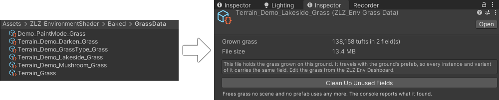

# Grass Setup

Plant grass on your Terrain in just a few steps. Everything is controlled from a single place, the `ZLZ_Env Dashboard`, and one scene can hold many grass types at once.

## Showcase
[(Grass Setup: Plant Different Grass Types on Each Terrain)](https://www.youtube.com/watch?v=3qydgQaQi_s)

## Setup Steps

1. **Place the Dashboard:** add `ZLZ_Env Dashboard` to the root of your environment (above all ground meshes). Every mesh under it appears in the panel with an On/Off switch.
2. **Choose where to plant:** tick on the meshes you want grass to grow on.
3. **Source:** choose where grass grows across the mesh.
   - **Uniform:** grass covers the whole mesh.
   - **Painted (Mask):** grass grows only where you have painted the ground, following the ground material's Texture Paint. For example, if the ground is painted with a grass zone and a sand zone, grass grows only in the grass zone and stays off the sand.
4. **Grass Type:** pick or create a Grass Type. Ready-made presets are included:
   - 5 grass types
   - 4 lying flower types
   - 1 standing flower type in 4 colors
   - or create your own Grass Type
5. **Grow All:** press `Grow All` and the grass is generated from your settings.
6. **Paint more (optional):** press `Grow All` first, then drag the mouse across the ground to paint extra grass by hand.

## Creating Your Own Grass Type

- Press `Create New` on the Grass Type field in the Dashboard.
- The new file is created at `Assets/ZLZ_EnvironmentShader/Grass/Types/ZLZ_GrassType.asset`.
- Every setting can be edited directly on the Grass Type:
- **Material:** the material for this grass or flower (each asset has a live preview so you can tell them apart).
- **Meshes:** the mesh(es) for LOD 0. You can add several, and one is picked at random per tuft.
- **Far Mesh:** the mesh for LOD 1 (the far field). Leave it empty to use the full LOD 0 mesh at every distance.
- **Density (per m2):** how densely this type is planted per square metre. Higher means thicker grass.
- **Max Tufts:** a safety cap on this type's count, so grass can never explode on a very large surface.
- **Size Min:** the smallest size for this grass or flower.
- **Size Max:** the largest size. Each tuft gets a random size between Min and Max.
- **Height Offset:** sinks or raises the base of the grass or flower. Use a small negative value to push the base into the ground so blades do not float.
- **Clustering:** higher values make grass and flowers gather into patches (0 = an even scatter, like normal grass). When Clustering is on, a `Patch Size` slider appears to set how wide each patch is.

## Where Is Grass Data Stored

Grass is stored in `ZLZ_EnvGrassData`, located at `Assets/ZLZ_EnvironmentShader/Baked/GrassData/`.
- One Grass Data file works with one Dashboard only. Growing again with the same Grass Data overwrites the previous data immediately.
- Press `New` to create a fresh Grass Data file yourself.
