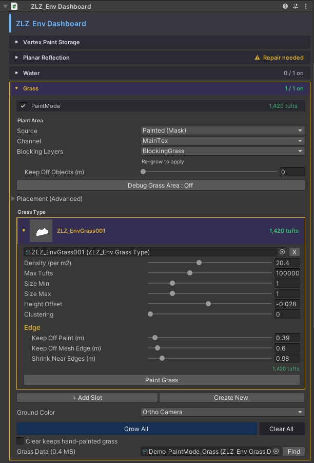
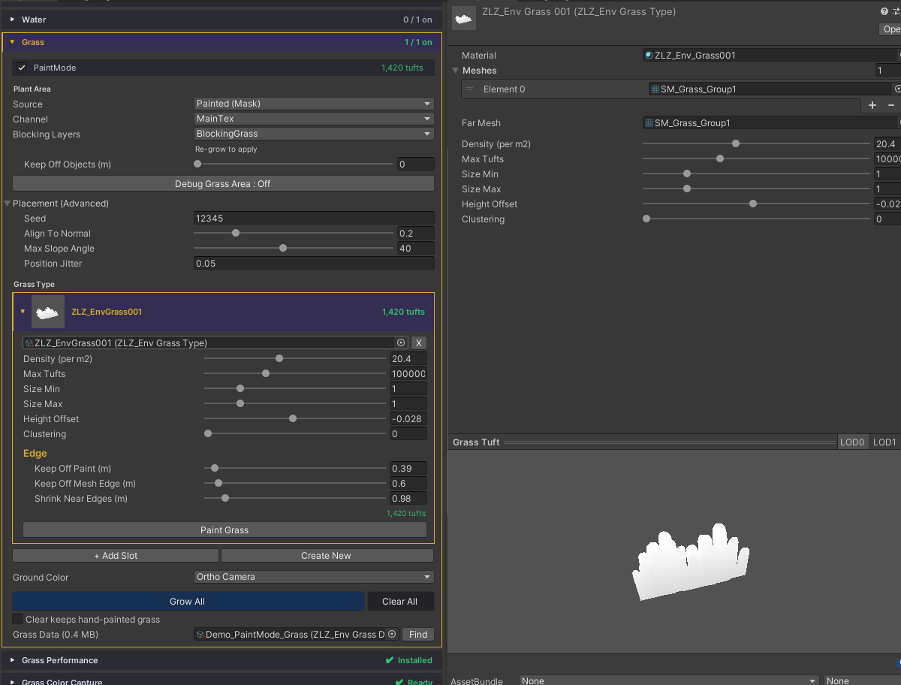

# Grass Setup

ปลูกหญ้าลงบน Terrain ของคุณได้ในไม่กี่ขั้นตอน ทุกอย่างคุมผ่าน `ZLZ_Env Dashboard` ที่เดียว และรองรับหญ้าหลายชนิดในฉากเดียว

## Showcase
[(Grass Setup — Plant Different Grass Types on Each Terrain)](https://www.youtube.com/watch?v=3qydgQaQi_s)

## ขั้นตอนการติดตั้ง

1. **วาง Dashboard** — ใส่ `ZLZ_Env Dashboard` ไว้ที่ root ของ environment (อยู่เหนือ mesh พื้นทั้งหมด) — ทุก mesh ที่อยู่ใต้มันจะโผล่ในแผงพร้อมสวิตช์ On/Off
2. **เลือกพื้นที่จะปลูก** — ติ๊กเปิด mesh ที่ต้องการให้มีหญ้า
3. **Source** — เลือกว่าจะหญ้าขึ้นที่บริเวณไหนของ Mesh บ้าง
  - Uniform : ปลูกทั้ง Mesh
  - Painted Mask : ปลูกหญ้าโดยอิงตาม Paint Mode ตัวอย่างเช่น
    - Main Texture = Texture หญ้า
    - Mask Texture R Channel = Texture ทราย
    - หากเราเลือก Main Texture หญ้าจะขึ้นแค่ในพื้นที่หญ้าเท่านั้น  จะไม่ขึ้นที่ Texture ทราย
4. **Grass Type** — เลือกหรือสร้าง Grass Type  เรามี Grass Type ให้แล้วดังนี้
  - หญ้าทั้งหมด 5 แบบ
  - ดอกไม้สำหรับวางนอน 4 แบบ
  - ดอกไม้สำหรับวางตั้ง 1 แบบ 4 สี
  - ผู้ใช้งานสร้าง Grass Type ที่ตัวเองต้องการเองได้
5. **Grow All** — กดปุ่ม `Grow All` หญ้าจะถูกสร้างขึ้นตามที่ตั้งไว้
6. **Paint เพิ่ม (ถ้าต้องการ)** — ต้อง Grow All ก่อน แล้วลากเมาส์บนพื้นเพื่อระบายหญ้าเพิ่มเอง

## การสร้าง Grass Type ของตัวเอง

- สามารถสร้างที่ Create New ที่ Grass Type ใน Dashboard
- ระบบจะสร้าง Grass Type ไว้ที่นี่ > Assets/ZLZ_EnvironmentShader/Grass/Types/ZLZ_EnvFlower001.asset
- ใน Grass Type เราสามารถตั้งค่าได้ที่นี่เลย
- Material : เลือก Material หญ้า หรือ ดอกไม้ที่ต้องการ  สามารถดูได้จากตัวอย่างที่มีให้
- Meshes : ใส่ Mesh สำหรับ LOD 0
- Far Meshs : ใส่ Mesh สำหรับ LOD 1 หากไม่มีใส่อันเดียวกับ Meshes LOD 0 ก็ได้
- Density : จำนวนการปลูกหญ้า  ยิ่งเยอะหญ้ายิ่งหนาแน่น
- Max Turfts : Limit ว่าหญ้าจะไม่มีทางเกินเท่าไหร่
- Size Min : ขนาดหญ้าหรือดอกไม้ที่เล็กที่สุด
- Size Max : ขนาดหญ้าหรือดอกไม้ที่ใหญ่ที่สุด
- Height Offset : สามารถปรับตำแหน่งเริ่มต้นของหญ้าหรือดอกไม้ได้  ว่าจะให้ Offset ขึ้นลงมากแค่ไหน
- Clustering : ค่ายิ่งสูง หญ้าและดอกไม้ จะจับกลุ่มกันมากยิ่งขึ้น

## ข้อมูลหญ้าเก็บที่ไหน
หญ้าถูกเก็บใน `ZLZ_EnvGrassData` ซึ่งจะถูกเก็บไว้ที่นี่ > Path : Assets/ZLZ_EnvironmentShader/Baked/GrassData/.asset
- Grass Data 1 อัน จะทำงานต่อ 1 Dashboard เท่านั้น  หากใช้ Grass Data เดิมปลูกหญ้าจะทับข้อมูลเก่าทันที
- ผู้ใช้สามารถกด New เพื่อสร้าง Grass Data ได้เอง
