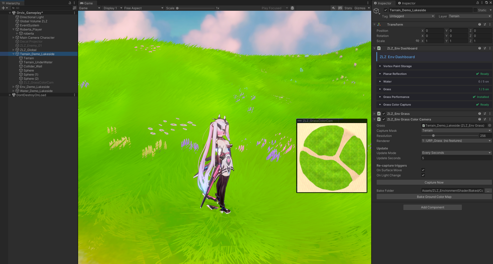

# Grass

## What Can the ZLZ Env Shader Grass System Do?
- Control all grass through `ZLZ_EnvDashboard` (choose the surface, pick the Grass Type, Paint, Grow) — create grass in a single click
- Grass data is stored in `ZLZ_EnvGrassData` instead of in the Scene, keeping Scenes small and letting the data travel with the Prefab — so it works in both Scene-based and Prefab-based workflows
- Grass is generated automatically from a Mask Texture; you define where grass is allowed to grow instead of painting every clump by hand
- If you want, you can still paint additional grass manually
- Supports many types of grass and flowers at the same time
- Shrinks grass along the border between grassy and non-grassy areas for a smooth transition
- Define grass-free zones through the Blocking Layer system
- Grass has an Interaction system that responds to characters
- Grass works with the `ZLZ_Global_Wind` system and sways in sync with the wind
- Grass samples its color from a camera so it always matches the ground color, and that camera is heavily optimized so it barely affects performance
- Runs on both PC and Mobile
- Includes an LOD system (LOD 0 = standard Mesh, LOD 1 = optimized Mesh, Culling = removes grass that is too far away)
- Uses GPU Instancing and is heavily optimized to squeeze out the highest possible FPS

## Realtime Grass Color via an Orthographic Camera


This system makes the base of the grass blend with the color of the ground it sits on. A top-down camera captures the ground color (after lighting and shadow) and feeds it to the grass to tint its gradient. Grass on soil takes on a soil tint, grass in shadow darkens with the ground, and there is no hard seam between grass and ground. The camera only runs when needed and then shuts itself off, so it barely costs any performance.

- **Grass** — assign the Root that has the Dashboard (added automatically during setup). The camera frames itself to cover every active grass field on its own
- **Capture Mask** — choose the Layer you want the grass to sample color from, normally the same Layer the Terrain uses
- **Resolution** — the resolution of the color image fed to the grass. Since it is only a broad color tone and needs no sharpness, 256 is enough and keeps this camera lightweight
- **Renderer** — select `URP_Grass` (installed automatically). This camera adds no extra Features so it stays as light as possible
- **Update** — controls the capture cadence at runtime, with two modes:
  - **Once** — captures the color once at start, then turns the camera off. Best for scenes where the lighting and ground are static
  - **Every Seconds** — re-captures on an interval you specify, for cases where the ground color keeps changing on its own
- **Re-capture** — even with Update set to Once, the system automatically re-captures when something changes. It only captures when there is an actual change; if everything is static the camera stays off and costs nothing
  - **On Surface Move** — re-captures when a captured area moves / rotates / scales, so grass color stays matched to the ground even if the Terrain moves
  - **On Light Change** — re-captures when the Directional Light changes direction, color, or intensity, keeping grass color and shadow correct even in day-night scenes
- **Capture Now** — press to capture and update the grass color immediately, for when you have changed something and want to see the result right away
- **Bake Ground Color Map** — if you would rather not use the Orthographic camera, you can Bake the ground color into a Texture and use that instead — though the camera is now so optimized that it is barely different from using a Texture

## Grass Interaction with Characters


Grass responds when a character or object moves through it.

- Attach `ZLZ_Env Grass Interactor` to any character you want to interact with the grass
- **Radius** — adjust the size of the area to fit the character, for interacting with the grass
- **Push** — sets how far the blades lean sideways, away from the object
- **Flatter** — sets how far the blades are pressed down toward the ground
- **Debug Mode** — visualizes the area that affects the grass

## LOD System
Grass uses a distance-based LOD system to stay cheap to render — full-detail meshes near the camera, and lighter meshes or culling farther away.

See **[Grass LOD](grass-lod/)** for the full breakdown.
