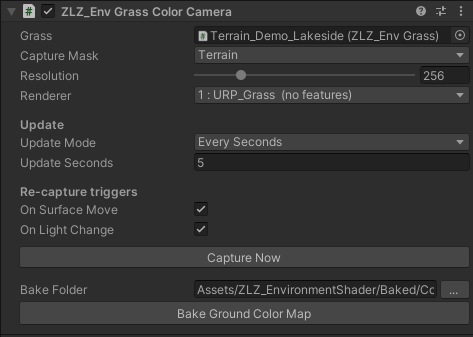

<!-- DRAFT — ยังไม่ขึ้นเว็บจริง. พรีวิว: jekyll serve --unpublished. พร้อมขึ้นเว็บ: ลบ published: false -->

# Grass

## ShowcasePaintMode - Control


## ShowcasePaintMode - Texture


## ShowcasePaintMode - Brush


## ShowcasePaintMode - Debug


### Setup - PaintMode

- The Mesh you want to paint must be under `Base_Terrain`, or under a Parent that has the `Env Dashboard` script attached
  - Path : Assets/ZLZ_EnvironmentShader/Demo/Prefab/Base_Terrain.prefab
- Assign a Material that uses ZLZ_Environment_Shader
  - Path : Assets/ZLZ_EnvironmentShader/Shaders/Core/ZLZ_Environment_Shader.shader

### ระบบหญ้าของ ZLZ Env Shader ทำอะไรได้บ้าง?
- หญ้าถูกควบคุมผ่าน ZLZ_EnvDashboard (เลือกพื้นผิว, เลือก Grass Type, Paint, Grow) สามารถสร้างหญ้าได้ภายในคลิ๊กเดียว
- ข้อมูลหญ้าถูกเก็บใน ZLZ_EnvGrassData ไม่ใช่บน Scene  ทำให้ Scene เล็ก และหญ้าจะอยู่ใน Prefab  ฉะนั้นจะรองรับการทำงานทั้งแบบ Scene และแบบ Prefab
- สร้างหญ้าขึ้นอัตติโนมัติ โดยเลือกพื้นที่ที่จะเกิดหญ้าจาก Mask Texture ผู้ใช้งานไม่จำเป็นต้องมานั่ง Paint หรือ ระบายเอง
- ผู้ใช้งานสามารถ Paint Grass เพิ่มเติมเองได้หากต้องการ
- รองรับการใช้งานหญ้า + ดอกไม้ ได้หลากหลายประเภทพร้อมกัน
- ลดขนาดหญ้าในบริเวณเส้นขอบ  ระหว่างจุดที่มีหญ้าและไม่มีหญ้า  ทำให้หญ้าเรียบเนียน
- สามารถสร้างพื้นที่ที่ไม่มีหญ้าได้ ผ่านระบบ Blocking Layer
- หญ้ามีระบบ Interactive กับตัวละคร
- หญ้าทำงานคู่กับระบบลม ZLZ_Global_Wind และการทำงานของหญ้าจะ Sync กับลม
- หญ้ารับค่าสีจากกล้อง  ทำให้สีของหญ้าตรงกับสีพื้นตลอดเวลา และถูก Optimize กล้องอย่างดีทำให้กล้องแทบไม่ส่งผลต่อ Performance
- รองรับการใช้งานบนทั้ง PC และ Mobile
- มีระบบ (LOD 0 = Mesh ปกติ, LOD 1 = Optimize Mesh, Culling = นำหญ้าออกหากอยู่ไกลเกินไป)
- หญ้าใช้ GPU Instancing และได้รับการ Optimize เยอะมาก  เพื่อให้ได้ FPS สูงที่สุด

### หญ้ารับค่าสี Realtime ผ่านกล้อง Orthographic


ระบบนี้ทำให้โคนหญ้ากลมกลืนกับสีของพื้นที่มันขึ้นอยู่ โดยมีกล้องมองจากด้านบนคอยถ่ายสีพื้น (ที่ผ่านแสงและเงาแล้ว) ส่งให้หญ้านำไปไล่โทน หญ้าบนดินจึงอมสีดิน
หญ้าในเงาจึงเข้มตามพื้น ไม่เกิดรอยต่อแข็งๆ ระหว่างหญ้ากับพื้น ตัวกล้องจะทำงานเฉพาะตอนจำเป็นแล้วปิดตัวเอง จึงแทบไม่กินประสิทธิภาพ

- Grass : ใส่ Root ที่มี Dashboard ซึ่งระบบจะใส่ให้อัตโนมัติตั้งแต่ตอนติดตั้ง กล้องจะจัดกรอบภาพให้ครอบคลุมพื้นหญ้าทุกผืนที่เปิดใช้งานเอง
- Capture Mask : เลือก Layer ที่ต้องการให้หญ้ารับสี  ซึ่งโดยปกติจะเลือก Layer เดียวกับที่ Terrain ใช้
- Resolution : ความละเอียดของภาพสีที่ส่งให้หญ้า เนื่องจากเป็นเพียงโทนสีกว้างๆ ไม่ต้องการความคมชัด ตั้งแค่ 256 ก็เพียงพอ และช่วยให้กล้องตัวนี้ทำงานเบา
- Renderer : เลือก URP_Grass ซึ่งจะติดตั้งให้อัตติโนมัติ  โดยกล้องนี้จะไม่ Add Features เพิ่ม  เพื่อให้กล้องนี้ทำงานได้เบาที่สุด
- Update : กำหนดจังหวะการถ่ายตอนเล่นจริง มี 2 โหมด
  - Once : ถ่ายเก็บค่าสีครั้งเดียวตอนเริ่ม แล้วปิดกล้อง เหมาะกับฉากที่แสงและพื้นอยู่นิ่ง
  - Every Seconds : ถ่ายซ้ำเป็นรอบ ระบุได้ว่าทุกกี่วินาที เผื่อกรณีที่พื้นมีสีเปลี่ยนเองตลอดเวลา
- Re-capture : แม้ตั้ง Update เป็น Once ระบบนี้ก็ยังสั่งถ่ายใหม่ให้อัตโนมัติเมื่อเกิดการเปลี่ยนแปลง โดยจะถ่ายจริงเฉพาะตอนมีอะไรเปลี่ยน ถ้าทุกอย่างนิ่งกล้องจะปิดอยู่ ไม่กินเครื่อง
  - On Surface Move : ถ่ายใหม่เมื่อพื้นที่ถูก Capture มีการขยับ/หมุน/ย่อขยาย แม้ Terrain จะเคลื่อนที่ สีหญ้าก็ยังตรงกับพื้น
  - On Light Change : ถ่ายใหม่เมื่อ Directional Light เปลี่ยนทิศทาง สี หรือความสว่าง ทำให้สีและเงาของหญ้ายังถูกต้องแม้ในฉากที่สลับกลางวัน-กลางคืน
- Capture Now : กดเพื่อสั่งถ่ายและอัปเดตสีหญ้าใหม่ทันที ไว้ใช้เวลาที่แก้บางอย่างแล้วอยากเห็นผลเดี๋ยวนั้น
- Bake Ground Color Map :  : กรณีที่ไม่อยากใช้กล้อง Orthographic สามารถ Bake สีพื้นเป็น Texture ไปใช้แทนได้ แต่ปัจจุบันกล้องถูก Optimize มามากจนแทบไม่ต่างจากการใช้ Texture

### ระบบ หญ้า Interaction กับตัวละคร


หญ้าจะตอบสนองเมื่อมีตัวละครหรือวัตถุเคลื่อนที่ผ่าน

- ติดตั้ง `ZLZ_Env Grass Interactor` ให้กับตัวละครที่ต้องการ Interaction กับหญ้า
- Radius : ปรับขนาดของพื้นที่ให้เหมาะสมกับตัวละคร  เพื่อ Interaction กับหญ้า
- Push : กำหนดว่าใบหญ้าจะเอนออกด้านข้าง หนีออกจากวัตถุ มากแค่ไหน
- Flatter : กำหนดว่าใบหญ้าจะถูกกดลงล่าง เข้าหาพื้น มากแค่ไหน
- Debug Mode : Interaction เพื่อเช็คพื้นที่ที่ส่งผลกับหญ้า

### ระบบ LOD


- สามารถ Optimize หญ้าได้ที่ `ZLZ_Global_Grass`
- Performance บอกข้อมูลของหญ้าที่มีในฉากปัจจุบัน
- ผู้ใช้สามารถปรับได้ว่าในแต่ละระยะจะแสดงผล LOD ไหน
- LOD 0 = Mesh หญ้าปกติ
- LOD 1 = Low Mesh + ลดจำนวน
- Culled = ตัดหญ้าออก
- Debug LOD Distance จะแสดงผลในแต่ละระยะ
- LOD 1 Density = ปรับจำนวนของหญ้าที่อยู่ในระยะ LOD 1 ว่าจะลดลงมากแค่ไหน
- มีระบบ Distance Fade เพื่อทำให้การสวิช LOD ในแต่ละระยะเกิดขึ้นอย่างเรียบเนียน
