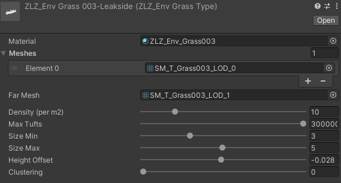
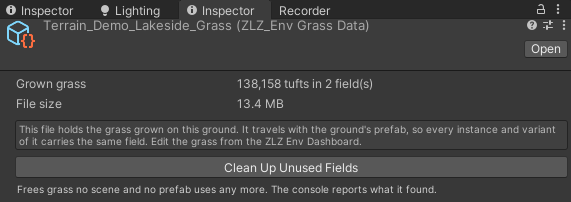
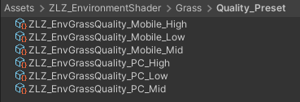
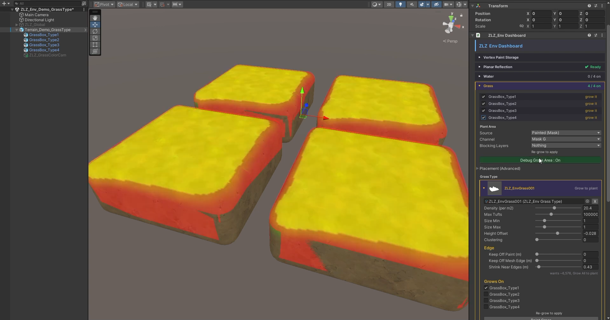
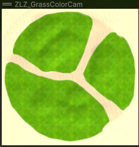
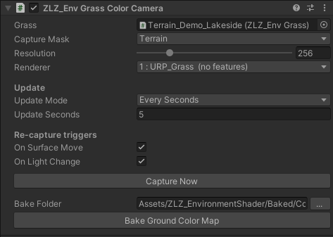
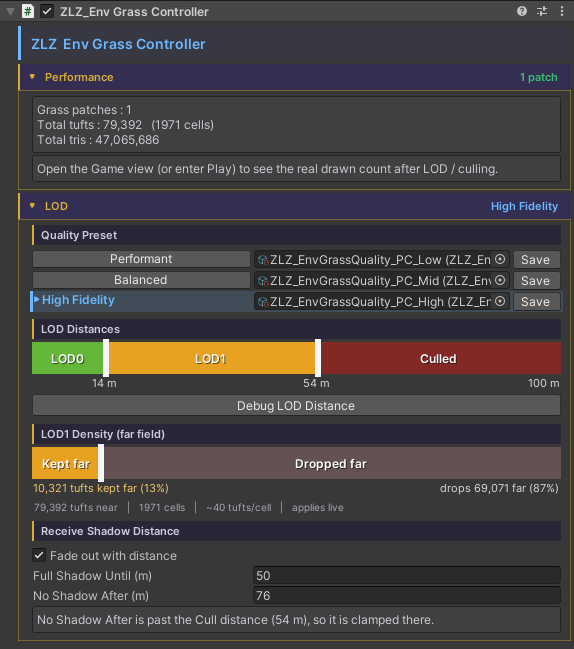

<!-- DRAFT — ยังไม่ขึ้นเว็บจริง. พรีวิว: jekyll serve --unpublished. พร้อมขึ้นเว็บ: ลบ published: false -->

# ZLZ Grass System

<!--  -->

The ZLZ grass system is not a single shader — it is a **complete system for planting grass onto meshes you made yourself**, covering the scatter, the storage, the LOD, the wind, and the way blades part as a character walks through them.

| Piece | What it is |
|---|---|
| **ZLZ/Environment/Grass** | The shader that draws the blades and flowers |
| `ZLZ_EnvGrass` | Plants the field and draws it. Lives on the Dashboard |
| `ZLZ_EnvGrassType` | A preset asset : "this is what this kind of grass looks like" |
| `ZLZ_EnvGrassData` | The file holding the tufts you have grown |
| `ZLZ_EnvGrassController` | LOD for all the grass in the scene |

- Path : `Assets/ZLZ_EnvironmentShader/Shaders/Core/ZLZ_Environment_Grass.shader`
- Everything is driven from **ZLZ_Env Dashboard > Grass** — no hunting for components one at a time

---

## What This System Solves

- **Not tied to Unity Terrain** — plant straight onto meshes sculpted in Maya or Blender
- **Planted in one click** — pick the surfaces, pick a grass type, press `Grow All`
- **The field lives in an asset, not the scene** — scenes stay small, and grass travels with its Prefab
- **Several types at once** — grass and flowers in one field, each with its own density, size and mesh
- **Clean edges with no hand-tweaking** — blades taper along paths and keep clear of props
- **Colour matches the ground** — never a foreign green sheet laid over dirt, sand or stone
- **Sways to the same wind as the trees** — one `ZLZ_Env Wind Controller` drives the whole scene
- **Parts as a character walks through** — with no per-blade colliders
- **LOD and Quality Presets built in** — thins with distance, and swaps whole sets for PC or Mobile

---

## How Grass Comes to Exist



Every step lives in the **Grass** section of the Dashboard that owns that ground (normally the Terrain Dashboard).

1. **Choose which surfaces grow grass** — the Dashboard lists every mesh underneath it with a tick box. Tick only the ones you want. If a mesh carries several materials, a second row of tick boxes lets you choose which material grows grass (grass on the grass material, none on the rock material)
2. **Choose a Grass Type** — pick one of the presets that ship with the package, or press `Create New` for your own. Several types can run at once
3. **Press `Grow All`** — the system scatters tufts across the whole surface at each type's density, then writes the result into the Grass Data file

If you want tighter control than that, a **hand-painting mode** lets you add or remove tufts spot by spot in the Scene view.

> **Most values apply live**, with nothing to re-grow — height, edge distances, edge softness and the mask threshold can all be dragged in real time. Only the values that decide *where a tuft lands* (density, clustering, blocking layers) need a fresh `Grow`.

---

## Grass Type — One Preset per Kind of Grass

Instead of wiring a Material to a Mesh in every place they are used, everything that describes "what this kind of grass looks like" is stored in a single asset file, reusable across every mesh and every scene.

| Group | What is in it |
|---|---|
| **Shape** | Material, the tuft meshes (one picked at random per tuft), and an optimized mesh for the far field |
| **Amount** | Density in tufts per square metre, and a cap on the tuft count so one type can never explode across a huge surface |
| **Size** | A random size range, and a Height Offset that sinks the base slightly into the ground so blades do not float |
| **Clustering** | How tightly this type clumps, and how wide each clump is |
| **Edges** | Distance kept from painted ground, distance kept in from the mesh edge, and the band over which blades taper down instead of ending on a hard line |

Clustering is what makes flowers read as flowers. Grass scattered evenly looks right; flowers scattered evenly look like spilled salt. In nature flowers spread in patches, so leave this at 0 for grass and raise it for flowers.

---

## Grass Data — Where a Grown Field Is Kept

Press `Grow All` and the result does not go into the scene. It goes into **an asset file** — the same idea behind Unity keeping TerrainData separate from the Terrain itself.

### What is inside it

It stores **the position of every tuft**, grouped into cells, rather than a finished baked mesh. That difference matters more than it sounds:

- No large mesh assets appear in your project
- The cells it groups by are the same cells the system culls with at draw time, so the per-frame work loops over cells rather than tufts

One file holds several surfaces, each with its own field bound by a key — so surfaces can be reordered, added or removed in the Dashboard without any other surface losing its data.

### Why an asset rather than the scene

Two reasons, and both are genuinely painful without it.

1. **Scene files bloat.** Per-tuft data written straight into a scene makes the scene file enormous
2. **Prefabs become unworkable.** On a prefab instance, every single tuft turns into a property override that Unity re-diffs whenever you edit anything on that object. On a large field that stalls the editor for minutes

Stored as an asset, neither happens.

### The payoff — a grown field travels with the Prefab

**The prefab holds the reference, and the reference holds the grass.** Which means:

- Grow the field once on a ground prefab, then drop that prefab into as many scenes as you like — the grass comes with it every time
- Variants of that prefab use the same field straight away
- In Prefab Mode the Grass section is **read-only**, showing which file this prefab baselines, how many tufts it holds and how large it is. Grow and Clear only work in a scene, because both build scene-level plumbing (the ground-colour camera, the ZLZ_Global) that must never land inside the prefab file

### Where the file comes from

- **Normally it is created for you** on the first Grow, named after the ground
- Press `New` in the Dashboard to make a fresh empty one and link it immediately
- Or make one by hand from `Create > ZLZ > Environment Shader > Grass Data` and drop it into the slot — a new file stays empty until something is grown into it

### The one rule to remember — one file per Dashboard

Within a single Dashboard, duplicated meshes get their own keyed field automatically. But **across two Dashboards the keys are not de-duplicated** — if both point at the same file, growing one overwrites the other's grass.

The Dashboard watches for this: if another Dashboard in the scene is using the same file, it says so. The fix is to press `New` so that one gets a file of its own, then Grow again.

> **Two cases to watch.** Duplicating a whole Dashboard, and dropping two instances of the same grass prefab into a scene — both share one file from the very first second.

### Clearing out what is no longer used

There is a tool that sweeps fields nothing claims any more out of the file, and it is deliberately cautious — because one file serves a whole prefab lineage, "the grass in front of me no longer uses this key" does not mean nobody does. A variant sitting in a scene you have not even opened may still be drawing it.

So it reads every saved scene and prefab in the project to prove ownership before deleting anything. If any of them cannot be read, nothing is deleted at all.

---

## How the System Decides Where Grass Grows

Four layers of control stack on top of each other.

**1. The base mode** — grass either covers the whole surface, or **the ground's own Paint system decides**. Choose the latter and the grass reads the Mask Texture or the Vertex Colors, according to what the ground material itself is set to — there is no second place to configure it, so ground and grass always agree.

**2. The mask threshold** — draggable live. The higher it goes, the more grass restricts itself to where the mask is genuinely strong. Useful for clearing a path.

**3. Blocking Layers** — pick which layers block grass. Only colliders on those layers make a bald patch, which means **the props in your level can keep grass out while your characters walk straight through it**.

**4. Edge distances** — distance from painted ground, from the mesh edge, and from blocking objects. All three apply live, and Shrink Near Edges tapers blades down before they end rather than cutting them on a hard line.

---

## Where a Blade's Colour Comes From

The colour you see on a single blade does not come from one field. Four layers stack up.

| Layer | Where it comes from | Which section |
|---|---|---|
| **1. Base colour** | The blade texture (RGB) multiplied by Base Color | Texture + Colors |
| **2. Colour in shadow** | Shadow Color — the colour a blade becomes in shadow, rather than simply going darker | Colors |
| **3. Gradient up the blade** | Height Gradient, running from Gradient Bottom at the base to Gradient Top at the tip, with Gradient Power setting how high the changeover sits | Colors |
| **4. Colour from the ground below** | Ground Color — samples the surface the grass stands on | Ground Color (toggleable) |

> **The first three are enough for most grass.** Height Gradient already gives you a deep base fading to a light tip, so plenty of projects use nothing but a blade mesh with an alpha cutout and no colour texture at all.

---

### Ground Color — Letting Grass Take Colour From the Ground

The colour map can come from one of two places, chosen in the **Ground Color** dropdown under `Dashboard > Grass`.

| Mode | Where the colour map comes from | Best for |
|---|---|---|
| **Ortho Camera** | An orthographic camera looking straight down, capturing the ground **after it has been lit**. The grass uses that colour directly with no second lighting pass — so a shadow moving across the ground moves across the grass with it | Scenes where the light changes, shadows move, or the ground is edited often while you work |
| **Baked** | A texture baked ahead of time and assigned by hand in the Baked Map slot. No extra camera in the scene at all | Scenes with static lighting, where the runtime cost has to be zero |

---

### Where to Adjust the Ortho Camera

Choose **Ortho Camera** and the system adds the `ZLZ_EnvGrassColorCamera` component for you, on the **same GameObject as the Dashboard**, already enabled. There is no camera to set up by hand.

You can adjust it in two places — at **`Dashboard > Grass Color Capture`** (which also carries a status strip and a repair button), or on the component directly.

| Setting | What it does |
|---|---|
| **Capture Mask** | The layers the camera captures. Leave it at `Nothing` and the system uses the layers of every surface currently growing grass |
| **Resolution** | Resolution of the colour map (64–1024, default 256) — it is a broad colour tone, so low is plenty |
| **Renderer Index** | Which renderer in the URP Asset the camera renders through |
| **Update Mode** | `Once` captures at start then disables the camera / `Every Seconds` re-captures on a timer / `Every Frame` re-captures every frame |
| **Re-capture triggers** | Capture again when a surface moves, and when the main light changes direction, colour, intensity or temperature |
| **Capture Now** | Take one capture right away |

> **Renderer Index matters more than it looks.** The camera has to render through a bare renderer carrying no Renderer Features — otherwise the captured colour is processed a second time by Tone Mapping / Outline / SSAO, and the grass stops matching the ground. The Dashboard creates a renderer named `URP_Grass` and points the camera at it for you the moment you choose the mode.

> **Only one colour camera may run per scene**, because the colour map is a single global — two of them would overwrite each other every frame. The Dashboard disables the others for you once you choose which one owns the capture.

> **At runtime the camera barely works at all.** `Once` captures and then switches itself off; the other modes only enable it on the frames a capture is actually due, and everything in between is a cheap has-anything-changed check. While you are editing it refreshes on its own as you change the ground, so you see the result without pressing anything.

---

## Scene Level — ZLZ_Env Grass Controller

LOD distances do not live on each patch of grass. They live on **one central controller for the whole scene**, which pushes its values out to every patch — so no field ever ends up with distances out of step with its neighbours.

Create it in one click from `GameObject > ZLZ > Setup ZLZ Global`, which brings the wind and fog controllers along in the same place.

What it controls:

- **The distance where grass starts thinning out**, and what fraction of it survives out there
- **The distance where it stops drawing**
- **The fade band** — grass dissolves gradually through a dither before the cut-off, so you never see a hard-edged circle travelling with the camera
- **The band where it stops receiving shadows** — distant grass skips the shadow-map read entirely, a large saving on a dense field

### Quality Preset — Swap the Whole Set With the Quality Level

The values above can be saved into a **Quality Preset** file, and each file mapped to one of Unity's Quality Levels.

Six ship with the package : `PC_Low / PC_Mid / PC_High` and `Mobile_Low / Mobile_Mid / Mobile_High`.

So a game shipping several quality tiers **swaps its entire grass LOD just by changing the Quality Level, with not one tuft re-grown** — and because they are assets, the same preset serves every scene in the project.

---

## Performance

| Technique | What it buys |
|---|---|
| **GPU Instancing** | One blade mesh reused for every tuft, submitted in batches |
| **Cell-based culling** | The per-frame work loops over *cells* (a few hundred) rather than *tufts* (hundreds of thousands). Each cell is frustum- and distance-tested on the CPU, then the whole cell goes out in a single draw |
| **Grass Resolution** | Draws the grass colour into a buffer smaller than the screen and composites it back — the overdraw is paid at a fraction of the pixels, while shadows stay at full resolution |
| **Mesh Baker** | Builds a mesh from a Texture2D sample, so you never have to make one in Maya or Blender |
| **Shadows dropped at distance** | Skips the shadow-map read, which is heavy work once multiplied by the pixel count of a whole field |

> **Grass deliberately does not receive SSAO.** A dense field of thin alpha-tested blades reads as a blotchy smear under SSAO, and the field also casts its AO down onto the ground beneath it, mottling the lawn. Blades keep their clean toon shading instead — the same shading the character shader uses.

---
