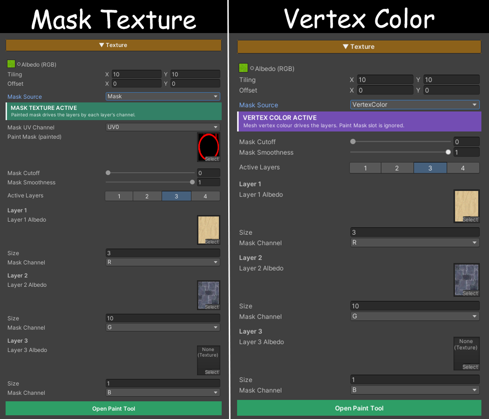

# PaintMode - Tools

## ShowcasePaintMode - Control


## ShowcasePaintMode - Texture


## ShowcasePaintMode - Brush


# PaintMode - Tools

### Mask Source
- เลือกว่า "ข้อมูลการระบาย" เก็บอยู่ที่ไหน สลับด้วย keyword ตอน build ไม่ใช่ค่า runtime
- Mask = เก็บใน texture (_PaintMask) ระบายละเอียดได้เท่าความละเอียดของ texture ไม่ผูกกับจำนวน vertex แต่ mesh ต้องมี UV ที่สะอาดในช่องที่เลือก และต้องมีไฟล์ mask เพิ่มในโปรเจกต์
- Vertex Color = เก็บลง vertex color ของ mesh ตรงๆ ไม่ใช้ texture ไม่ใช้ UV เลย เบากว่า และ mesh ที่ศิลปินระบาย vertex color มาจาก DCC จะขึ้นให้เห็นทันที แต่ความละเอียดถูกจำกัดด้วยความถี่ของ vertex
- หากมีข้อมูลอยู่ทั้ง Mask และ Vertex Color จะแสดงผลตามที่เลือกเท่านั้น
- ระบบ Grass จะอ่านตามค่านี้ พอสลับ Mask Source ระบบจะ re-sample หญ้าทุกกอใหม่ให้อัตโนมัติ

### Active Layers (1-4)
- เลือกว่าจะใช้กี่ Layer ซึ่ง Layer ที่ไม่ถูกใช้จะถูกซ่อน
- สามารถใส่ Texture ในแต่ละ Layer ได้ว่าจะใช้ Texture ไหนในแต่ละช่อง
- สามารถปรับ Size ของ Texture ได้

### Mask
- สามารถตั้งชื่อไฟล์ Mask Texture ได้  โดยที่หลัง Paint เสร็จจะ Export ให้ อัตติโนมัติ
- สามารถตั้ง Resolution ได้ (512, 1024, 2048)
- ระบุตำแหน่งที่ตั้งได้ว่าหลังจาก Paint เสร็จแล้วไฟล์ Mask Texture จะไปถูกเก็บไว้ที่ไหน
- New Mask : สร้าง Mask Texture ใหม่
- Clear : ล้างข้อมูลเก่าทั้งหมดใน Mask Texture แผ่นเดิม
- Revert to Saved : ย้อนกลับถึงจุดที่ Save
- Undo : สามารถย้อนกลับได้ทั้งหมด 8 ครั้ง หรือ สามารถกดปุ่ม Ctrl + Z ได้
- Debug Mode : สามารถใช้งานได้เมื่อเปิด Start Painting เท่านั้น

# PaintMode - Material

### Albedo (RGB) / Tiling / Offset
- Texture ฐานของ material ตัวนี้ คือสิ่งที่เห็นในบริเวณที่ ยังไม่ได้ระบาย ทุก Paint Layer วางทับลงบนตัวนี้อีกที
- Tiling/Offset เป็นของ Unity มาตรฐาน (_MainTex_ST) มีผลกับ Albedo ฐานเท่านั้น ไม่เกี่ยวกับ Layer
- ถ้าเปิด Triplanar ช่องนี้จะถูกแทนด้วย World Tiling + Blend Sharpness

### Parameters
- Mask Cutoff = ร่นขอบเข้า ยิ่งเพิ่ม รอยที่ระบายจางๆ จะหายไป เหลือแต่ตรงที่ระบายหนัก ใช้เก็บงานแทนการเอาแปรงไปลบเอง
- Mask Smoothness = ความนุ่มของขอบ ค่าสูง = ขอบนุ่ม ไล่สีเนียน ค่าต่ำ = ขอบคม เข้าใกล้ 0 จะเป็นขอบตัดแข็งแบบ 2 สีชัดๆ
