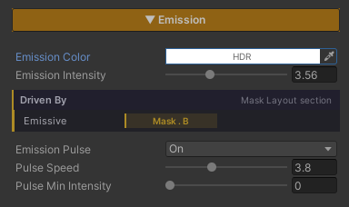

# Emission

Make parts of a surface **give off their own light** — crystals glowing in a cave, house windows lit at night, a neon sign, cracks in rock with lava behind them, mushrooms glowing deep in a forest.

This light **does not depend on the scene's lighting**. It is added after all the lighting has been worked out, so anything emissive stays bright even in full shadow — which is how it should be. A lamp does not go out because it is standing in the shade.

There is also **Emission Pulse** built in as a sub-feature, for light that beats up and down on a rhythm, with no script and no animation to author.

## Showcase Emission


---

## Setup

Turn on the **Emission** feature in the Features grid at the top of the Inspector and the **Emission** section appears.

It ships **off**, and while it is off these calculations are stripped out of the compiled shader.

---

## Parameters

- **Emission Color** (default white, an **HDR** field) — the colour of the light given off. This field accepts values above 1 through the Intensity multiplier in the colour picker, which is the range Bloom picks up and blooms
- **Emission Intensity** (`0–10`, default `1`) — the brightness. Push it past `1` to reach into HDR range so Bloom can take over

### Emission Pulse

A sub-feature with its own on/off switch, independent of the parent. Off by default; turning it on reveals two values.

- **Pulse Speed** (`0.1–10`, default `1`) — how fast the light beats
- **Pulse Min Intensity** (`0–10`, default `0`) — the brightness at the dimmest point of the beat

The beat is a sine wave running between **Pulse Min Intensity** and **Emission Intensity**. Put simply, Intensity is the bright end and Pulse Min is the dim end.

- Pulse Min at `0` = fades out completely and comes back — right for a blinking warning light
- Pulse Min close to Intensity = a gentle breathing beat — right for a magic crystal

---

## Choosing What Glows

Left alone, **the whole surface glows**, which suits objects that emit across their entire body — a lamp, a crystal.

To glow only in places — windows on a house wall, cracks in a boulder — wire it to a **Feature Mask** channel in the **Mask Layout** section. White in the mask means full glow, black means none.

Underneath the sliders is a strip reporting whether the whole surface is glowing or which channel it is currently reading.

> **The Env Shader's default is to glow across the whole surface**, unlike ZLZ Anime Shader where a mask has to be present before the effect does anything. If you turn Emission on and the whole object lights up unintentionally, that means no mask is wired yet.

---

## Cost

**No extra texture reads.** Both the Feature Mask and the surface colour have already been sampled at earlier stages; this feature itself is just a few multiplies and an add.

Emission Pulse adds a sine per pixel, which is close to free, and the whole block is stripped out when that sub-switch is off.

**The single Feature Mask is shared with Metallic and Smoothness**, so using Emission alongside those two costs no additional texture at all. That is the main reason the mask system is built this way.

---

## Works With Other Features

### Bloom
Emission does not make light bleed on its own — it only pushes colour values above 1. The bleed itself is **Bloom's** job, in URP's Volume. If you want a glow that spills, Bloom has to be enabled in the scene; otherwise you get a very bright colour with hard edges.

### Specular & Metallic
They share one Feature Mask on different channels, so you can plan which channel drives what. See [Specular & Metallic]({{ '/env/shader/specular/' | relative_url }}).

### Paint Mode and Triplanar
Emission reads the surface colour after it has been fully assembled, so painting a layer over something or projecting it with Triplanar keeps the glow matching whatever is actually visible.

### Surface Accumulation
Snow settling over a surface replaces the colour underneath it, so an area that was glowing dims as it gets covered. Which is right — a lit sign buried under snow really should go dark. See [Surface Accumulation]({{ '/env/shader/snow-accumulation/' | relative_url }}).

---

## Limits

- **It does not light anything around it.** The glow lives on the surface itself and will not brighten the ground beside it. For that, place a real Light as well
- **Black areas of the texture will not glow.** The emission is multiplied by the surface's own colour, and anything multiplied by zero stays zero — the area has to carry some colour in the texture first
- **The bleed depends on Bloom.** The feature does not produce it by itself
- **The beat is one fixed sine shape.** There is no choice of waveform and no per-object offset, so every object sharing a material pulses in unison
- **There is one Feature Mask bank.** The base surface uses a single RGBA texture, so at most 4 features can be wired at once
