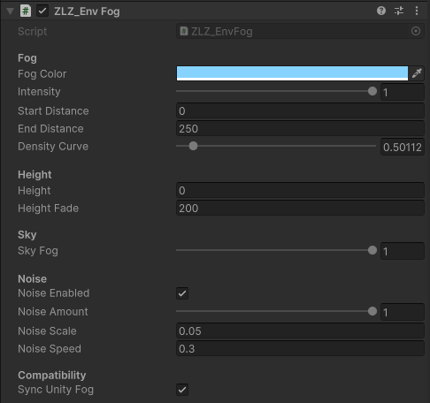

# Fog

**One atmosphere for the whole scene** — distance fades the world into a haze, a low mist lies over the ground with the hills and rooftops rising out of it, and the skybox picks up the same tone along the horizon, so land and sky meet with no seam.

Unlike the other features in the Environment Shader section, **Fog is not a material feature** — there is no toggle in the Features grid and nothing to set per material. Every value lives on a single component in the scene, and everything that draws fog reads from it. Ground, cliffs, props, grass and water all sink into the same haze, because they all use the same numbers.

## Showcase Fog


---

## Setup

Two things, and the second one is normally already done for you.

### 1. The component in the scene

Add **`ZLZ_Env Fog`** from `Add Component > ZLZ > Environment Shader > ZLZ_Env Fog`. It can live anywhere — an empty object called `Fog`, or the same object as the Environment Dashboard.

Or let the setup menu do it: **`GameObject > ZLZ > Setup ZLZ Global`** creates Grass, Wind **and** Fog together under a parent called `ZLZ_Global`. Running it again is safe — an older scene without a Fog only gains the piece it is missing, and nothing is ever duplicated.

> **Nothing is baked into the scene.** Every value lives on the component, so the fog rides Prefabs like any other component, and each level can carry its own atmosphere with it.

### 2. The Renderer Feature

The URP Renderer's feature list has to contain **`ZLZ Env Fog`**. It is installed automatically when the package is imported, along with the other ZLZ features — if it goes missing (deleted by hand, say), put it back with **Add Renderer Feature** on the URP Renderer.

The Renderer Feature itself **has nothing to configure**. Every value lives on the scene component.

> **No need to tick Depth Texture on the URP Asset.** The pass requests the depth texture itself, so the fog works without touching the URP Asset.

### Turning the fog off

Set **Intensity to `0`**, or **disable the component**, or **delete the component** — all three do the same thing: the pass is never enqueued, and everything that draws fog skips its own work.

A fog that is not in use costs nothing at all, so there is no reason to strip the component out of a scene that simply does not want fog today.

---

## Parameters

### Fog

- **Fog Color** (default a pale blue) — the colour everything fades into. Pick something close to the horizon of your skybox for the classic soft look; a darker, dirtier tone reads as dust or dusk
- **Intensity** (`0–1`, default `1`) — master strength, and the master switch as well. `0` turns **the whole system** off and skips every piece of fog work
- **Start Distance** (metres, default `40`) — where the fog starts to take hold. Anything closer than this is not touched at all
- **End Distance** (metres, default `250`) — where the fog is at full density
- **Density Curve** (`0.25–4`, default `1`) — shapes the density between Start and End **without moving either end**. Below `1` the fog arrives early (thicker up close, the far end unchanged); above `1` it stays clear longer and thickens late; `1` is an even ramp

> **End is already kept above Start for you.** Drag End below Start and the value snaps back to Start + 0.1 m, so the band can never invert.

### Height

- **Height** (world Y, default `0`) — at this height and below, the fog is at full density
- **Height Fade** (metres, default `200`) — how many metres above Height the fog takes to thin away to nothing

**This pair is what turns distance fog into weather.** Leave Fade at its large default and the height band is nearly full everywhere, which gives you ordinary distance fog. Shrink it to a few metres and you get **a low mist lying on the ground**, with hills, towers and rooftops rising out of it.

### Sky

- **Sky Fog** (`0–1`, default `1`) — how much fog the **skybox** picks up at the horizon. `1` blends land and sky together seamlessly, `0` leaves the skybox untouched

Sky pixels have nothing behind them, so distance is meaningless there — what decides is **the direction you are looking**. The fog gathers along the horizon and clears as you look up toward the zenith, and at the horizon it reaches exactly the strength the ground fog reaches at End Distance. That is why distant hills and the sky behind them meet without a visible line.

### Noise

Off by default. Turn it on and the fog **gathers and thins into slow drifting banks** instead of sitting perfectly even — the difference between "a fog setting" and weather.

- **Noise** (default off) — with it off the noise maths is genuinely skipped, not just hidden
- **Noise Amount** (`0–1`, default `0.5`) — how far the banks depart from the flat density. `1` lets it wander a full ±50%
- **Noise Scale** (default `0.015`) — the frequency of the pattern in world space. **Smaller values mean larger, calmer banks**
- **Noise Speed** (default `0.3`) — how fast the banks drift

The banks **drift diagonally** rather than pulsing in place, so the motion reads as weather rather than as a texture breathing. In the distance they **settle back into flat fog** — from halfway to End Distance the pattern fades out, because out there it is smaller than a pixel and could only shimmer, and a far fog wall should sit calm anyway.

### Compatibility

- **Sync Unity Fog** (default off) — see the next section

---

## Sync Unity Fog

The ZLZ fog covers **the opaque scene, the skybox and ZLZ water**, but it cannot cover particles or standard shaders from elsewhere, because those are transparent and never reach the depth texture.

Turn this on and the component drives Unity's own fog with matching values — colour, Linear mode and the same start distance — **while playing only**. Those materials then fade toward the same tone instead of standing out bright in front of a fogged valley.

> **The trade-off, stated plainly.** The ZLZ ground and grass shaders already apply Unity fog themselves. With this on, both are fogged twice inside the blend band, which reads as slightly denser fog than the values suggest. That is why it is **off by default** — turn it on when you have particles or outside materials that need to match, then re-tune Start / End with it enabled.

Two things it deliberately does not do:

- **It never touches edit mode.** Writing `RenderSettings` on every slider drag would leave the scene dirty, so the bridge only runs in play mode
- **Your project's own fog settings survive.** They are captured once and restored the moment this stops driving

---

## Limits

- **VR is not supported yet** — a fullscreen triangle under stereo needs its own path, so while XR is enabled the pass switches itself off. The fog inside the water shader still runs, so water in a VR scene stays consistent with itself
- **Transparent materials are not fogged**, apart from ZLZ water. Glass, particles and transparent shaders from elsewhere never enter the depth texture — **Sync Unity Fog** is the answer for those
- **Cameras rendering to a Render Texture are skipped**, as are preview cameras, reflection probes and the mirror camera of Planar Reflection. **The Scene view is allowed through**, so you can tune the fog and watch it as you go
- **One fog per scene.** It is an atmosphere, not a per-material or per-volume effect. With two components in one scene, the one enabled last is the one driving
- **This is not volumetric fog.** There are no light shafts and no scattering around lights — it is a haze computed from distance and height, which is what a stylised scene wants and what stays viable on Mobile
