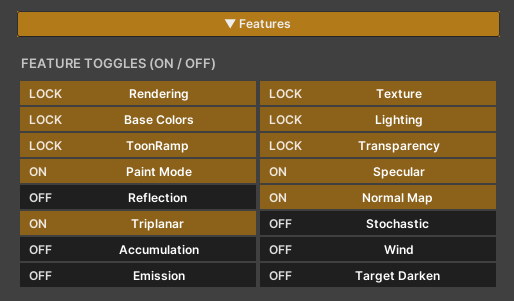
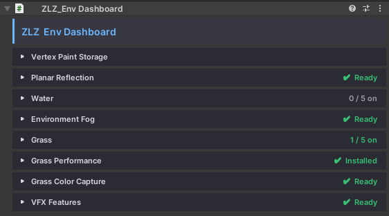
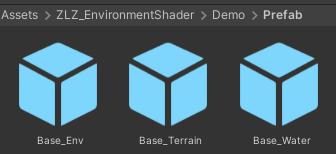
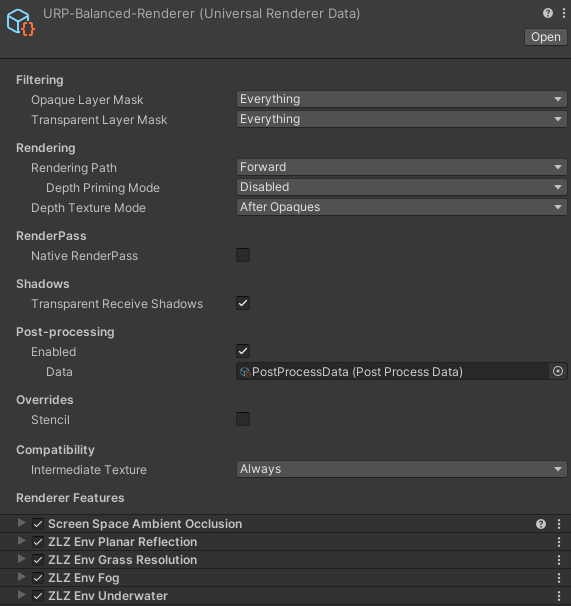

<!-- DRAFT — ยังไม่ขึ้นเว็บจริง. พรีวิว: jekyll serve --unpublished. พร้อมขึ้นเว็บ: ลบ published: false -->

# ZLZ Environment Shader

<!--  -->

`ZLZ_Environment_Shader` is the main surface shader of the package. It renders everything you sculpted yourself — ground, cliffs, rocks, trees, leaves, buildings, props — every mesh that comes out of Maya or Blender runs on this one shader.

The package ships three shaders, each with its own clearly separated job:

| Shader | Used for |
|---|---|
| **ZLZ/Environment/Shader** | Every general surface |
| **ZLZ/Environment/Grass** | The blades and flowers the Grass system plants |
| **ZLZ/Environment/Water** | Water surfaces |

- Path : `Assets/ZLZ_EnvironmentShader/Shaders/Core/ZLZ_Environment_Shader.shader`
- Inspector : a dedicated ZLZ GUI (`ZLZEnvShaderGUI`) — the same layout and the same habits as ZLZ Anime Shader

---

## What This Shader Solves

- **Not tied to Unity Terrain** — paint up to 4 texture layers onto meshes you sculpted yourself. A cliff leaning at 70 degrees can be painted. A cave with a ceiling can be painted. Neither is something Terrain can do
- **Paint data stored two ways** — into a Mask Texture, or into the mesh's Vertex Colors. Pick whichever suits your pipeline (Vertex Color costs you no extra texture at all)
- **Four customisable brushes** — painting normally means Unity Terrain, where the brush is whatever Unity gives you. Here one slot is the built-in soft circle and the other three take any Texture2D you drop on them, so shaping your own brush takes seconds
- **The anime look is the baseline, not an add-on** — Shadow Color and ToonRamp Smoothness are part of the locked core, so an environment sits next to a ZLZ Anime Shader character correctly with no tuning
- **Turning a feature off really removes it** — every disabled feature is stripped out of the compiled shader variant, not multiplied by zero. A material using only Albedo and ToonRamp ends up about as cheap as a plain unlit shader
- **Works with URP the way an environment shader should** — Lightmaps, Shadowmask, Subtractive, SSAO, URP Decals, Unity's own fog, GPU Instancing and the SRP Batcher all work with nothing to change

---

## How the Material Is Laid Out

Open a material and the **Features panel sits at the very top** — a grid of buttons that switch features on and off. Below it are the value sections, each appearing once its feature is enabled.

Features come in two groups.

### Group 1 — Locked (6 sections, always on)

The structural sections. They cannot be turned off, and there is no reason to want to: they cost next to nothing.

| Section | What it controls |
|---|---|
| **Rendering** | Render Queue (Opaque / AlphaTest / Transparent), Blend, Cull Mode, ZWrite, ZTest, Alpha Clipping + Cutoff, Cast Shadow |
| **Texture** | Albedo, Tiling / Offset — and with Triplanar on, World Tiling and Blend Sharpness appear here instead |
| **Base Colors** | Base Color, Shadow Color, Texture Brightness |
| **Lighting** | Receive Shadow, Additional Light Intensity |
| **ToonRamp** | Toon Ramp Smoothness — how hard the edge between lit and shadowed areas reads |
| **Transparency** | Alpha Value, Shadow Alpha Clip + Cutoff |

> Beyond those six there is a **Mask Layout** section further down the list (it has no button in the Features panel). It decides which channel of the Feature Mask each of Metallic / Smoothness / Emissive reads from — see the Feature Mask section below.

### Group 2 — Optional (10 features you switch on and off)

| Feature | What it does |
|---|---|
| **Paint Mode** | Blend up to 4 texture layers over the base surface, each with its own albedo, normal, smoothness and metallic |
| **Specular** | A Blinn-Phong highlight, with a Toon Highlight mode that cuts it into a hard anime edge, and Metallic built in |
| **Reflection** | Adds the mirror-camera (Planar) tier on top of the probe reflection |
| **Normal Map** | Surface bump detail |
| **Triplanar** | Projects textures along the world axes, for meshes with no UVs or stretched ones |
| **Stochastic** | Removes the visible repeat when a texture tiles across a large surface |
| **Accumulation** | Snow / dust / moss settling on up-facing surfaces, with no mask to author |
| **Wind** | Vertex-stage foliage sway, driven by the material's own values or by the scene-wide wind |
| **Emission** | Surfaces that give off their own light, with an optional pulse |
| **Target Darken** | Dims the whole scene to spotlight a target, driven from script at runtime |

> These features are meant to be set while authoring, **not switched at runtime** — flipping one asks the shader to compile a new variant. Target Darken is the exception; it was built to be driven from code.

---

## Feature Mask — One Texture, Three Features

Metallic, Smoothness and Emissive do not each carry their own texture. They share a single **Feature Mask (RGBA)**, and each one picks for itself whether it reads the R, G, B or A channel.

So a wet rock that needs metalness, gloss and a glowing seam costs **one extra texture** instead of three — saving both VRAM and the number of texture reads the GPU has to make.

And when a feature's channel is set to **None**, its slider simply applies evenly across the whole surface. If no feature uses the mask at all, the GUI strips the texture read out of the shader for you, leaving no cost behind.

---

## ZLZ_Env Dashboard — The Piece That Installs Everything

Materials using this shader should always live **under a ZLZ_Env Dashboard**.

The reason is that Environment features do not end at the material. Reflection needs a Renderer Feature plus a component on the floor. Fog needs both a Renderer Feature and a controller in the scene. Grass needs a ground-colour camera and a renderer of its own. Asking a user to install each of those by hand in the URP Asset is easy to get wrong — and the symptom when it goes wrong is "I turned the feature on and nothing happened", which is the hardest kind of problem to trace.

The Dashboard solves this by **installing all of it the moment the component is added**, and by watching for any piece that goes missing afterwards.

- Add it from `Add Component > ZLZ/Environment Shader/ZLZ_Env Dashboard`
- Or right-click a GameObject and choose `ZLZ > Setup Env Dashboard`

---

### The Dashboard Sections

Every section carries a status strip telling you whether its pieces are complete. When something is missing, the button that repairs it is right there — no hunting through the URP Asset.

| Section | What you can do |
|---|---|
| **Vertex Paint Storage** | See where each painted mesh keeps its data and which source model file it is linked to — edit the model in Maya/Blender, re-import, and the paint follows it across |
| **Planar Reflection** | Status of the Renderer Feature, URP_Reflection and the floor components, with a `Repair Reflection Setup` button |
| **Water** | Every water body listed, toggled on and off one at a time, its material managed, and the Foam Flow baked |
| **Underwater** | Status of the Renderer Feature behind the underwater view |
| **Environment Fog** | Status of the fog Renderer Feature, plus a button that creates the Fog Global in the scene |
| **Grass** | The heart of the grass system — choose which surfaces grow grass, manage Grass Types, paint extra by hand, `Grow All` / `Clear All`, and set the ground colour |
| **Grass Performance** | Switch on the half-resolution grass pass |
| **Grass Color Capture** | Status of the ground-colour camera, with a repair button |
| **VFX Features** | Target Darken settings for this group |

---

### Components the Dashboard Adds for You

| Component | Added to | Why |
|---|---|---|
| `ZLZ_EnvPlanarReflectionPlane` | Every floor under the Dashboard whose material has Reflection on | Tells the mirror camera where the reflecting plane is |
| `ZLZ_EnvWater` | Every mesh already wearing a water material | Holds what a material cannot — the wave rhythm curve, and that pond's own underwater fog |
| `ZLZ_EnvGrass` | The Dashboard itself | The root of the grass system |
| `ZLZ_EnvGrassColorCamera` | The Dashboard itself | The camera that samples ground colour so grass blends into the surface below it |
| `ZLZ_EnvVFX` | The Dashboard itself | Receives the Target Darken calls from your game code |

The last two grass pieces stay **hidden until you actually start growing grass** — a bare enable checkbox on idle plumbing only invites turning half a system on by hand.

---

### Split the Scene Into 3 Dashboards : Terrain / Env / Water

The recommended layout is three groups, one Dashboard each (see `Demo/Prefab/Base_Terrain`, `Base_Env` and `Base_Water` for a working example).

| Dashboard | What lives inside | Which shader |
|---|---|---|
| **Terrain** | Ground, cliffs, landscape — the surfaces that grow grass, take painted textures, and reflect when wet | **ZLZ_Environment_Shader** + ZLZ_Environment_Grass |
| **Env** | All props — trees, leaves, rocks, buildings, mushrooms, set dressing | **ZLZ_Environment_Shader** |
| **Water** | Every water body in the scene | ZLZ_Environment_Water |

`ZLZ_Environment_Shader` therefore belongs under both Terrain and Env — which one depends on what the piece is *for*, not on which shader it runs.

The split is not just tidiness, it changes behaviour: a Dashboard works on **every mesh underneath it**. Keep them separate and the Terrain Dashboard only ever sees surfaces that should grow grass, while the Water Dashboard only ever sees water — with nothing crossing over.

---

### Renderer Features the Dashboard Installs

Adding a Dashboard installs these four Renderer Features straight away — and installs them on **every Quality Level**, not only the tier that happens to be active.

| Renderer Feature | Installed for |
|---|---|
| **ZLZ Env Planar Reflection** | The mirror-camera reflection tier — shared by wet floors and water alike |
| **ZLZ Env Fog** | The scene atmosphere : distance haze, ground mist, and a sky that matches |
| **ZLZ Env Grass Resolution** | The grass performance mode — drawing grass below full resolution and compositing it back |
| **ZLZ Env Underwater** | What the camera sees while submerged : underwater fog, and the transition on the way down |

It also creates **two extra renderers** that do not ship with the package but are generated inside your project:

- **URP_Reflection** — a renderer used only by the mirror camera (with grass set to Quarter), so the reflection camera cannot recurse into itself, and so the reflected image never costs what the main image costs
- **Grass Colour Capture Renderer** — a bare renderer for the top-down camera that samples ground colour for the grass

> **Installed at import time.** This runs on package import too, so you do not have to add a Dashboard first — open a demo scene and it already looks right. On a version update, existing projects pick up any newly added Renderer Feature automatically. Every step is idempotent: run it any number of times and nothing is ever duplicated.

---

### Scripts the Dashboard Does Not Manage

Two groups sit outside the Dashboard, because their scope is different.

**Object level — on the things that move, not on the scenery**

| Component | Goes on |
|---|---|
| `ZLZ_EnvGrassInteractor` | A character or object that should part the grass as it walks through |
| `ZLZ_EnvWaterInteractor` | A character or object that should send out ripples on touching the water |
| `ZLZ_EnvWaterFloater` | Anything that should ride up and down on the surface — a boat, a buoy, a log |

**Scene level — one each per scene, shared by every Dashboard**

| Component | What it does |
|---|---|
| `ZLZ_EnvWindController` | The scene wind that trees, leaves and grass all sway to together |
| `ZLZ_EnvGrassController` | LOD distances and Quality Presets for all the grass in the scene |
| `ZLZ_EnvFog` | The scene's fog values |
| `ZLZ_EnvDarkenManager` | Drives the scene darken from game code, with a settings asset for its timing |

The first three are created together in one click from `GameObject > ZLZ > Setup ZLZ Global`, which groups them under a GameObject named `ZLZ_Global`.

> The Dashboard **deliberately does not create the Global for you.** A GameObject that appeared in the scene simply because you opened it would leave every scene you merely looked at dirty and asking to be saved, with nothing actually changed.

---

### The Dashboard Costs Nothing at Runtime

The Dashboard **holds no data of its own and runs no code at runtime** — the real data lives on the materials, in the `ZLZ_EnvGrassData` asset, and in the link registry. All of the UI is editor-side code that is compiled out of builds.

Two things follow from that:

- In a shipped game it is an empty marker that costs no CPU at all, and platforms that strip unused scripts lose nothing by dropping it
- The automation still works with no scene open, and works the same whether the Dashboard lives in a scene or inside a Prefab

---
