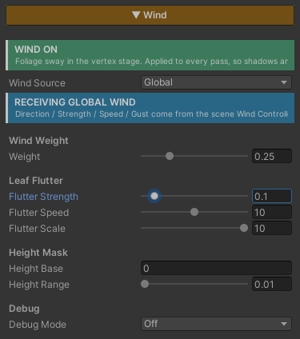

# Wind

Make **trees, bushes and leaves move with the wind** by displacing vertices in the vertex stage. The tip leans with the wind while the base stays planted.

The motion is two layers stacked — **Trunk Sway**, the slow wide bend along the wind direction, and **Leaf Flutter**, the fast small shimmer of individual leaves riding on top of it.

What makes it usable in practice is that **every pass moves together** — the pass that draws the image, the shadows, and the depth. The shadow cast on the ground sways with the tree instead of sitting still while the tree moves.

## Showcase Wind


---

## Setup

Turn on the **Wind** feature in the Features grid at the top of the Inspector. The **Wind** section appears, with a green **`WIND ON`** badge reporting its state.

The only thing you have to set afterwards is the **Height Mask**, to match the plant's actual height (see below). Everything else moves the moment you switch it on.

> **There is no mask to paint.** The system uses each vertex's height relative to the model's pivot to decide how much it should move. If the tree's pivot sits at its base as usual, it works straight away.

---

## Wind Source — Decide Where the Wind Comes From

The first value in this section determines which sliders appear below it.

### Local
This material carries its own wind — direction, strength, speed and gust size. Good for a single hero plant that wants its own rhythm.

### Global
The **ZLZ_Env Wind Controller** placed in the scene owns direction, strength, speed and gust, and this material keeps one value: **Weight**, how much of that wind it catches.

The payoff is a scene that moves as one — the wind rises and settles everywhere at the same moment, grass and trees together, tuned from a single place. See [Grass Global Wind]({{ '/env/grass/grass-global-wind/' | relative_url }}).

> **Setting Global with no Controller in the scene does not break anything** — the material falls back to its own Local values, and the Inspector warns you and tells you how to add one.

**Whichever mode you pick, Leaf Flutter and Height Mask always stay on the material**, because those two describe that particular plant's character rather than the wind's.

---

## Parameters

### Trunk Sway — Local mode only

- **Strength** (`0–2`, default `0.3`) — how far the tip leans with the wind, in world units
- **Speed** (`0–20`, default `1`) — the sway rate. Low = a lazy drift, high = a brisk wind
- **Direction (deg)** (`0–360`, default `0`) — the wind's heading on the ground plane, in degrees. One dial sweeps the whole compass
- **Gust Scale** (`0–10`, default `0.2`) — spreads a travelling gust across space so neighbouring plants fall out of sync. `0` = every plant sways in lockstep

### Wind Weight — Global mode only

- **Weight** (`0–1`, default `1`) — how much of the scene wind this material catches. `1` = full, `0` = ignores it. Use it to let low bushes move less than tall trees under the same wind

### Leaf Flutter — both modes

- **Flutter Strength** (`0–1`, default `0.1`) — the fast shimmer layered on top of the sway. `0` = off, which is **the cheapest option** and right for solid trunks that should not have fluttering leaves
- **Flutter Speed** (`0–20`, default `4`) — how quickly the shimmer runs
- **Flutter Scale** (`0–10`, default `1`) — its spatial frequency. Higher = finer, more independent per-leaf motion

### Height Mask — both modes

- **Height Base** (default `0`) — the object-space height at which the bend starts. Anything below it stays planted
- **Height Range** (`0.01–20`, default `2`) — how far above the base the bend ramps up to full. **Match it to the plant's real height**

The ramp is not linear — it eases in from the base, so the trunk reads solid and the tip reads supple, rather than the whole plant leaning by the same amount.

### Debug

- **Debug Mode** — set it to **Height Mask** to paint the sway amount as greyscale, **black at the base and white at the tip**, so Height Base and Height Range can be dialled by eye instead of guessed. Set it back to **Off** for production

---

## How Trunk Sway and Leaf Flutter Differ

The two layers differ in **where their timing comes from**, and that is what decides how each one looks.

| | Trunk Sway | Leaf Flutter |
|---|---|---|
| Timing read from | the plant's position in the world | each individual vertex's position |
| Result | the whole plant leans as one piece | each leaf jitters out of step |
| Character | slow, wide | fast, small |

Because Trunk Sway reads the plant's position, the whole plant leans together as a single object, and plants standing in different places fall out of step by themselves — which is what reads as a gust travelling across a forest.

Leaf Flutter reads the vertex position instead, so neighbouring leaves shimmer on different beats, giving a sparkle that a whole-plant lean cannot produce.

---

## Cost

All of it runs in the **vertex stage**, not per pixel, so the cost scales with the model's vertex count rather than how much of the screen it covers. A large tree close to the camera is no more expensive than the same tree far away.

**No texture is read at all.** The gust pattern is generated in the shader, so there is no noise map to prepare.

Worth knowing: this runs in **every pass** — image, shadow and depth — so the vertex displacement is recomputed in each of them. That is the price of having shadows sway with the tree instead of standing still.

The part you can drop for free is **Leaf Flutter** — set Flutter Strength to `0` and that whole block is skipped. Right for trunks, rocks, or anything that should not have leaves shimmering anyway.

With the feature off, the code is stripped out of the compiled shader entirely.

---

## Works With Other Features

### Grass
Grass runs on its own shader, but **reads the wind from the same Controller** when both are set to Global. Grass and trees in one scene therefore move on the same beat, rising and settling together.

### Surface Accumulation
They work at different stages and do not collide — Wind moves vertex positions, while Accumulation decides from the direction a surface faces. Snow resting on a branch sways with the branch without sliding off it. See [Surface Accumulation]({{ '/env/shader/snow-accumulation/' | relative_url }}).

### Normal Map and Specular
Both run per pixel, after the vertices have already moved, so surface detail and highlights travel with the moving model as you would expect.

---

## Limits

- **The motion is driven by object-space height.** If a plant's pivot is not at its base, compensate with Height Base
- **It leans along one wind direction.** It does not simulate twisting, or branches whipping independently of each other
- **It does not know about obstacles.** A tree behind a wall still catches the full wind
- **Height Range has to be set.** Left at the default on a much taller tree, the plant reaches full lean halfway up the trunk. Use Debug Mode to see it
- **Characters running past do not push the wind.** It is a signal computed from time and position, with no interaction from anything moving through it
