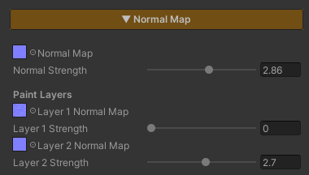

# Normal Map

Add surface relief without spending a single extra polygon — cracks in stone, mortar lines between bricks, wood grain, rippled sand. It all comes from a texture that says **which way each pixel faces**, and lets the light do the rest.

Environment work needs this more than most. Nearly every surface in a scene is a large plane carrying very few polygons, and without a Normal Map a wall or a floor is a dead-flat sheet that catches light identically across its whole area.

The thing worth knowing is that the Normal Map here **is not working alone** — it is the surface direction that everything downstream reads: Specular, Reflection, Paint Mode, Surface Accumulation, and on out to URP's SSAO and Decals.

## Showcase Normal Map


---

## Setup

Turn on the **Normal Map** feature in the Features grid at the top of the Inspector and the **Normal Map** section appears. Drop a texture in the slot and you are done.

The feature ships **off**, and while it is off its calculations are stripped out of the compiled shader entirely — nothing is left behind to pay for.

> **The texture has to be set to Texture Type `Normal map` in its Import Settings.** Otherwise Unity does not compress it as a normal map and the result comes out wrong.

---

## Parameters

- **Normal Map** — the texture slot. It defaults to `bump`, which is a flat surface
- **Normal Strength** (`0–5`, default `1`) — how deep the relief reads. `0` = flat, as though nothing were assigned. `1` = exactly what the texture describes. Above `1` pushes it past the authored depth, useful for keeping detail readable at a distance

### Why There Is No Tiling / Offset

The Normal Map here **always samples the Albedo's UV** — and follows the Triplanar projection along with it when Triplanar is on. Its own Tiling / Offset never did anything, so the field is hidden rather than left sitting there as a dead control.

That is a design decision rather than a limitation. If the colour pattern and the relief pattern do not line up, the surface reads as wrong immediately. Forcing both onto the same UV rules that problem out from the start.

---

## Works With Other Features

### Paint Mode
With Paint Mode on, this section grows a **Paint Layers** block underneath, carrying a **Layer N Normal Map** slot and a **Layer N Strength** slider for every active layer. The number of slots follows Paint Mode's Active Layer Count, up to 4.

Everything to do with normals lives in this one section, so there is no jumping between two places in the Inspector.

**Each layer's Strength is independent of the base Normal Strength.** You can tune how deep the painted grass or dirt reads without touching the rock underneath it, and without re-baking a texture.

Painted layer normals blend over the base by each layer's mask weight at that point.

### Triplanar
There are two separate paths, and they **are never mixed** :

| Mode | How it is computed |
|---|---|
| **Triplanar off** | the base normal and every paint-layer normal stack in tangent space, then convert to world space in a single transform |
| **Triplanar on** | every normal is projected from the three world axes and resolved directly in world space |

So a cliff or a blockout mesh with no UVs still carries proper relief. See [Triplanar]({{ '/env/shader/triplanar/' | relative_url }}).

### Stochastic Sampling
With Stochastic on, the Normal Map goes through the same treatment as the Albedo — three taps per pixel blended together. The relief stops repeating in a visible grid **at the same time** as the colour does, rather than fixing one and leaving the other out of step.

### Surface Accumulation
Snow, dust or moss settling on a surface **flattens the relief underneath it** by the Accum Normal Flatten amount, which is what should happen: snow lying thick fills the mortar lines in. Wherever the cover is heaviest the surface reads smoothest, while the thinner edges still show the pattern beneath.

### Specular and Reflection
Both read the surface direction after the Normal Map has bent it, so highlights and reflections travel across the relief on their own with nothing extra to configure.

> If you already want the reflection to ripple, pick either the Normal Map or **Mirror Distortion** from [Planar Reflection]({{ '/env/shader/planar-reflection/' | relative_url }}) — running both stacks two patterns on top of each other and just reads as busy.

### SSAO, Decals and Screen-Space Outline
The same normal is written into the DepthNormals pass, so every URP system that reads surface direction from that buffer — **SSAO, URP Decals and Screen-Space Outline** — sees the surface exactly as the eye does, not the raw flat polygon.

SSAO's contact darkening therefore lands in the real grooves, and decals curve over the detail they sit on. This is handled for you; there is nothing to set up.

---

## Limits

- **The mesh needs tangents.** In the normal path (Triplanar off) the maths runs through the mesh's tangent basis, so a model imported without tangents comes out wrong. When a mesh has no UVs, or stretched ones, turn on Triplanar instead
- **It has no Tiling / Offset of its own**, as described above — it always shares the Albedo's UV
- **The texture has to be imported as a Normal map**, or the result is wrong
- **`0` is not the same as off.** Setting Normal Strength to `0` does flatten the surface, but the shader still samples the texture. When you are done with it, switch the feature off in the Features grid to actually strip the work out
