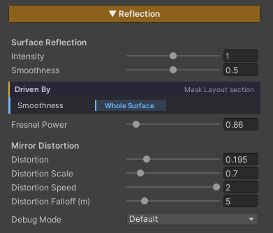
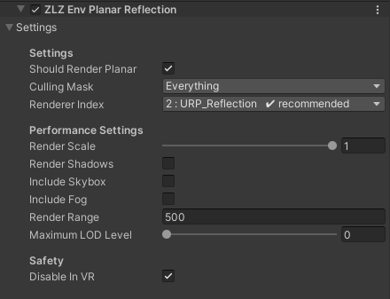

<!-- DRAFT — ยังไม่ขึ้นเว็บจริง. พรีวิว: jekyll serve --unpublished. พร้อมขึ้นเว็บ: ลบ published: false -->

# Planar Reflection

สะท้อนฉากจริงลงบนพื้นผิวแบบ **กระจกเงา** — พื้นหินเปียกหลังฝนตก พื้นหินอ่อนในโถงวัง หรือถนนยางมะตอยที่ยังไม่แห้ง จะเห็นเงาของกำแพง เสา และตัวละครที่ยืนอยู่ตรงนั้นจริงๆ ไม่ใช่แค่ก้อนแสงเบลอๆ จาก Reflection Probe

วิธีทำงานคือระบบจะวาง **กล้องอีกตัวหนึ่งสะท้อนข้ามระนาบ** แล้ววาดฉากซ้ำจากมุมนั้น ผลที่ได้จึงเป็นภาพสะท้อนที่ตรงตามฉากจริงทุกเฟรม วัตถุขยับ ภาพสะท้อนก็ขยับตาม

เพราะต้องวาดฉากซ้ำอีกรอบ Planar Reflection จึงเป็นฟีเจอร์ที่ **แพงที่สุดตัวหนึ่งของ Env Shader** ส่วน Performance Settings ใน Renderer Feature จึงถูกออกแบบมาให้ตัดต้นทุนตรงนี้โดยเฉพาะ และค่าเริ่มต้นก็ตั้งมาแบบประหยัดไว้ก่อนแล้ว

## Showcase Planar Reflection
<!-- TODO: ถ่ายคลิปแล้วแทนบรรทัดนี้ด้วย include youtube-loop.html พร้อม id ของคลิป
     (เขียนเป็น Liquid tag ตรงๆ ไม่ต้องอยู่ใน comment — ดูตัวอย่างที่ env/shader/triplanar/index.md) -->

---

## Reflection ทำงานเป็น 2 ชั้น

การสะท้อนของ Env Shader แบ่งเป็นสองชั้นซ้อนกัน :

| ชั้น | ที่มา | สถานะ |
|---|---|---|
| **Reflection Probe** | Probe ที่เบคไว้ในฉาก | เปิดอยู่เสมอ ปิดไม่ได้ |
| **Planar Reflection** | กล้องกระจกที่วาดฉากซ้ำแบบเรียลไทม์ | เปิด/ปิดได้จากปุ่ม Features |

ชั้น Probe ทำงานให้ฟรีอยู่แล้วโดยไม่ต้องตั้งค่าอะไร ส่วน Planar Reflection คือชั้นที่ **ซ้อนทับลงไปอีกที** เมื่อคุณต้องการภาพสะท้อนที่คมและตรงกับฉากจริง

> ถ้าพื้นผิวนั้นไม่ได้ต้องการความคมระดับกระจกเงา การใช้ Reflection Probe อย่างเดียวมักจะพอ และไม่มีต้นทุนเพิ่มเลย

---

## Setup

Planar Reflection ต้องครบ **สองฝั่ง** ขาดฝั่งใดฝั่งหนึ่งจะไม่เห็นภาพสะท้อน

1. **ฝั่ง Material** — เปิดฟีเจอร์ **Reflection** จากปุ่มกริด Features ด้านบนสุดของ Inspector
2. **ฝั่ง URP Renderer** — ต้องมี Renderer Feature ชื่อ **`ZLZ Env Planar Reflection`** อยู่ในลิสต์

เมื่อเปิดฝั่ง Material แล้ว หัวข้อ **Reflection** จะโผล่ขึ้นมาใน Inspector พร้อมค่าทั้งหมดที่อธิบายด้านล่าง

---

## Parameters — Material

### Surface Reflection

- **Intensity** (default `1`) — ความเข้มของภาพสะท้อนที่ผสมลงบนพื้นผิว ยิ่งสูงยิ่งเห็นภาพสะท้อนชัด ยิ่งต่ำภาพสะท้อนยิ่งจางลงไปกับสีพื้นผิวเดิม
- **Smoothness** (default `0.5`) — ความเนียนของผิว ค่าสูง = ผิวเรียบเหมือนกระจก ภาพสะท้อนคมชัด ค่าต่ำ = ผิวด้าน ภาพสะท้อนฟุ้งกระจาย

### Driven By

เลือกว่าจะให้ภาพสะท้อน **ปรากฏตรงไหนของพื้นผิว**

- **Smoothness** — อ่านจากแชนแนล Smoothness ของ Feature Mask ทำให้สะท้อนเฉพาะบริเวณที่คุณระบายไว้ เหมาะกับพื้นที่เปียกเป็นหย่อมๆ เช่นแอ่งน้ำบนถนน
- **Whole Surface** — สะท้อนทั้งผิวเท่ากันหมด ไม่ต้องใช้ Mask

> โหมด **Smoothness** ต้องมี Feature Mask อยู่ในหัวข้อ **Mask Layout** ก่อน ถ้ายังไม่ได้ใส่ ให้ใช้ **Whole Surface** ไปก่อน หรือดูวิธีแพ็คมาสก์ได้ที่หัวข้อ Mask Layout

- **Fresnel Power** (default `0.86`) — ควบคุมว่าภาพสะท้อนจะแรงขึ้นแค่ไหนเมื่อมองผิวในมุมเฉียง ตามธรรมชาติแล้วพื้นเปียกที่มองจากมุมราบจะสะท้อนแรงกว่ามองจากด้านบนตรงๆ ค่านี้คือตัวกำหนดความชันของการไล่นั้น

### Mirror Distortion

กลุ่มนี้ทำให้ภาพสะท้อน **บิดเป็นระลอก** แทนที่จะเป็นกระจกเงานิ่งสนิท ช่วยให้พื้นเปียกดูมีผิวน้ำบางๆ อยู่จริง

- **Distortion** (default `0.195`) — ความแรงของการบิด `0` = กระจกเงาเรียบสนิท ยิ่งสูงภาพสะท้อนยิ่งย้วย
- **Distortion Scale** (default `0.7`) — ขนาดของลายระลอก ค่าต่ำ = ระลอกใหญ่เป็นคลื่นกว้างๆ ค่าสูง = ระลอกถี่เล็ก
- **Distortion Speed** (default `2`) — ความเร็วที่ลายระลอกไหล ตั้ง `0` เพื่อให้หยุดนิ่ง
- **Distortion Falloff (m)** (default `5`) — ระยะเป็นเมตรที่การบิดจะค่อยๆ จางหายไป ระลอกใกล้กล้องยังเห็นชัด ส่วนที่ไกลออกไปจะนิ่งลง กันไม่ให้ภาพสะท้อนระยะไกลกลายเป็นนอยส์กระพริบ

### Debug Mode

ดรอปดาวน์สำหรับดูผลลัพธ์แยกส่วนขณะปรับค่า ค่าปกติคือ **Default** (แสดงผลจริง)

<!-- TODO: ลิสต์ตัวเลือกทั้งหมดในดรอปดาวน์ Debug Mode พร้อมอธิบายว่าแต่ละอันแสดงอะไร -->

---

## Parameters — Renderer Feature

ส่วนนี้อยู่บน **URP Renderer** ไม่ใช่บน Material — ค่าที่ตั้งตรงนี้จึงมีผลกับ **ทุกวัสดุที่ใช้ Planar Reflection ในฉากพร้อมกัน**

### Settings

- **Should Render Planar** — สวิตช์หลักของทั้งระบบ ปิดตัวนี้แล้วกล้องกระจกจะไม่วาดเลย ใช้เทียบ before / after หรือปิดทิ้งไว้ตอนโปรไฟล์ประสิทธิภาพได้ทันที
- **Culling Mask** (default `Everything`) — เลือกว่า Layer ไหนบ้างที่จะ **ปรากฏในภาพสะท้อน** นี่คือจุดที่ประหยัดได้มากที่สุด : ตัดพวกเอฟเฟกต์ ฝุ่น หรือ props เล็กๆ ที่มองไม่ออกอยู่แล้วในภาพสะท้อนออกไป ก็ลดของที่ต้องวาดซ้ำลงทันที
- **Renderer Index** (แนะนำ `URP_Reflection`) — เลือกว่ากล้องกระจกจะวาดด้วย Renderer ตัวไหนใน URP Asset ควรชี้ไปที่ Renderer เฉพาะกิจที่ตัด post-processing และ Renderer Feature อื่นๆ ออกไปแล้ว เพราะภาพสะท้อนไม่จำเป็นต้องผ่านเอฟเฟกต์ชุดเดียวกับภาพหลัก ระบบจะขึ้นป้าย **`✔ recommended`** ให้เมื่อเลือกตัวที่ถูกต้อง

### Performance Settings

ทั้งกลุ่มนี้มีไว้เพื่อ **ลดต้นทุนของการวาดฉากรอบที่สอง** ค่าเริ่มต้นตั้งมาแบบประหยัดไว้แล้ว

- **Render Scale** (default `1`) — ความละเอียดของภาพสะท้อน `1` = เต็มความละเอียด ลดลงมาแล้วภาพสะท้อนจะนุ่มขึ้นแต่เร็วขึ้นชัดเจน เป็นค่าที่ควรลองลดเป็นอันดับแรกเมื่อต้องการเฟรมเรต
- **Render Shadows** (default ปิด) — วาดเงาในภาพสะท้อนด้วยหรือไม่ ปกติปิดไว้เพราะเงาในภาพสะท้อนแทบสังเกตไม่เห็น แต่ราคาแพง
- **Include Skybox** (default ปิด) — ให้ภาพสะท้อนมีท้องฟ้าด้วยหรือไม่ เปิดเมื่อพื้นผิวหันขึ้นรับท้องฟ้าโดยตรง เช่นพื้นลานกลางแจ้ง
- **Include Fog** (default ปิด) — ให้หมอกของฉากมีผลกับภาพสะท้อนหรือไม่ เปิดเมื่อฉากใช้หมอกหนาจนภาพสะท้อนที่ไม่มีหมอกดูหลุดออกจากฉาก
- **Render Range** (default `500`) — ระยะไกลสุดที่กล้องกระจกจะมองเห็น ของที่ไกลกว่านี้จะไม่ถูกวาดลงในภาพสะท้อน ลดค่านี้ลงให้พอดีกับฉากช่วยตัดงานได้มาก
- **Maximum LOD Level** (default `0`) — บังคับให้ของในภาพสะท้อนใช้ LOD ที่หยาบลง เพื่อวาดโมเดลเวอร์ชันเบากว่าในรอบที่สอง

> **ลำดับที่แนะนำเมื่อต้องรีดเฟรมเรต** : ตัด **Culling Mask** ก่อน → ลด **Render Range** → ลด **Render Scale** → ค่อยขยับ **Maximum LOD Level** สามอย่างแรกลดงานลงโดยแทบไม่กระทบภาพที่ผู้เล่นเห็น

### Safety

- **Disable In VR** (default เปิด) — ปิด Planar Reflection อัตโนมัติเมื่อรันบน VR เพราะการวาดฉากซ้ำในโหมดสเตอริโอมีต้นทุนสองเท่า แนะนำให้เปิดค่านี้ไว้

---

## Works With Other Features

### Reflection Probe
ทั้งสองชั้นทำงานพร้อมกัน ไม่ใช่การเลือกอย่างใดอย่างหนึ่ง — Probe เป็นฐาน แล้ว Planar Reflection ซ้อนทับลงไป

### Water
ระบบน้ำใช้กล้องกระจกตัวเดียวกันนี้ และภาพสะท้อนของน้ำจะยึดกับ **ระดับน้ำนิ่ง** ไม่ใช่ระดับที่กำลังขยับ เพื่อไม่ให้ภาพสะท้อนเลื่อนขึ้นลงตามคลื่น ส่วนนี้จัดการให้อัตโนมัติ ไม่ต้องตั้งค่า ดูเพิ่มที่ [Water Waves]({{ '/env/water/water-waves/' | relative_url }})

### Normal Map
Normal Map บิดทิศของผิวจริง ภาพสะท้อนจึงบิดตามไปด้วย ถ้าต้องการระลอกบนภาพสะท้อนอยู่แล้ว ควรเลือกใช้อย่างใดอย่างหนึ่งระหว่าง Normal Map กับ **Mirror Distortion** ไม่งั้นลายจะซ้อนกันจนดูรก

### Triplanar
ไม่เกี่ยวข้องกัน — Triplanar เปลี่ยนวิธีแมปเท็กซ์เจอร์ ส่วนภาพสะท้อนคำนวณจากทิศของผิวและตำแหน่งกล้อง จึงใช้ร่วมกันได้โดยไม่ต้องปรับอะไร

---

## Limits

- **ต้องมี Renderer Feature เสมอ** — เปิดฟีเจอร์บน Material อย่างเดียวไม่พอ ถ้าไม่มี `ZLZ Env Planar Reflection` อยู่บน URP Renderer จะไม่มีภาพสะท้อนเกิดขึ้น
- **กล้องกระจกวาดกับระนาบคงที่** — Planar Reflection เหมาะกับพื้นผิวที่ **ราบ** พื้นที่โค้งหรือขรุขระมากๆ จะได้ภาพสะท้อนที่ไม่ตรงกับความเป็นจริง กรณีนั้นควรใช้ Reflection Probe แทน
- **มีต้นทุนคือการวาดฉากอีกหนึ่งรอบ** — ยิ่งฉากหนัก รอบที่สองก็ยิ่งหนักตาม ให้ใช้ Performance Settings ควบคุมเสมอ
- **VR ปิดอยู่โดยค่าเริ่มต้น** ผ่านสวิตช์ **Disable In VR**
- **กล้องที่เรนเดอร์ลง Render Texture, กล้องพรีวิว และ Reflection Probe จะถูกข้าม** — กล้องกระจกจะไม่ทำงานซ้อนกับกล้องพวกนี้

<!-- TODO: ยืนยันว่ามีข้อจำกัดเรื่อง Dashboard ติดตั้ง Renderer Feature ให้อัตโนมัติเหมือน Underwater หรือต้องเพิ่มเอง -->
