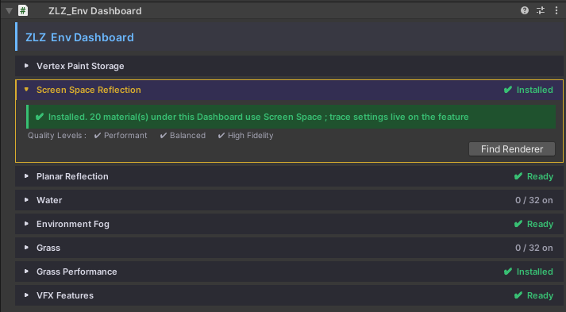
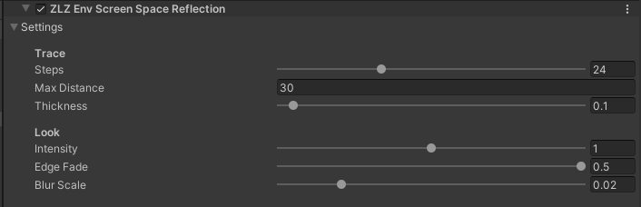

# Screen Space Reflection

> **New in v1.1.0.** v1.0.0 had [Planar Reflection]({{ '/env/shader/planar-reflection/' | relative_url }}) only.

Reflections on **any surface** — raised platforms, slopes, walls — with no reflection plane to set up. Each pixel traces its reflection through the frame already on screen. It is the **default Reflection Type** when you turn Reflection on.

## Showcase Screen Space Reflection


---

## Choosing a Reflection Type

Each material uses **one** method :

| | **Screen Space** | **Planar** |
|---|---|---|
| **Surfaces** | Any | Flat floors only |
| **Off-screen objects** | Not reflected | Reflected |
| **Cost** | One pass, no second render | Renders the scene twice |
| **Water** | — | Yes |

> Start with Screen Space. Switch to Planar for large flat floors where reflections vanishing at the screen edge would be noticed.

---

## Setup

1. **Material** — turn on **Reflection** in the Features grid. **Reflection Type** starts on `Screen Space Reflection`
2. **URP Renderer** — needs **`ZLZ Env Screen Space Reflection`**. The Dashboard installs it for you
3. **Scene** — add a baked **Reflection Probe** over the reflective area

> **Always pair it with a Reflection Probe.** SSR can only reflect what is on screen. Everything else — the screen edges and the area behind characters — shows the probe instead. Without one, those gaps show the Skybox.

---

## Parameters — Material

- **Intensity** (default `1`) — strength of the reflection
- **Smoothness** — shared with Specular. High = sharp, low = blurry, `0` = no reflection
- **Fresnel Power** (default `5`) — lower = visible from more angles, higher = grazing angles only
- **Reflection Type** — Screen Space or Planar

### Debug Mode

- **Default** — final result
- **Fresnel Mask** — how much reflection each pixel gets
- **Screen Space Trace** — white = hit, red = hidden behind an object, blue = off screen, green = facing the camera
- **Screen Space Only** — the traced reflection without the probe

---

## Parameters — Renderer Feature

Applies to every Screen Space material at once.

- **Steps** (default `24`) — trace quality. `24` for PC, `12` for Mobile
- **Max Distance** (default `30` m) — how far a ray can travel
- **Thickness** (default `0.1` m) — raise only if thin objects show holes in their reflection
- **Intensity** (default `1`) — strength of the traced reflection over the probe
- **Edge Fade** (default `0.12`) — fades reflections out near the screen edges
- **Blur Scale** (default `0.015`) — blur on rough surfaces

> Need frames back? Lower **Steps** first, then **Max Distance**.

---

## Limits

- Only reflects **what is on screen** — use Planar when off-screen reflections matter
- **Opaque** materials only
- **Water** always uses Planar Reflection
