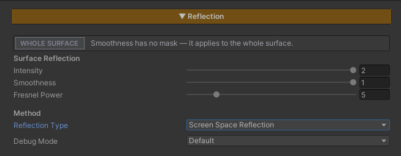

# Screen Space Reflection

> **New in v1.1.0.** In v1.0.0 the only reflection method was [Planar Reflection]({{ '/env/shader/planar-reflection/' | relative_url }}). From v1.1.0 each material chooses between the two.

Reflections that work on **any surface, at any height, facing any way** — a raised stone platform, a wet wall, a polished pillar, a stepped courtyard where every level has to reflect. No reflection plane to set up, no mirror camera, nothing to pick.

It works by letting **each pixel trace its own reflected ray through the frame that has already been drawn**. Where the ray lands on something on screen, that is what the surface reflects. Where it finds nothing, the pixel falls back to the Reflection Probe.

Screen Space Reflection is now the **default Reflection Type** — turning Reflection on in a material lands on it. Switch to Planar only for the floors that need to reflect things that are off screen.

## Showcase Screen Space Reflection


---

## Choosing a Reflection Type

Reflection in the Env Shader is two layers stacked on each other. The **Reflection Probe** is always there underneath; on top of it, each material picks **one** real-time method :

| | **Screen Space Reflection** | **Planar Reflection** |
|---|---|---|
| **How it works** | Each pixel traces through the frame already on screen | A mirror camera redraws the scene reflected about the floor |
| **Surfaces** | Any — raised platforms, slopes, vertical walls | Flat floors on one plane |
| **Off-screen objects** | Cannot reflect them — falls back to the probe | Reflects them |
| **Setup** | The Renderer Feature only | The Renderer Feature + a Reflection Plane on each floor (added for you by the Dashboard) |
| **Cost** | One pass over the reflective pixels, no second scene render | A second render of the scene |
| **Mirror Distortion** | — | Yes |
| **Water shader** | — | Yes (water always uses Planar) |

The choice is **one per material**. Using both on the same surface would pay for two reflections and stitch two different images together at the screen edge, so the Inspector does not allow it.

> **Rule of thumb** : start with Screen Space. Switch a material to Planar when the player can see a reflection go missing at the edge of the screen — typically a large, flat, glossy floor with tall objects standing just out of view.

---

## Setup

Screen Space Reflection needs **both halves**.

1. **On the material** — turn on the **Reflection** feature in the Features grid at the top of the Inspector. **Reflection Type** starts on `Screen Space Reflection`
2. **On the URP Renderer** — the Renderer Feature **`ZLZ Env Screen Space Reflection`** has to be in the list

The Renderer Feature is installed for you on package import and by the **ZLZ_Env Dashboard**, on every Quality Level. If it is ever removed, the material Inspector shows an amber banner and the Dashboard's **Screen Space Reflection** section offers an `Install Screen Space Reflection Feature` button.

> **Nothing breaks without it.** If the Renderer Feature is missing or switched off, a Screen Space material simply shows its Reflection Probe — you lose the traced reflection, not the surface.

---

## Parameters — Material

The Reflection section is shared by both methods. With **Reflection Type** set to Screen Space, the Mirror Distortion group is hidden, since there is no mirror image to distort.

### Surface Reflection

- **Intensity** (default `1`) — how strongly the reflection blends onto the surface. `0` = none
- **Smoothness** — how polished the surface is, the same value the Specular section uses. High = a sharp, mirror-like reflection. Low = a soft, blurred one. `0` = matte, no reflection. With Paint Mode on, each layer's Smoothness blends over this, so water can reflect sharply while grass beside it reflects nothing
- **Fresnel Power** (default `5`) — how fast the reflection fades as the camera tilts from a grazing angle toward looking straight down. `2`–`3` = visible across more angles, `8`–`10` = grazing angles only

### Method

- **Reflection Type** — `Screen Space Reflection` or `Planar Reflection`. See [Choosing a Reflection Type](#choosing-a-reflection-type) above

### Debug Mode

A dropdown for inspecting the reflection while tuning. Set it back to **Default** before shipping.

- **Default** — the normal, final result
- **Fresnel Mask** — how much reflection each pixel is allowed, from the Fresnel angle and Smoothness together
- **Screen Space Trace** — what happened to each pixel's ray :
  - **White** — the ray hit something on screen
  - **Red** — the ray passed behind an object, so the true reflection is hidden
  - **Blue** — the ray left the screen without finding anything
  - **Green** — the ray turned back toward the camera, so there is nothing on screen for it to find
- **Screen Space Only** — the traced reflection by itself, without the probe fallback

---

## Parameters — Renderer Feature

This section lives on the **URP Renderer**, not on a material — so what you set here applies to **every Screen Space material in the scene at once**. Use **Find Renderer** in the Dashboard's Screen Space Reflection section to jump straight to it.

### Trace

- **Steps** (default `24`, range `4`–`64`) — samples taken along each reflected ray. More steps find thinner objects and reach further before the ray can skip over something; the cost rises in step with it. `24` suits PC, `12` suits Mobile
- **Max Distance** (default `30` m) — how far a ray travels before giving up and handing the pixel to the probe
- **Thickness** (default `0.1` m) — how far behind a surface a ray may pass and still count as hitting it. Keep it small : anything thinner than this (hair, railings, weapons) is read as solid and its reflection turns into a flat cut-out. Raise it only if reflections show holes on thin objects. `0.1` suits characters

### Look

- **Intensity** (default `1`, range `0`–`2`) — strength of the traced reflection over the probe. `1` = fully replaces the probe wherever the ray hits
- **Edge Fade** (default `0.12`) — the fraction of the screen over which reflections fade out toward the screen edges, where the frame runs out of picture. This hides the hard cut where a reflection would otherwise end
- **Blur Scale** (default `0.015`) — how soft the reflection gets on rough surfaces. Applied in full at Smoothness `0` and not at all at Smoothness `1`. Soft reflections read as polished stone, and they also hide tracing noise

> **Suggested order when you need frames back** : lower **Steps** first → shorten **Max Distance** → lower Smoothness or raise **Fresnel Power** on large surfaces seen from above, so fewer pixels need a trace at all.

---

## Performance

- **No second scene render** — unlike Planar Reflection, the scene is drawn once. The trace reads the colour and depth that URP already has for the frame
- **Only Screen Space materials pay** — the reflection pass is switched off on every material that does not use Screen Space, so those materials cost nothing extra
- **Invisible reflections are skipped** — where the Fresnel angle and Smoothness together leave almost no reflection (a floor seen from straight above, matte masked areas), the trace is skipped and the probe answers instead
- **Runs on every platform** — it is a plain fragment pass, so it works on WebGL, GLES, Metal and Vulkan alike

---

## Limits

- **It can only reflect what is on screen** — this is true of every screen-space reflection. Objects behind the camera or past the edge of the frame do not appear; the probe fills in there. When that matters, switch the material to [Planar Reflection]({{ '/env/shader/planar-reflection/' | relative_url }})
- **The area hidden behind an object cannot be reflected** — a ray that passes behind a character standing on the floor would need to see the surface behind that character, which the frame does not contain. That region takes the probe colour, and can show as a faint ghost of the character's outline. **Screen Space Trace** debug paints it red
- **The Renderer Feature is required for the traced reflection** — without `ZLZ Env Screen Space Reflection` on the URP Renderer, Screen Space materials show only their probe reflection
- **Opaque materials only** — the reflection pass is drawn for materials in the Opaque render queue
- **The Water shader does not use it** — water always reflects with Planar Reflection
- **Preview cameras, reflection probes and hidden cameras are skipped**, including the mirror camera of Planar Reflection. **The Scene view is allowed through**, so you can tune it and watch it as you go
