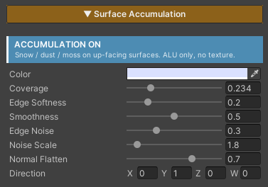

# Surface Accumulation

Settle **snow, dust or moss** onto the up-facing parts of a surface — a roof gone white while the walls stay clear, dust caught along the top edge of a rock, moss growing on the one side of a boulder that catches the light.

All of it is **pure arithmetic, with no texture involved at all**. No mask to author, nothing to paint by hand, nothing to bake. The shader compares the direction a surface faces against a direction you choose, and works out for itself where the cover belongs.

The advantage of doing it that way is that **rotating an object moves the snow with it**. Re-pitch a roof and the cover settles on whatever side now faces up — there is no mask to go back and fix.

## Showcase Surface Accumulation


---

## Setup

Turn on the **Accumulation** feature in the Features grid at the top of the Inspector. The **Surface Accumulation** section appears, with a blue **`ACCUMULATION ON`** badge reporting its state.

The defaults are already snow — a faintly blue-white cover falling from above — so it reads correctly the moment you switch it on, with nothing else to set.

---

## Parameters

- **Color** (default blue-white) — the colour of the cover. Near-white for snow, brown for dust, green for moss
- **Coverage** (`0–1`, default `0.5`) — the master amount. Higher reaches further down the slopes. **Both ends are absolute** — `0` leaves the surface completely clear, and `1` covers every face including the undersides
- **Edge Softness** (`0–1`, default `0.2`) — whether the snowline fades gradually or cuts crisply
- **Smoothness** (`0–1`, default `0.5`) — the surface response of the covered area. High = wet, shiny snow; low = dry, matte dust. This feeds straight into Specular and Reflection
- **Edge Noise** (`0–1`, default `0.3`) — breaks the edge so it is not an unnaturally clean band. `0` = a clean edge
- **Noise Scale** (`0.1–20`, default `5`) — the world size of the patches that break up the edge. Higher = finer break-up
- **Normal Flatten** (`0–1`, default `0.7`) — how much the cover smooths the bump detail underneath it
- **Direction** (default `(0, 1, 0)`) — where the cover settles. The default points along world up, so snow falls from the sky. Tilt it for moss on one particular wall

> **Leaving Direction empty at `(0,0,0)` will not break anything** — that case is guarded and falls back to world up.

---

## Cost

**Not one extra texture read.** The cost is arithmetic only, because the colour is flat and the edge break-up is generated in the shader.

The values it needs — the surface direction and the world position — are things the pixel is already carrying, so nothing extra has to be passed in.

The most expensive part is the three-dimensional noise, and that whole block is skipped when **Edge Noise is `0`**. If you wanted a clean edge anyway, you do not pay for it.

With the feature off, the code is stripped out of the compiled shader entirely.

---

## Works With Other Features

### Paint Mode and Triplanar
This feature runs after both of them, so it overlays the finished result no matter what the surface underneath was assembled from. A Triplanar cliff and a multi-layer painted floor both take snow the same way, with nothing to configure differently.

### Normal Map
Normal Flatten is what decides how far the cover smooths the relief beneath it. The most heavily covered areas read smoothest, while the thinly covered edges still show the original detail. See [Normal Map]({{ '/env/shader/normal/' | relative_url }}).

### Specular & Metallic
This section's Smoothness replaces the surface's own value by how much cover is present, so wet snow can be shiny while the rock beneath it stays matte. See [Specular & Metallic]({{ '/env/shader/specular/' | relative_url }}).

### Stochastic Sampling
They work on separate layers and do not interfere. Stochastic changes how the texture is read; this feature overlays afterwards, once the surface is fully assembled.
