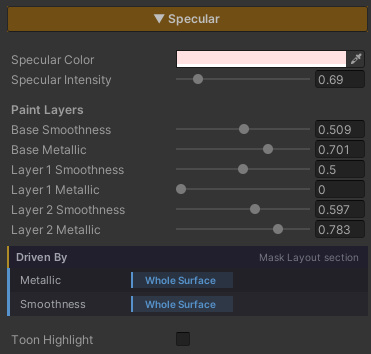

# Specular & Metallic

Control **how glossy** a surface is and **whether it is metal** — polished stone with a highlight sweeping across it, a steel pipe reflecting in its own brass colour, or a plain plaster wall that reflects nothing at all.

Both live in one feature because they answer the same question — **how does light bounce off this surface**. In the shader itself they sit in the same **Specular** block, not in separate places.

The highlight is **GGX, the same one URP Lit uses**, calibrated so that Specular Intensity `1` matches a standard URP Lit surface. You start from a physically correct base and push toward a stylized look from there, rather than the other way round.

## Showcase Specular & Metallic


---

## Setup

Turn on the **Specular** feature in the Features grid at the top of the Inspector and the **Specular** section appears with everything below in it, Metallic included.

It ships **off**, and while it is off these calculations are stripped out of the compiled shader.

> **Metallic only does anything while Specular is on.** With Specular off, Metallic is forced to `0` no matter where the slider sits.

---

## Parameters

- **Specular Color** (default white) — the colour of the highlight, multiplied on top of the light's own colour
- **Specular Intensity** (`0–5`, default `1`) — how strong the highlight is. `1` matches a standard URP Lit surface; above that is deliberate exaggeration for stylized work
- **Smoothness** (`0–1`, default `0.5`) — how polished the surface is. Low = matte, a wide faint highlight. High = polished, a small sharp one
- **Metallic** (`0–1`, default `0`) — `0` = an ordinary surface with a white highlight. `1` = metal

### What Metallic Actually Changes

This is not just a gloss dial. It changes three things about the surface at once, following URP's Metallic workflow :

| Part | As Metallic goes toward `1` |
|---|---|
| **The highlight** | shifts from white to **the Albedo's own colour** (brass gets a gold highlight) |
| **The reflection** | is tinted the same way, from both the Probe and Planar Reflection |
| **The diffuse body** | falls away almost entirely |

That last one surprises people, but it is correct — **a metal's colour lives in its reflections, not in its diffuse**. If you push Metallic to `1` and the object turns black, the scene has nothing for it to reflect; the settings are not wrong.

> **Metallic needs a scene with something to reflect.** If you are making metal, keep a Reflection Probe in the scene, or turn on [Planar Reflection]({{ '/env/shader/planar-reflection/' | relative_url }}) alongside it.

---

## Toon Highlight

A toggle at the very bottom of the section. It ships **off**, which gives the soft, physically-grounded GGX highlight. Turning it on blends toward a hard-edged anime highlight and reveals two sliders.

- **Step** (`0–1`, default `0`) — how hard the edge gets. `0` = still soft, `1` = a full anime step. It narrows the edge and blends in more of the stylized shape at the same time
- **Threshold** (`0–1`, default `0.5`) — where that edge falls along the highlight's curve, which is what decides whether the highlight reads large or small

It sits at the bottom because it is a styling accent for hero props, not part of everyday surface setup. Most environment surfaces should stay on GGX.

---

## Feature Mask — Per-Pixel Control

The Smoothness and Metallic sliders apply to the whole surface evenly. When you want **only part of a surface to be glossy or metal**, wire it to the Feature Mask.

The system uses a single RGBA texture as the mask bank for the base surface, with each channel (R/G/B/A) holding one feature's mask. You choose which feature reads which channel in the **Mask Layout** section, and the mask tiles with the Albedo.

Both Metallic and Smoothness default to **None**, meaning they are not wired to a channel yet and the sliders apply across the whole surface as normal.

Underneath the two sliders is a strip reporting which of them a mask is currently driving — it exists so a slider that appears to do nothing explains itself.

> Mask values **multiply** the slider rather than replacing it. If the slider is `0`, a fully white mask still gives you `0`.

**When no feature uses the mask at all, the shader does not sample that texture.** This is managed for you; there is nothing to strip out by hand.

---

## Works With Other Features

### Reflection
Reflection Probe lighting **is not exclusive to the Reflection feature** — turning on Specular alone already gives you probe reflections, scaled by Smoothness.

With **both Specular and Reflection off**, the surface stays fully matte and picks up no environment gloss at all, matching how a low-smoothness URP surface behaves.

Pixels with very low Smoothness skip the probe sample entirely, for free.

For a true mirror image you also need [Planar Reflection]({{ '/env/shader/planar-reflection/' | relative_url }}).

### Paint Mode
With Paint Mode on this section changes shape. Smoothness and Metallic move under a **Paint Layers** heading and are renamed **Base Smoothness** and **Base Metallic**, followed by **Layer N Smoothness** and **Layer N Metallic** for every active layer.

That makes the base surface and the painted layers read as one set — painted water glossy, the grass beside it matte, a steel plate metal, all inside a single material.

**Specular Color and Specular Intensity stay shared across the material**, not split per layer.

Every layer's Metallic starts at `0`, which keeps the natural reading — dirt painted over a steel floor is dirt, until the layer says otherwise.

### Normal Map
The highlight reads the surface direction after the Normal Map has bent it, so it travels across the relief on its own. See [Normal Map]({{ '/env/shader/normal/' | relative_url }}).

### Surface Accumulation
Snow or dust settling on a surface pulls Smoothness toward its own value by how thickly it has gathered, so a covered area takes on the gloss of what is lying on it rather than staying at the gloss of the surface underneath.

---

## Limits

- **Metallic does nothing while Specular is off** — the value is forced to `0`
- **Metallic with nothing to reflect goes black.** The scene needs a Reflection Probe or Planar Reflection
- **A masked Smoothness only applies while Specular is on.** With Reflection on but Specular off, the probe reflection uses the raw Smoothness slider without the mask
- **Masks multiply, they do not replace.** A slider left at `0` stays `0`
- **There is one Feature Mask bank.** The base surface uses a single RGBA texture, so at most 4 features can be wired at once
