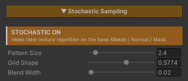

# Stochastic Sampling

Kill the **visible repeat** that shows up when one texture tiles across a large surface. The same rock, the same clump of grass, coming back at even intervals until the eye reads it as a grid.

The usual fixes are a bigger texture, or several textures swapped around — both cost VRAM and authoring time. This fixes the **way the texture is read** instead, without adding a single file.

And it does not trade the repeat away for blur. Most of the surface still comes through at full sharpness, just shuffled until the eye cannot find the rhythm; the blending is confined to narrow seams whose width you control with **Blend Width**.

## Showcase Stochastic Sampling


---

## Setup

Turn on the **Stochastic** feature in the Features grid at the top of the Inspector. The **Stochastic Sampling** section appears, with an orange **`STOCHASTIC ON`** badge reporting its state.

It ships **off**, because this one genuinely costs something (see Cost below). It is meant to be switched on for the surfaces that need it, not left on across a whole scene.

---

## Parameters

- **Pattern Size** (`1–20`, default `4`) — how often the texture re-randomizes. Higher = smaller random patches and more variation. **Raise it until the repeating grid disappears**, then stop
- **Grid Shape** (`0–1`, default `0.5774`) — shears the random lattice. The default suits most textures; **only touch it if a directional pattern still shows through**
- **Blend Width** (`0.02–1`, default `0.2`) — the **detail versus seams** dial. Low keeps a single sample dominant across most of a patch, so the Normal Map keeps its full depth and the Albedo its full contrast, at the price of tighter, more noticeable transitions between patches. High blends all three samples together and the surface goes flat and hazy

> **Raise Blend Width only as far as you need to** — until the transitions stop reading as edges — and then stop.

In practice **Pattern Size** and **Blend Width** are the two you tune. Grid Shape can be left alone.

---

## How It Works

UV space is split into a **triangular lattice**. Each cell shifts the texture lookup by its own random offset, and the three overlapping cells are sampled and mixed.

The random offset comes from hashing the cell coordinate directly, so a given cell always gets the same value — the pattern never crawls or flickers as the camera moves.

### The Hard Part Is the Seams

Mixing all three samples by their raw weight — the textbook form — makes **almost every pixel an average of three unrelated regions of the texture**. Every rock edge, crack and groove comes through at roughly a third of its strength, with faint ghosts of two other places laid over it.

The average colour survives, but the structure does not. The surface goes flat and hazy, and **pushing the contrast back afterwards does not help**, because the detail was averaged away rather than merely dimmed.

The fix is to **confine the blend to a narrow band along the cell borders**, keeping only the weights that fall within `Blend Width` of the dominant one. Over most of a patch a single sample wins outright and reaches the screen at **full detail**; blending happens only at the seams.

At a cell corner one weight is already 1, so a corner stays a single sample at any Blend Width — both ends of the slider's range stay continuous.

### Normal Maps Get Their Own Path

Mixing three samples pulls the result **in toward the average**. On albedo that reads as a mild haze. On a normal map what shrinks is the **surface tilt**, and it shrinks by a different amount in each part of a cell — which makes the lattice itself visible as soft flat patches.

So the tilt that the blend removes is scaled back in by a computed factor, which is exact when the three samples are independent. At a cell corner that factor is 1, so again both ends stay continuous.

The other half is **blend order**. The colour path mixes the raw texel and lets the caller unpack it afterwards. A normal map cannot work that way: mixing while still packed leaves a shortened result, and rebuilding the Z axis from it then flattens the surface a second time, invisibly. So each sample is **unpacked first and mixed afterwards**, which is also correct for any encoding — BC5, DXT5nm or raw RGB.

### Mip Selection

The lookup uses **the original UV's gradients** to choose the mip level, rather than letting the hardware derive them from the already-offset UV. Without that, the jumps between cells would fool the hardware into picking the wrong mip and leave seams.

---

## Cost

The cost here is **texture bandwidth, not ALU**. The numbers that matter :

| Situation | Fetches per texture |
|---|---|
| Stochastic off | 1 |
| Stochastic on | **3** |
| Stochastic + Triplanar | **9** (one triplet per world axis) |

Multiply that by **how many base textures the material actually uses**. With Albedo, Normal Map and Feature Mask all in play, it is three times over.

This makes **Stochastic together with Triplanar the most expensive combination** in the shader. Save it for large surfaces where it pays — a cliff face, ground that covers the whole scene — rather than small props.

With the feature off, everything drops back to a single fetch. Nothing is left behind.

---

## Which Textures Suit It

| Works well | Do not use |
|---|---|
| rock, dirt, grass, sand, moss | brick, tile, floorboards |

The dividing line is whether the pattern **has structure that has to line up**.

Nobody knows where any particular pebble belongs in a rock texture, so shuffling it still reads as rock. Brick and tile have courses that must meet exactly; a random offset breaks them and the misalignment reads as wrong immediately.

---

## Works With Other Features

### Triplanar
They work together, and it is the most sensible pairing there is — cliffs and terrain, the surfaces Triplanar exists for, are exactly the wide surfaces where a repeat shows up worst.

With both on, each of Triplanar's three world-axis lookups becomes a stochastic one, at the cost shown in the table above. See [Triplanar]({{ '/env/shader/triplanar/' | relative_url }}).

### Normal Map
The base Normal Map is shuffled the same way the Albedo is, so the relief and the colour stop repeating **together**, rather than fixing one and leaving the other on a grid.

And because normal maps get the dedicated path described above, the surface's depth is not eaten by this feature — the Normal Strength you set still reads the way you set it. See [Normal Map]({{ '/env/shader/normal/' | relative_url }}).

Under Triplanar each world axis is its own tilt-corrected stochastic set before the three are blended together.

### Feature Mask
The base Feature Mask is shuffled along with everything else, so the places that are glossy or metal still line up with the pattern you can see instead of drifting off it. See [Specular & Metallic]({{ '/env/shader/specular/' | relative_url }}).

### Paint Mode
**Painted layers do not use Stochastic** — they stay on a single plain lookup. This feature covers the base surface's textures only.

If a painted layer covers enough ground to show its own repeat, it needs a different fix: adjust that layer's Size, or paint it so its coverage is not one large unbroken sheet.

---

## Limits

- **It covers the base Albedo, Normal Map and Feature Mask only.** Paint Mode's layers are not included
- **Not for structured patterns.** Brick, tile and floorboards lose their alignment and read as wrong
- **3× the texture fetches, and 9× combined with Triplanar.** This is a feature to switch on in specific places, not across a scene
- **It fixes repetition, it does not add detail.** A texture too low-res to hold up close by is a different problem
- **Detail and seams always trade against each other.** `Blend Width` moves the balance point, but no setting gives you both in full
