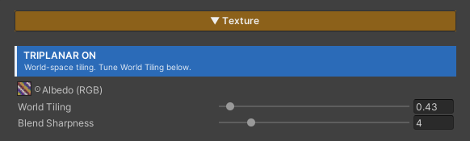

# Triplanar

Lay textures onto a mesh while **ignoring its UVs entirely** — the system projects the texture in from the three world axes (top, front, side) and blends them by the direction the surface faces. A cliff, a rock or a blockout box whose UVs are stretched, or which has no UVs at all, tiles cleanly: no smearing, no seams.

It is an enormous shortcut for environment work: sculpt a cliff in Blender and drop it straight into Unity — no time spent unwrapping, and no worry that reshaping it later will break the UVs.

And because the pattern is anchored to world coordinates, **separate meshes placed next to each other tile as one continuous surface**. A cliff assembled from ten rocks reads as one rock face rather than ten pieces each carrying their own patch of texture.

## Showcase Triplanar


---

## Setup

Turn on the **Triplanar** feature in the Features grid at the top of the material — that is the whole setup. Nothing else to configure, no UVs needed, nothing to bake.

Once it is on, the **Texture** section rearranges itself:

- A blue **`TRIPLANAR ON`** badge appears at the top of the section, telling you the tiling is world-space from now on
- Unity's **Tiling / Offset** fields disappear, replaced in the same spot by **World Tiling** and **Blend Sharpness**

> **Each mode keeps its own values.** Switch Triplanar back off and the old Tiling / Offset numbers are still there, untouched — so you can flip between the two to compare results without losing anything.

---

## Parameters

- **World Tiling** (`0.01–10`, default `1`) — how frequently the pattern repeats against the real world. Higher = it repeats more often (the pattern looks smaller). This one value drives **the Albedo, the Normal Map and the Feature Mask together**, so all three always line up
- **Blend Sharpness** (`1–20`, default `4`) — how hard or soft the three axes cross-fade into each other. High = biased toward whichever axis the surface faces most, giving a crisper seam. Low = a wider, softer blend

> **Blend Sharpness only shows on curved or sloped surfaces.** A straight wall or a flat floor already faces one axis head-on, so turning the value barely changes anything. To see it clearly, try it on a sphere.

---

## What Switches to World Space

| Part | With Triplanar on |
|---|---|
| **Albedo** | projected from the three world axes |
| **Normal Map** | projected from the three world axes, and resolved directly in world space |
| **Feature Mask (RGBA)** | projected from the three world axes, so Metallic / Smoothness / Emissive still match the pattern you see |
| **Paint Layer textures** | projected from the three world axes, and **each layer carries its own World Tiling** |
| **Paint Mask** | **stays on UVs**, because the brush paints in UV space |

The three-axis blend weights are computed **once per pixel** and shared by every texture, so the Albedo, the Normal and the Mask are locked to exactly the same projection and can never drift apart.

> **The Normal Map has no Tiling field of its own** — in either mode. It always follows the Albedo's mapping (it is hidden in the shader itself), because otherwise you would get a surface whose colour detail and bump detail do not line up.
