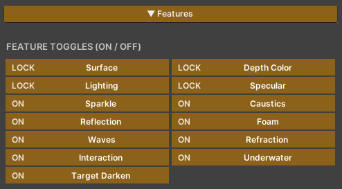
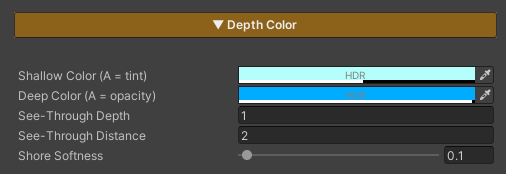
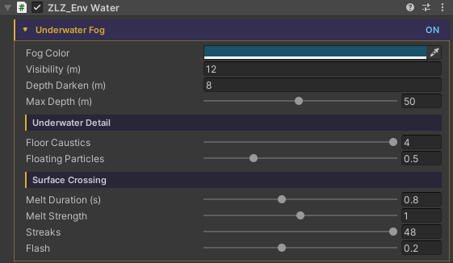
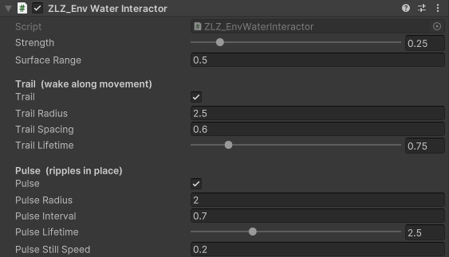
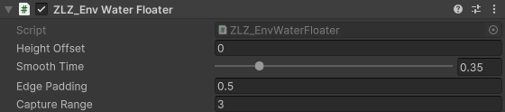
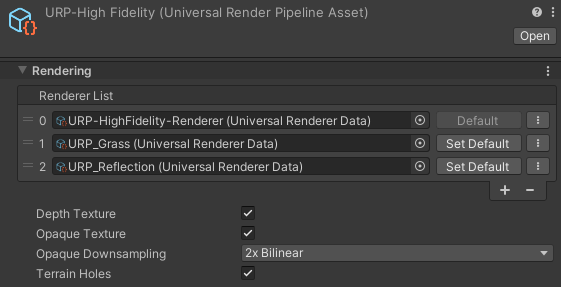

<!-- DRAFT — ยังไม่ขึ้นเว็บจริง. พรีวิว: jekyll serve --unpublished. พร้อมขึ้นเว็บ: ลบ published: false -->

# ZLZ Water System

<!--  -->

The ZLZ water system covers everything from **the surface seen from above** to **the world you see once you dive under it** — colour graded by depth, foam along the shore, sun glitter, the caustic web on the shallow floor, ripples as a character wades in, objects riding up and down, and underwater fog once the camera goes below.

| Piece | What it is |
|---|---|
| **ZLZ/Environment/Water** | The shader that draws the surface |
| `ZLZ_EnvWater` | Marks a mesh as water, and holds what a material cannot |
| `ZLZ_EnvWaterInteractor` | Goes on a character or object that should ripple the water |
| `ZLZ_EnvWaterFloater` | Goes on anything that should ride the surface |
| `ZLZ_EnvUnderwaterFeature` | The Renderer Feature behind the full-screen underwater fog |

- Path : `Assets/ZLZ_EnvironmentShader/Shaders/Core/ZLZ_Environment_Water.shader`
- Everything is driven from **ZLZ_Env Dashboard > Water**

---

## What This System Solves

- **One mesh = one body of water** — a lake, a river and a pond coexist in the same scene, each at its own level, with its own colour and its own murk. Not one water plane stretched over the whole scene
- **Colour and clarity driven by one set of values** — a single density drives both the water colour and its opacity, so the two can never fight the way they do when set separately
- **See-through tuned on two axes independently** — how many metres down you see before the water turns opaque, and how many metres across you see before distant water hazes over. These are genuinely separate
- **A shoreline that is alive** — foam gathers where the water is shallow, with both a crisp waterline and soft clusters, and it can be baked to run toward the shore on every side
- **Underwater is real, not a colour sheet over the screen** — dive under and the surface reads from below as a bright cone overhead ringed by a dark rim, with underwater fog that melts into it as one continuous body
- **Waves whose rhythm you draw yourself** — the level rises and falls as one to a curve you author, so the water swallows the beach on the way up and gives the sand back on the way down
- **Ripples without physics** — no colliders, no render targets. A character wading through leaves a line of ripples along their path
- **Turning a feature off really removes it** — disabled features are stripped from the compiled shader variant, so water using only colour and foam stays light enough for mobile
- **Caustics have a performance mode** — swap live computation for a texture read and the heaviest block on the surface leaves the variant entirely

---

## How Water Comes to Exist

<!--  -->

Every step lives in the **Water** section of the Dashboard that owns that body (normally the Water Dashboard), in three clear stages.

**1. Water Mesh + Material** — the Dashboard lists every mesh underneath it with a tick box. Tick one and it becomes water on the spot; then pick a water material from the ones in your project (three ship with the package).

**2. Interaction Meshes** — scan for the surrounding pieces that shape the direction the foam runs, such as islands, rocks and shoreline, then tick which of them should also send ring waves radiating out.

**3. Bake** — bakes the direction map out as a small texture bound to the material. Foam then starts running toward the shore, following the real shape of the coastline.

> **Ticking is reversible.** The system remembers what material the mesh wore before it became water, and untick restores it exactly. It also remembers whether it was the one that added the Reflection Plane, or whether the mesh already had one.

---

## How the Water Material Is Laid Out

The layout matches the other shaders in the package — the **Features panel at the very top**, with the value sections below it.

### Group 1 — Locked (4 sections, always on)

| Section | What it controls |
|---|---|
| **Surface** | The ripple texture, its strength, and its flow speed — one normal map sampled as two layers scrolling against each other, so no repeat is visible, tiled by world coordinates so a large body stays continuous |
| **Depth Color** | The whole of the water's colour and clarity — see the next section |
| **Lighting** | Receive Shadow, Shadow Strength, Additional Light Intensity |
| **Specular** | The sun glint on the surface, with a Toon Step that cuts it to a hard anime edge, and its own ripple strength independent of the surface |

### Group 2 — Optional (9 features you switch on and off)

| Feature | What it does |
|---|---|
| **Foam** | Foam where the water is shallow — a crisp waterline, soft clusters, and a mode that makes it run toward the shore |
| **Waves** | The level rises and falls as one, to a rhythm you draw |
| **Interaction** | Rings expanding around anything touching the water |
| **Reflection** | The mirror-camera reflection tier, with a distance over which it hands back to the probe |
| **Refraction** | The view of what lies under the surface wobbles with the ripples |
| **Sparkle** | Glitter scattered across the surface, thickest along the path where the sun reflects toward the eye |
| **Caustics** | The web of light on the shallow floor |
| **Underwater** | The surface seen from below, paired with the full-screen underwater fog |
| **Target Darken** | Dims along with the whole scene when driven from game code |

> There is also a **Debug** section with no button in the Features panel. It isolates one stage at a time — water density, surface normal, Fresnel, foam coverage, the raw scene behind the surface, body colour, and caustic coverage.

---

## Depth Color — The Heart of How Water Looks

If you only tune one section to get water looking right, this is the one — because it controls both **colour** and **clarity** together from one set of values, rather than leaving them set separately and fighting each other.

| Setting | What it means |
|---|---|
| **See-Through Depth** | How many metres down you see before the water turns opaque — the **vertical** axis. This is what lets you see the bottom in the shallows while the deep goes dark |
| **See-Through Distance** | How many metres across you see before distant water hazes over — the **horizontal** axis. This is what makes the gradient long and smooth instead of switching colour all at once |
| **Shallow Color** | The colour of the shallows, and its **Alpha is the clarity** — the lower it goes, the more clearly the bottom shows |
| **Deep Color** | The colour of the deep, and its **Alpha is the opacity** — 1 being fully solid |
| **Shore Softness** | How soft the line is where the water meets the shore or an object, so it never cuts like a sheet of paper |

Because the colours' Alpha is what drives the clarity, **colour and transparency are one thing** — move the depth once and both the colour and the opacity shift together. You never end up with water that is crystal clear but deeply tinted.

---

## What a Material Cannot Hold — `ZLZ_EnvWater`

A material can only hold numbers and textures, but some of what water needs is more complex than that. Those things live on the `ZLZ_EnvWater` component, which is added for you the moment you tick a mesh as water.

| Group | What it holds |
|---|---|
| **Wave rhythm** | The **curve** you draw for how the level rises and falls, plus the height in metres and the seconds per loop — a material cannot hold a curve, so the component bakes it into a texture and pushes that into the material for you |
| **This pond's murk** | Fog colour, how far you see underwater, how dark it gets as you go deeper, and the strength of the caustics and the drifting motes |
| **Crossing the surface** | How long the image takes to settle, how hard it is dragged, how many streaks, and the froth flash at the instant you break the surface |
| **Shore Flow** | The list of pieces that shape the flow direction, which of them send ring waves, and the baked direction texture |

Because these are per-component rather than global, **two ponds in the same scene can be murky by different amounts** — a clear blue lake and a brown muddy bog ten metres apart, with nothing special to set up.

> **The component does no per-frame work.** It is a data holder and the marker the Dashboard and the tools use to find water bodies. All of the drawing lives on the material.

---

## The Pieces That Go on Other Objects

These two do not live on the Dashboard — they go on the things that move around the scene.

### `ZLZ_EnvWaterInteractor` — Making Ripples

Rather than one ring that follows the object, it **spawns ripples one at a time**, and each expands and fades from where it was born. A character wading through therefore leaves a line of ripples along their path, the way real footsteps in water do.

Two emitters run together, each with its own size and lifetime:

- **Trail** — emits while the object is **moving**, leaving a wake along its path. A short lifetime reads best
- **Pulse** — emits on an interval while the object is **roughly still**, such as treading water or a fountain, and pauses itself once the object starts moving so Trail takes over instead of stacking on top

None of this **uses physics or a render target** — it is a small array published to the shader once a frame. Each ring bends the surface normal where it sits, so the lighting, the glint, the reflection and the refraction all follow for free.

### `ZLZ_EnvWaterFloater` — Making Things Float

It finds the body of water beneath the object and eases the object's height onto the surface level the player actually sees — including as the level breathes up and down with the waves.

- Moves the **Y axis only**. X and Z are left to your game code, so a boat still steers exactly as before
- **No physics.** For a vessel that should heel and collide, keep the Rigidbody kinematic while afloat, or query the surface height yourself from code
- It uses the level of whichever body it happens to be over, and once you carry something ashore it simply stops working rather than touching the object's position

---

## What the URP Asset Needs

Water is the one system in the package that **reads the image of the scene behind itself**, so there are two boxes to tick.

| Turn on | Needed when |
|---|---|
| **Depth Texture** | Always — the depth colour, the soft shore and the foam all need to know how far down the bottom is |
| **Opaque Texture** | When using **Refraction** or **Underwater**, since both read the image of the scene behind the surface |

The Renderer Features involved (**ZLZ Env Underwater** for the fog, **ZLZ Env Planar Reflection** for the reflection) are installed by the Dashboard at package import, so there is nothing to add by hand.

---

## Performance

| Technique | What it buys |
|---|---|
| **Every feature is opt-in** | Turning one off really removes it from the shader variant, rather than multiplying by zero |
| **Caustics Baked Pattern** | Swaps live caustic computation for a texture read, taking the heaviest loops on the surface out of the variant entirely — a mode built for mobile, and the texture is generated for you on first use |
| **Water has no shadow pass and no depth pass** | As well as being cheaper, this is a correctness decision — it keeps water out of the depth texture it samples |
| **Underwater fog is paid only when used** | With the camera above water, no pass is queued at all. The only cost is the position check |
| **Ripples use no physics** | No colliders, no render target — just a small array published to the shader once a frame |
| **Sparkle scales its detail with distance** | The glitter grid steps down in the far field, so points stay small sharp specks at any distance instead of growing into distracting blobs |

> **Mirror Fade Distance is worth knowing about.** With a low camera near the surface, Fresnel goes to maximum across all distant water, so the reflected terrain can replace the water colour wholesale. Set this and the mirror image hands back to the probe with distance — near water keeps its sharp reflection, while far water goes back to reflecting the sky.

---
