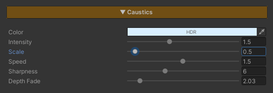

<!-- DRAFT ภาษาไทย — ยังไม่ขึ้นเว็บจริง. พรีวิว: jekyll serve --unpublished. พร้อมขึ้นเว็บ: แปลเป็นอังกฤษ แล้วลบ published: false -->

# Water Caustics

ลายแสงเต้นระยิบบนพื้นใต้น้ำ — แสงแดดที่ถูกผิวน้ำที่กระเพื่อมรวมลำลงไปเป็นเส้นสว่างสานกันเป็นตาข่าย แล้วคลานไปเรื่อยๆ ไม่หยุด เป็นสัญญาณเดียวที่ทำให้คนดูรู้ทันทีว่า "น้ำนี้ใสและมีพื้นอยู่ข้างล่าง" ไม่ใช่แผ่นสีฟ้าวางทับพื้นทราย

ลายนี้ถูก **ฉายลงไปติดที่พื้น** ไม่ได้แปะอยู่บนผิวน้ำ — คำนวณจากตำแหน่งจริงของพื้นที่มองทะลุลงไปเห็น เพราะฉะนั้นกล้องขยับไปทางไหน ลายก็ยังอยู่กับพื้นที่เดิม และระลอกคลื่นก็เลื่อนผ่านมันไป ไม่ใช่ลากมันไปด้วย

ทั้งหมดเป็น procedural ไม่ใช้เท็กซ์เจอร์ ไม่มี pass เพิ่ม และปิดไว้แล้วไม่กินอะไรเลย

## Showcase Water Caustics


---

## Setup

1. **ที่ Material ของน้ำ** — เปิดฟีเจอร์ **Caustics** (แถวปุ่มด้านบนของ Inspector)
2. **ที่ URP Asset** — เปิด **Depth Texture** ให้แน่ใจ เพราะระบบต้องรู้ว่าพื้นอยู่ลึกแค่ไหนจึงจะฉายลายลงไปติดพื้นได้

> **ควรเปิด Refraction คู่กัน** ถ้าเปิด Refraction อยู่แล้ว น้ำจะโชว์ภาพพื้นจริงผ่านผิวน้ำ ลาย Caustics ก็จะไปวางบนพื้นที่มองเห็นนั้นพอดี — เป็นการใช้งานที่ระบบถูกออกแบบมาให้ ถ้าไม่เปิด Refraction ลายยังทำงานอยู่ (ระบบจะดันความทึบของผิวน้ำขึ้นตามความสว่างของลายให้เอง เพื่อให้ลายทะลุขึ้นมาให้เห็นในน้ำตื้นที่โปร่งอยู่)

ไม่ต้อง Bake อะไร ไม่ต้องมี component ไม่ต้องวางแสงเพิ่ม — ลายอ่านสีและทิศจาก Directional Light ของฉากเอง

---

## Parameters

ทั้งหมดอยู่บน Material ใต้หัวข้อ **Caustics** และจะโผล่มาเมื่อเปิดฟีเจอร์แล้ว

- **Color** (HDR, default ขาว) — สีของลายแสง คูณกับสีของ Directional Light อยู่แล้ว ปกติปล่อยขาวไว้ ใช้ตอนอยากให้แสงใต้น้ำอมเขียวหรืออมฟ้ากว่าแสงบนบก
- **Intensity** (`0–4`, default `1.2`) — ความสว่างของลาย `0` = ไม่เห็นเลย
- **Scale** (`0.1–8`, default `1`) — ความถี่ของตาข่าย คิดเป็น **world space** ไม่ผูกกับ UV หรือขนาด mesh ค่าสูง = ตาข่ายถี่เล็ก (สระว่ายน้ำ), ค่าต่ำ = ตาข่ายใหญ่ (ทะเลเปิด) ลากน้ำไปขยายเท่าไรลายก็ยังขนาดเดิม
- **Speed** (`0–3`, default `0.6`) — ลายคลานเร็วแค่ไหน `0` = หยุดนิ่ง (ยังเห็นลายอยู่ แต่ไม่ขยับ)
- **Sharpness** (`1–16`, default `6`) — ความคมของเส้น ค่าสูง = เส้นเรียวคมแบบสระว่ายน้ำน้ำใสจัด และภาพรวมจะมืดลงเพราะเส้นบางลง ค่าต่ำ = เส้นหนานุ่มฟุ้งกระจายทั่วพื้น
- **Depth Fade** (`0.1–20`, default `4`) — น้ำลึกกี่เมตรแล้วลายจะหายไปหมด ลายจะสว่างที่สุดตรงชายฝั่งแล้วจางลงแบบเร่ง (กำลังสอง) ตามความลึก

> **ทำไมลึกแล้วต้องหาย?** สองเหตุผลที่ตรงกับของจริง: แสงที่รวมลำถูกน้ำดูดซับไปก่อนถึงพื้น และน้ำลึกในระบบนี้ทึบอยู่แล้ว (ตาม Depth Color) ให้ตั้ง Depth Fade ใกล้เคียงกับ **See-Through Depth** ในหัวข้อ Depth Color ลายจะหายไปพอดีกับตอนที่พื้นเริ่มมองไม่เห็น

---

## ลายมาจากไหน

ตาข่ายสร้างจาก **Worley noise สองชั้น** คนละสเกลคนละจังหวะ ซ้อนกัน — จุดศูนย์ของแต่ละเซลล์วนอยู่ในเซลล์ตัวเองตามคลื่นไซน์ ทำให้ทั้งผืนคลานและระยิบไปเรื่อยๆ ส่วนที่สว่างคือ **สันขอบระหว่างเซลล์** (จุดที่ไกลจากศูนย์ที่สุด) นั่นคือเส้นตาข่ายที่เห็น

ที่ใช้สองชั้นเพราะชั้นเดียวจะอ่านออกเป็นตะแกรงกลมๆ ซ้ำๆ ทันที

---
