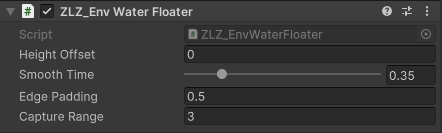

<!-- DRAFT (ภาษาไทย) — ยังไม่ขึ้นเว็บ. พรีวิว: jekyll serve --unpublished. พร้อมขึ้นเว็บ: แปลเป็น EN แล้วลบ published: false -->

# Water Floater

ทำให้ของลอยน้ำได้ในคลิกเดียว — เรือ ถังไม้ ทุ่น หรือใบไม้ ทุกเฟรม component จะหาผืนน้ำที่อยู่ใต้ object แล้วขยับความสูงให้ตรงกับผิวน้ำที่ผู้เล่นเห็น**เป๊ะ**

ถ้าผืนน้ำเปิด [Waves (Shore Breath)]({{ '/env/water/water-waves/' | relative_url }}) ไว้ ของก็จะขึ้นลงตามจังหวะน้ำไปด้วย เพราะฝั่ง C# อ่านเส้นโค้ง ความสูง และนาฬิกาชุดเดียวกับ shader ไม่ใช่การเดาตามให้ใกล้เคียง ถ้าไม่ได้เปิด Waves ของก็จะนิ่งอยู่ที่ระดับผิวน้ำตามปกติ

ไม่มีฟิสิกส์ ไม่มี collider — ขยับ transform ตรงๆ จึงเบามาก

## Showcase
<!-- TODO: อัดคลิปแล้วใส่ id -->


---

## Setup

1. ผืนน้ำต้องมี component `ZLZ_EnvWater` (ถ้าสร้างน้ำจาก Dashboard หรือ Base Prefab จะมีให้อยู่แล้ว)
2. ใส่ component `ZLZ_Env Water Floater` บน object ที่ต้องการให้ลอย

> **ต้องมี `ZLZ_EnvWater` เท่านั้น** — floater ค้นหาผืนน้ำจากทะเบียนที่ component นี้ลงทะเบียนไว้ ถ้าเป็น mesh น้ำเปล่าๆ ที่ไม่มี component มันจะไม่รู้ว่าผิวน้ำอยู่สูงเท่าไร แล้วจะไม่ทำอะไรเลย

---

## Parameters



- **Height Offset** (เมตร, ค่าเริ่มต้น `0`) — ระยะที่ object ลอยเหนือ (+) หรือจมใต้ (−) ระดับน้ำ ค่าติดลบ = เรือที่บรรทุกของจนกินน้ำลึก, ค่าบวก = จุกไม้ก๊อกที่ลอยพ้นน้ำ
- **Smooth Time** (`0–2` วินาที, ค่าเริ่มต้น `0.35`) — เวลาที่ใช้ปรับตัวเข้าหาระดับน้ำใหม่ ให้ความรู้สึกหนักและหน่วง ตั้ง `0` = ติดหนึบไปกับผิวน้ำเลย (เหมาะกับใบไม้)
- **Edge Padding** (เมตร, ค่าเริ่มต้น `0.5`) — ระยะเผื่อรอบขอบผืนน้ำที่ยังนับว่า "อยู่เหนือน้ำนี้" เรือที่เบียดเข้าริมตลิ่งจึงยังลอยอยู่
- **Capture Range** (เมตร, ค่าเริ่มต้น `3`) — ระยะที่ floater จะเริ่มออกฤทธิ์ ถ้า object อยู่ไกลกว่านี้จะถูกปล่อยไว้เฉยๆ ถังไม้ที่ผู้เล่นแบกข้ามสะพานจึงไม่โดนดูดลงน้ำ ตั้ง `0` = ดูดเสมอไม่จำกัดระยะ

### Smooth Time กับ Height Offset ใช้ยังไงให้ได้อารมณ์ที่ต้องการ

สองค่านี้คือค่าที่ตัดสินบุคลิกของวัตถุเกือบทั้งหมด ลองเทียบจากตัวอย่างนี้

| อยากได้ | Height Offset | Smooth Time |
|---|---|---|
| ใบไม้ / กลีบดอกไม้ ที่แนบผิวน้ำ | `0` | `0` – `0.1` |
| ทุ่น / ลูกบอลยาง เด้งตามน้ำทันใจ | `0` | `0.15` – `0.3` |
| เรือลำเล็ก | `-0.1` ถึง `-0.3` | `0.3` – `0.5` |
| เรือใหญ่ / แพบรรทุกของ อืดและหนัก | `-0.4` ขึ้นไป | `0.6` – `1.2` |
| ขอนไม้ที่โผล่พ้นน้ำครึ่งท่อน | `+0.1` ถึง `+0.3` | `0.4` |

> **Smooth Time ยาวเกินไปกับคลื่นที่เร็ว** จะทำให้วัตถุตามน้ำไม่ทันจนดูเหมือนลอยนิ่งอยู่กลางอากาศตอนน้ำลง ถ้า **Seconds per Loop** ของผืนน้ำสั้น (คลื่นถี่) ให้ลด Smooth Time ลงตาม

---

## สิ่งที่ควรรู้เกี่ยวกับพฤติกรรม

- **ขยับแกน Y เท่านั้น** X กับ Z ไม่ถูกแตะ โค้ดเกมยังบังคับทิศเรือได้ตามปกติ
- **ไม่มีการเอียงตัวหรือโคลงเคลง** โดยตั้งใจ เพราะการยกตัวแบบ Shore Breath ไม่มีความชัน ถ้าใส่การโคลงเข้าไปจะเป็นการโฆษณาความชันที่ผิวน้ำไม่มีจริง อยากได้เรือโคลง ให้ทำเป็นอนิเมชันหรือสคริปต์แยกซ้อนทับเอา
- **อยู่นอกผืนน้ำ = ไม่ทำอะไรเลย** ไม่มีการสร้างแรงโน้มถ่วงปลอม แบกถังขึ้นฝั่งได้ตามปกติ
- **รองรับผืนน้ำหลายผืนคนละความสูง** ถ้า object อยู่เหนือหลายผืนพร้อมกัน (เช่น บ่อน้ำยกระดับที่ซ้อนอยู่เหนือทะเลสาบ) มันจะเลือกผืนที่**ระดับผิวน้ำใกล้ตัวที่สุดในแนวตั้ง**
- **Gizmo** — เลือก object แล้วดูใน Scene view: **ฟ้า** = floater จะออกฤทธิ์, **ส้ม** = มีน้ำอยู่แต่ยังไกลเกิน Capture Range, **เทา** = ไม่มีผืนน้ำที่ลงทะเบียนไว้ใต้ object นี้ เส้นที่ลากจากตัว object ไปยังสี่เหลี่ยมเล็กๆ คือตำแหน่งที่มันจะไปหยุด
- **ระดับผิวน้ำอ่านจากขอบบนของ bounds** ของ mesh น้ำ ไม่ใช่ตำแหน่ง transform ถ้าใช้กล่องหนาๆ แทนระนาบบางเป็นผืนน้ำ ของจะลอยที่หน้าบนของกล่อง ซึ่งก็คือผิวน้ำที่มองเห็นพอดี

---

## ทำงานร่วมกับ Feature อื่น

### Waves (Shore Breath)
คู่หูหลักของ floater ฝั่ง C# ไม่ได้ประมาณค่าเอาเอง แต่อ่าน**เส้นโค้งที่ bake ไว้ตัวเดียวกัน** ด้วยวิธีเดียวกับที่ shader อ่าน (รวมถึงการไล่ค่าระหว่างจุดและการวนรอบ) และใช้นาฬิกาเดียวกัน ของจึงลอยตรงกับผิวน้ำที่เห็นทุกเฟรม ไม่มีอาการจมมิดหรือลอยเหนือน้ำตอนคลื่นขึ้นสูงสุด

ดูวิธีวาดจังหวะคลื่นที่หน้า [Water Waves]({{ '/env/water/water-waves/' | relative_url }})

### Water Interaction
floater ไม่ได้ทำให้น้ำกระเพื่อมด้วยตัวเอง ถ้าอยากให้เรือทิ้งแนวคลื่นไว้ข้างหลัง ให้ใส่ component `ZLZ_Env Water Interactor` เพิ่มบน object เดียวกัน ทั้งสองตัวทำงานแยกกันและไม่ตีกัน — ตัวหนึ่งคุมความสูง อีกตัวคุมคลื่น

ดูรายละเอียดที่หน้า [Water Interaction]({{ '/env/water/water-interaction/' | relative_url }})

---

## ใช้กับ Rigidbody และโค้ดเกม

floater เขียน `transform.position` ตรงๆ ทุกเฟรม ถ้า object มี **Rigidbody ที่ไม่ใช่ kinematic** ฟิสิกส์กับ floater จะแย่งกันเขียนตำแหน่งจนวัตถุสั่นหรือหลับไม่ลง — component จะขึ้น warning ใน Console ให้ทันทีที่ตรวจเจอ

มี 2 ทางเลือก

1. **ตั้ง Rigidbody เป็น kinematic ระหว่างลอยน้ำ** แล้วปล่อยให้ floater คุมความสูง เหมาะกับเรือที่ผู้เล่นขับเอง
2. **ไม่ใช้ floater แล้วขับ Rigidbody ด้วยแรงเอง** โดยถามความสูงผิวน้ำจากระบบโดยตรง เหมาะกับวัตถุที่ต้องชนกับของอื่นจริงๆ

```csharp
using ZLZ.AnimeShader;

// หาผืนน้ำใต้วัตถุ (คืนค่า null ถ้าไม่มีน้ำอยู่ใต้ตำแหน่งนั้น)
ZLZ_EnvWater water = ZLZ_EnvWater.FindWaterAt(transform.position, 0.5f);
if (water != null)
{
    // ความสูงผิวน้ำ ณ วินาทีนี้ รวมการขึ้นลงของ Shore Breath แล้ว
    float surfaceY = water.GetSurfaceHeight();
    float submerged = surfaceY - transform.position.y;
    if (submerged > 0f)
        rb.AddForce(Vector3.up * submerged * buoyancy, ForceMode.Acceleration);
}
```

`GetSurfaceHeight()` คือฟังก์ชันเดียวกับที่ floater ใช้ เรียกได้ทุกเฟรมโดยไม่สร้างขยะหน่วยความจำ

---

## ข้อควรรู้

- **ทำงานเฉพาะตอน Play** — ใน Edit Mode ของจะไม่ขยับตามคลื่น แต่ Gizmo จะบอกตำแหน่งที่มันจะไปหยุดให้เห็นล่วงหน้า จึงจัดวางของได้สะดวก
- **ไม่ต้องเปิด Waves ก็ใช้ได้** ถ้าผืนน้ำนิ่ง ของก็จะเกาะอยู่ที่ระดับผิวน้ำตามปกติ (บวก Height Offset)
- ขยับใน `LateUpdate` คือหลังจากโค้ดเกมขยับตัวละคร/เรือเสร็จแล้ว ค่า Y ที่ floater เขียนจึงเป็นค่าสุดท้ายเสมอ ไม่โดนทับ
- เคารพ `Time.timeScale` เหมือนตัวคลื่น — สโลว์โมชันแล้วของก็ลอยขึ้นลงช้าตาม
- **ไม่มีเพดานจำนวน** ต่างจาก Water Interactor ที่จำกัด 16 วงคลื่นพร้อมกัน — จะใส่ floater กี่ตัวในฉากก็ได้ เพราะแต่ละตัวคำนวณของตัวเองแยกกันและไม่ต้องส่งข้อมูลให้ shader
- ใส่ได้ object ละหนึ่งตัวเท่านั้น
