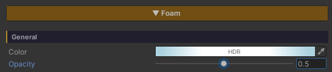
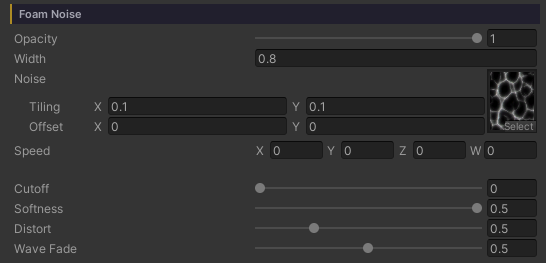
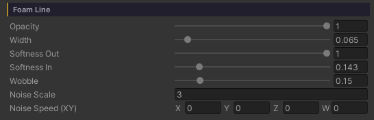
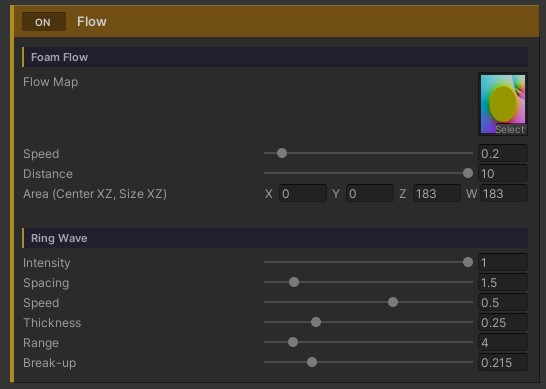

# Water Foam

White foam where the water meets the ground — a crisp inked waterline running along the shore, with soft clusters of froth trailing behind it toward open water. Both come out of the **depth of the water** on their own: no edge to draw, no texture to paint, and nothing to fix up when a rock moves or the beach is reshaped.

Every value in this section is measured in **metres of water depth** rather than UV, so no matter how far the water body is scaled the foam keeps its width.

The foam comes in two layers, each with its own group of controls.

- **Foam Line** — the crisp waterline hugging the shore's edge. This is what gives the shore its *drawn* line
- **Foam Noise** — the clusters broken up by a scrolling noise pattern. This is what gives it *body*

Both layers carry **their own Opacity**, so for the crisp line without the froth — or the froth without the line — turn the other side down to `0` and leave everything else exactly as it was.

## Showcase Water Foam


---

## Setup

1. **On the water material** — the **Foam** feature is already on from the start (the only button in the grid that ships enabled)
2. **On the URP Asset** — keep **Depth Texture** on, because all of the foam places itself from the depth of the water

**Foam Flow** and **Ring Wave** are extras that need a bake first — the Scan and Bake steps are on the [Water Ring Wave]({{ '/env/water/water-ring-wave/' | relative_url }}) page.

---

## General

The values that cover the whole foam system, waterline and clusters alike.

- **Color** (HDR, default white) — the colour of every kind of foam, including the froth from Interaction and the foam seen from under water
- **Opacity** (`0–1`, default `1`) — how opaque the foam is overall. (It is the Color's alpha, pulled out as its own slider: alpha inside a colour picker is easy to miss, and at `0` the whole system silently disappears with nothing to explain it.) It multiplies on top of each layer's own Opacity

---

## Foam Noise — The Clusters

This layer is the body of the foam, broken into clumps: a noise pattern cut by a brightness threshold, then weighted by how close the pixel is to the shore.

- **Opacity** (`0–1`, default `1`) — how opaque **the clusters alone** are, multiplied on top of the General Opacity. Turn it down to let the waterline or Ring Wave stand out without touching anything else
- **Width** (metres, default `0.5`) — how many metres out from the shore the cluster band reaches. Past that is open water with no foam
- **Noise** (Texture) — the cluster pattern, tiled in world space (set its frequency in the texture's own Scale field)
- **Speed** (Vector XY, default `(0.05, 0.03)`) — the direction and speed the pattern scrolls. **Used while Foam Flow is off**; with Foam Flow on, the movement is driven by Flow Speed / Distance instead
- **Cutoff** (`0–1`, default `0.4`) — how bright the noise has to be before it counts as foam. Low = foam everywhere, high = sparse patches
- **Softness** (`0.001–0.5`, default `0.1`) — how feathered the cluster edges are. Low = crisp stylized clumps, high = a gentle blur
- **Distort** (`0–2`, default `0.5`) — bends where the pattern is read using the ripple normal, so the clusters flex with the water instead of sitting rigid on the world grid (it reuses what the surface already sampled, so it costs no extra texture read)
- **Wave Fade** (`0–1`, default `1`) — **only appears with the Waves feature on**. `1` = the clusters wash out in the trough and come back in full on the crest, like foam carried up the beach and dragged back. `0` = the swell is ignored

> **Wave Fade only touches the clusters.** The waterline stays put throughout, so the shore never loses its inked edge at low tide.

---

## Foam Line — The Waterline

A thin solid band sitting exactly where the water meets the ground. This is what makes the shore read as line art.

- **Opacity** (`0–1`, default `1`) — how opaque **the waterline alone** is, the twin of the Foam Noise Opacity. `0` = no drawn line, just the froth, with every other value of the line left intact rather than dismantled
- **Width** (`0–1` metres, default `0.15`) — the thickness of the line, in metres of water depth. `0` turns the waterline off
- **Softness Out** (`0.01–1`, default `0.3`) — the fade at the **open-water** end. Low = a hard inked edge, `1` = a full gradient
- **Softness In** (`0–1`, default `0`) — the fade at the **shore** end. `0` = solid right up against the sand, which is the classic inked look
- **Wobble** (`0–1` metres, default `0.2`) — how far the line's edge wanders off the true contour, following a soft scrolling noise field. It billows the line into froth lobes and sends fingers up to touch the sand here and there. `0` = an even, machine-drawn stripe
- **Noise Scale** (default `15`) — the size of the lobes that Wobble produces. Low = long broad lobes, high = a fine ripple
- **Noise Speed (XY)** (default `(0, -0.2)`) — the direction and speed that noise field drifts

---

## Flow — Foam That Runs Toward the Shore

Normally the foam pattern scrolls one way across the whole surface, following **Speed** — which falls apart the moment there is an island or a rock out in the water, because foam should run toward the shore on **every** side of it. Flow fixes that by carrying the pattern along a direction field baked ahead of time.

At the bottom of the Foam section is a full-width **ON / OFF bar named Flow** (the same language the feature buttons at the top use). That one switch owns the two groups that share the same baked map — **Foam Flow** and **Ring Wave** — so with it off you get one bar and nothing else cluttering the Inspector.

### Foam Flow

- **Flow Map** — the direction map (RG = direction in world XZ, `0.5` at the middle = no flow). It normally comes from **Dashboard > Water > Bake Foam Flow**, so there is nothing to author by hand
- **Speed** (`0–3`, default `0.6`) — how fast the pattern travels
- **Distance** (`0–10` metres, default `1.5`) — how many metres it travels over one cycle
- **Area (Center XZ, Size XZ)** (default `(0, 0, 100, 100)`) — the world rectangle the map covers. The bake sets this for you

The advection reads the pattern twice, half a cycle apart, and cross-fades the two at their wrap points, so the pattern never visibly snaps back — and those two reads only happen inside the foam band.

### Ring Wave

The other group under the same Flow switch: bands of foam spreading out around a rock or a post standing in the water, read from the same map. It has a page of its own at [Water Ring Wave]({{ '/env/water/water-ring-wave/' | relative_url }}) — its sliders stay locked until a properly baked Flow Map is bound.
