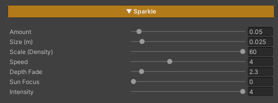

# Water Foam

Glitter flashing across shallow water — small points of light blinking on and off out of step with each other, gathering thickest along the path where the sun reflects toward the eye. It is the detail that makes shallow water feel *alive* instead of a smooth surface carrying one lone reflection of the sun.

The points here are **real points you can count**, not a by-product of the ripple pattern: the system lays a grid over the world and lets each cell hold at most one point. That makes "how many" and "how big" sliders you turn directly, rather than side effects of some other value.

And a point in the distance stays **a point** — it never swells into a blob, never smears into a bright haze, and never crawls about as sub-pixel noise.

## Showcase Water Sparkle


---

## Setup

1. **On the water material** — turn on the **Sparkle** feature (the button grid at the top of the Inspector)
2. **On the URP Asset** — keep **Depth Texture** on, because the sparkle knows whether it sits on shallow or deep water from the depth of the water column

Nothing to bake, no component to add, no texture to assign — the sparkle takes the sun's direction and colour from the scene's Directional Light.

---

## Parameters

All of these live on the material under **Sparkle**, and only appear once the feature is on.

- **Amount** (`0–1`, default `0.35`) — the fraction of grid cells that carry a sparkle, which is simply **how many points** there are. `0` = none at all, `1` = every cell has one
- **Size (m)** (`0.001–0.3`, default `0.01`) — the diameter of a point, in **real world metres**, and independent of Scale
- **Scale (Density)** (`0.1–60`, default `12`) — the grid frequency, which is the **density** of the glitter (points per metre). High = a tight shimmer, low = fewer points further apart
- **Speed** (`0–12`, default `4`) — how fast the points twinkle. Each cell keeps its own phase, so they never blink in unison. `0` = the points hold still
- **Depth Fade** (`0.1–30`, default `2`) — how many metres of water column it takes for the sparkle to disappear. Low = a band along the shore only, high = glitter across the whole surface, the open-sea look
- **Sun Focus** (`0–32`, default `6`) — how tightly the glitter hugs the sun's reflection path. High = pinned into one narrow lane of light, `0` = **spread evenly over the whole surface, with no regard for where the sun is**
- **Intensity** (`0–4`, default `1.5`) — how bright the points are

> **The sparkle's colour comes from the Specular section** — it shares **Specular Color** and is multiplied by the Directional Light's colour on top of that. There is no separate colour field for Sparkle at the moment, so to recolour the glitter, adjust Specular Color.
