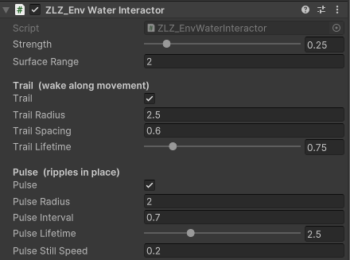
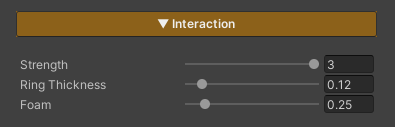

# Water Interaction

ผิวน้ำกระเพื่อมเป็นวงเมื่อมีตัวละครหรือวัตถุเคลื่อนผ่าน ระบบนี้ไม่ได้ใช้วงคลื่นวงเดียวที่วิ่งตามตัวละคร แต่จะ **"หย่อน" วงคลื่นทิ้งไว้เป็นจุดๆ** แล้วแต่ละวงขยายออกและจางหายจากตำแหน่งที่มันเกิด ตัวละครที่เดินลุยน้ำจึงทิ้งแนวคลื่นเป็นรอยเท้าไว้ข้างหลัง เหมือนน้ำจริง

ทำงานบน GPU ทั้งหมด ไม่มี collider ไม่มี Render Texture ไม่มีการคำนวณฟิสิกส์ จึงเบาพอสำหรับทั้ง PC และ Mobile

## Showcase Water Interaction Trail


## Showcase Water Interaction Pulse


---

## Setup

ต้องทำ 2 อย่างคู่กัน ขาดอย่างใดอย่างหนึ่งจะไม่เห็นคลื่น

1. **ที่ material ของน้ำ** — เปิด feature **Interaction** (ปุ่มในตาราง Features ด้านบนสุดของ Inspector)
2. **ที่ตัวละคร / วัตถุ** — ใส่ component `ZLZ_Env Water Interactor` ลงบน object ที่ต้องการให้กวนน้ำ (ผู้เล่น, NPC, เรือ, ลูกบอลที่กลิ้ง)

> ค่าบน component คือ **ขนาดและจังหวะ** ของคลื่นแต่ละวง (ต่างกันได้ในแต่ละ object)
> ค่าบน material คือ **หน้าตา** ของคลื่นทั้งผืนน้ำ (ใช้ร่วมกันทุก object)

---

## Interactor (ตั้งค่าต่อ object)

`ZLZ_Env Water Interactor` มีตัวปล่อยคลื่น **2 ตัวที่ทำงานแยกจากกันโดยสิ้นเชิง** เปิดพร้อมกัน เปิดตัวเดียว หรือปิดทั้งคู่ก็ได้ และแต่ละตัวมี "ขนาดวง" กับ "อายุวง" เป็นของตัวเอง เพราะคลื่นตอนเดินกับคลื่นตอนยืนนิ่งมักไม่ควรมีขนาดเท่ากัน

### ค่าหลัก
- **Strength** (`0–2`, ค่าเริ่มต้น `1`) — object นี้กวนน้ำแรงแค่ไหน (คูณกับความสูงของคลื่น) ตั้ง `0` = ไม่เกิดคลื่นเลย
- **Surface Range** (เมตร, ค่าเริ่มต้น `2`) — ระยะสูง-ต่ำที่ยังนับว่า "แตะน้ำอยู่" คลื่นจะเกิดก็ต่อเมื่อ object อยู่เหนือพื้นที่ของผืนน้ำ **และ** อยู่ห่างจากระดับผิวน้ำไม่เกินค่านี้ มีไว้กันตัวละครที่เดินบนสะพานสูง 20 เมตรไม่ให้ทำน้ำข้างล่างกระเพื่อม

### Trail — คลื่นตามการเคลื่อนที่
หย่อนคลื่นทิ้งไว้ **ขณะที่ object เคลื่อนที่** เกิดเป็นแนวคลื่นตามทางเดิน เหมาะกับ **อายุสั้น** เพื่อให้คลื่นสะบัดออกแล้วหายไปไว ๆ ข้างหลังตัวละคร

- **Trail** — เปิด/ปิดตัวปล่อยนี้
- **Trail Radius** (เมตร, ค่าเริ่มต้น `1.5`) — วงคลื่นขยายออกไปได้กว้างสุดเท่าไร
- **Trail Spacing** (เมตร, ค่าเริ่มต้น `0.5`) — object ต้องเดินไปไกลเท่าไรจึงจะหย่อนคลื่นวงถัดไป ยิ่งน้อย = แนวคลื่นยิ่งถี่
- **Trail Lifetime** (`0.1–4` วินาที, ค่าเริ่มต้น `1.2`) — คลื่นแต่ละวงอยู่นานแค่ไหน

### Pulse — คลื่นตอนอยู่กับที่
ปล่อยคลื่นตามรอบเวลา **ขณะที่ object แทบไม่ขยับ** เหมาะกับตัวละครที่ยืนแช่น้ำ, น้ำพุ, น้ำหยด และเหมาะกับ **อายุยาว** เพื่อให้วงคลื่นค่อย ๆ แผ่ออกอย่างนุ่มนวล

- **Pulse** — เปิด/ปิดตัวปล่อยนี้
- **Pulse Radius** (เมตร, ค่าเริ่มต้น `1.2`) — วงคลื่นขยายออกไปได้กว้างสุดเท่าไร
- **Pulse Interval** (วินาที, ค่าเริ่มต้น `0.6`) — ระยะห่างระหว่างคลื่นแต่ละวง
- **Pulse Lifetime** (`0.3–8` วินาที, ค่าเริ่มต้น `3`) — คลื่นแต่ละวงอยู่นานแค่ไหน
- **Pulse Still Speed** (เมตร/วินาที, ค่าเริ่มต้น `0.2`) — ถือว่า "ยืนนิ่ง" เมื่อความเร็วไม่เกินค่านี้ ถ้าเคลื่อนเร็วกว่านี้ Pulse จะหยุดพักและปล่อยให้ Trail ทำงานแทน ตั้งค่าสูง ๆ = ปล่อย Pulse ตลอดเวลาไม่ว่าจะขยับหรือไม่

### สิ่งที่ควรรู้เกี่ยวกับพฤติกรรม
- **Trail กับ Pulse ไม่ซ้อนกัน** — พอตัวละครเดิน Pulse จะหยุดเอง เหลือแต่แนวคลื่นตามทาง ไม่ใช่คลื่นวงกลมซ้อนกันมั่ว
- **ตัวนับเวลาของ Pulse ไม่ถูกรีเซ็ตตอนเคลื่อนที่** — พอตัวละครหยุดเดิน วงแรกจึงมาทันที เหมือนจังหวะที่ยืนลงหลักพอดี ไม่ต้องรอครบรอบใหม่
- **Radius กับ Lifetime สัมพันธ์กัน** — วงคลื่นจะขยายจนถึง Radius ภายในเวลาเท่ากับ Lifetime พอดี ดังนั้น **Lifetime สั้น = คลื่นขยายเร็ว** ส่วน Radius คุมแค่ขนาดสุดท้าย
- **Gizmo** — เลือก object แล้วดูใน Scene view: วงกลม**สีฟ้า** = Trail Radius, วง**สีเขียว** = Pulse Radius ใช้เทียบขนาดกับตัวละครได้เลย
- **ทำงานเฉพาะตอน Play** — คลื่นใช้นาฬิกาของเกม (เคารพ `Time.timeScale` ด้วย สโลว์โมชันคลื่นจะช้าตาม) ต่างจาก Global Wind ตรงที่ใน Edit Mode จะไม่ขยับ

---

## ค่าบน Material (หมวด Interaction)

สามค่านี้กำหนดหน้าตาของคลื่นทุกวงบนผืนน้ำนั้น (เปิด feature **Interaction** ไว้)

- **Strength** (`0–3`, ค่าเริ่มต้น `1`) — ความแรงรวมของคลื่นบนผืนน้ำนี้ คูณทับกับ Strength ของแต่ละ object อีกที
- **Ring Thickness** (`0.02–1`, ค่าเริ่มต้น `0.12`) — ความหนาของแถบวงคลื่น เป็น**เมตรจริง** และ**ไม่ผูกกับขนาดวง** โดยตั้งใจ ดังนั้นย่อ/ขยาย Radius ได้โดยที่ความคมของเส้นคลื่นไม่เปลี่ยน — ค่าน้อย = วงบางคม, ค่ามาก = วงหนานุ่ม
- **Interaction Foam** (`0–2`, ค่าเริ่มต้น `0.5`) — ฟองสีขาวที่เกาะบนสันคลื่น ตั้ง `0` = ได้แค่การกระเพื่อมของผิวน้ำเฉย ๆ ไม่มีฟอง

---

## คลื่นส่งผลถึง Feature อื่นเองโดยอัตโนมัติ

วงคลื่นทำงานด้วยการ**บิด normal ของผิวน้ำ** ตรงตำแหน่งนั้น ไม่ได้วาดทับเป็นภาพ ผลคือแสงเงาทุกอย่างวิ่งตามคลื่นให้ฟรี ๆ โดยไม่ต้องตั้งค่าเพิ่ม

- **Specular / Sun Glint** — ประกายแดดแตกกระจายตามสันคลื่น
- **Reflection** — เงาสะท้อนบิดเบี้ยวตรงที่น้ำกระเพื่อม
- **Refraction** — ภาพใต้น้ำสั่นตามวงคลื่น
- **Lighting** — สันคลื่นรับแสง ท้องคลื่นเป็นเงา

---

## ข้อจำกัด (Limits)

- **16 วงคลื่นพร้อมกันทั้ง Scene** — นับเป็น "วงคลื่นที่ยังมีชีวิต" ไม่ใช่จำนวน interactor ตัวละครหนึ่งตัวที่เดินอยู่อาจกินไปหลายวงพร้อมกัน
- **8 วงต่อ interactor หนึ่งตัว** — เกินจากนี้ วงที่เก่าที่สุดจะถูกตัดทิ้งก่อน
- **เมื่อเกิน 16 วง** ระบบจะเลือกวงที่**ใกล้กล้องที่สุด**ไว้ก่อน คลื่นที่หายไปจึงเป็นคลื่นไกล ๆ ที่มองแทบไม่เห็นอยู่แล้ว
- จำนวนนี้ไม่มีค่าใช้จ่ายจนกว่าจะมีคลื่นเกิดจริง — shader วนลูปตามจำนวนคลื่นที่มีชีวิตอยู่ ไม่ใช่วนถึง 16 เสมอ

---

## Surface Gate (ระบบกันคลื่นเกิดผิดที่)

Interactor จะยิงคลื่นเฉพาะตอนที่อยู่ใกล้ผิวน้ำจริง ๆ ระบบนี้ต้องการ component `ZLZ_EnvWater` บน object ของน้ำเพื่อจะรู้ว่า "ผิวน้ำอยู่สูงเท่าไร"

- ถ้าใน Scene **ไม่มี** `ZLZ_EnvWater` เลย ระบบจะปล่อยผ่านทั้งหมด (mesh น้ำเปล่า ๆ ที่ทำไว้แต่เดิมยังใช้งานได้เหมือนเดิม)
- รองรับผืนน้ำหลายผืนที่อยู่คนละความสูง — ตัวละครจะกวนเฉพาะผืนที่ตัวเองแตะอยู่
- ถ้าเปิด feature **Waves (Shore Breath)** ไว้ด้วย ระยะ Surface Range จะเผื่อความสูงของคลื่นให้อัตโนมัติ ตัวละครจึงไม่หลุด gate ตอนน้ำขึ้นสูงสุด
- ตอนที่ตัวละครกระโดดลงน้ำ ระบบจะรีเซ็ตจุดอ้างอิงให้ ทำให้เกิดวงคลื่นแรกทันทีที่แตะน้ำ แทนที่จะลากคลื่นยาวมาจากตำแหน่งเดิมบนฝั่ง

---
