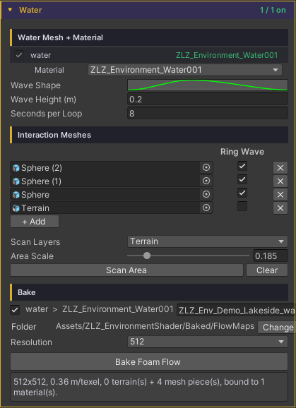
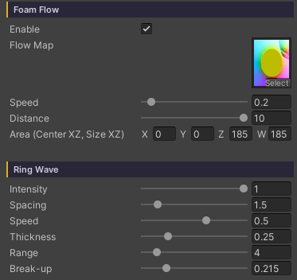

# Water Ring Wave

Thin bands of foam spreading outward around a rock, a small island or a post standing in the water — like waves meeting an obstacle and rippling back out. It makes an object planted in the water look like it belongs there, instead of a model dropped on top of a surface.

These are not compass-drawn circles: the bands are **contour lines that follow the object's shape**. Close in they hug its silhouette, easing round as they travel outward, so a long rock gets long ovals rather than circles that fight its form.

All of it comes from a map baked ahead of time, so nothing measures distance at runtime.

## Showcase Water Ring Wave


---

## Setup

Ring Wave builds on the Foam Flow system. Four things have to be in place before any rings appear.

1. **On the material** — turn on the **Foam** feature
2. **On the material** — in the Foam section, turn on **Foam Flow**
3. **On the water object** — pick the pieces that should throw rings, then **Bake** (see the next section)
4. **On the material** — in the **Ring Wave** group, raise **Intensity** above `0`

> **The sliders stay locked until a baked Flow Map is bound.** That is not a fault — the Flow Map slot defaults to flat grey, which decodes into phantom rings covering the entire surface. They stay locked until there is real data to read.

---

## Shore Flow — Pick the Pieces, Then Bake

Found under **Dashboard > Water** (or straight on the water object's Inspector, if it does not sit under a Dashboard).

### 1. Scan for pieces

- **Scan Layers** — which layers to search
- **Area Scale** (`0.05–1`) — the fraction of the water body covered. `1` = the whole surface; lower values focus on the middle zone, which also packs the map's resolution into that zone. It draws live as a **gold rectangle** in the Scene view, so the reach is never a guess
- Press **Scan Area** — every piece that **rises above the waterline** inside the rectangle goes into a freshly rebuilt list

Scan sets a starting value per piece type.

| Type | Ring Wave default | Why |
|---|---|---|
| Terrain | Off | It is a coastline: it should get foam running down its shore, not rings |
| Mesh | On | It is a rock, a post or a prop, the kind of thing rings belong around |

If a piece you expected never shows up, check the Console — every skipped candidate is listed by name with its reason (layer not in Scan Layers / entirely below the waterline / outside the Area Scale rectangle), and clicking the name jumps straight to the object.

### 2. Tick Ring Wave per piece

Each row in the list is one piece, with a **Ring Wave** checkbox.

- **Every listed piece** shapes the foam flow field (foam runs down its shore) whether or not it is ticked
- **Ticking Ring Wave** adds rings radiating from that piece on top

Use **+ Add** to add one by hand, **✕** to remove a row, **Clear** to empty the list.

### 3. Bake

- Tick which water bodies to bake and name the texture per row (default `<Scene>_<Object>_FlowMap`)
- **Folder** — defaults to `Assets/ZLZ_EnvironmentShader/Baked/FlowMaps`, changeable
- **Resolution** — `128` / `256` / `512` / `1024`. Flow is low-frequency data, so the resolution does not have to scale with the size of the scene; `256` covers most work
- Press **Bake Foam Flow** — it rasterizes, saves and binds to the material on its own: no dialogs, and Undo works

> **Edit the list and you have to bake again.** A banner appears saying "List changed. Press Bake Foam Flow to apply" — it never bakes silently behind you.

---

## Parameters

All of these live on the material under **Foam > Foam Flow > Ring Wave**.

- **Intensity** (`0–1`, default `0`) — the master switch and the strength of the rings. `0` = off, and the remaining sliders stay hidden until you raise it
- **Spacing** (`0.25–10`, default `1.5`) — the distance between bands, in metres. Lower = tight rings, like fast chop
- **Speed** (`-2–2`, default `0.5`) — how fast the bands travel. **Positive expands outward, negative contracts** (waves running back toward the object)
- **Thickness** (`0.05–0.9`, default `0.25`) — the width of each foam band. Low = a sharp thin line, high = a soft wide one
- **Range** (`0.5–30`, default `8`) — how many metres the rings reach before fading out completely
- **Break-up** (`0–1`, default `0.5`) — warps the radius and tears the bands into arcs, so they read as hand drawn instead of compass drawn. `0` = perfectly smooth rings

---

## Behaviour Worth Knowing

- **Rings scale themselves to the piece.** The bake measures each piece's footprint into the map, then Spacing and Range are scaled by it against a **5 metre reference piece**. A pebble gets small tight rings and a boulder gets wide ones **from the same sliders** — no separate material needed
- **Rings emerge from the object's edge** rather than popping in fully formed. The area on the piece itself is a flat zero-distance plateau, so without a fade-in over the first stretch of distance a new ring would light that whole area up at once — a solid disc flashing for a frame before it reads as a ring
- **The map stores distance up to 30 metres**, which is exactly where the Range slider tops out. There is no data past that
- A piece that is **entirely below the waterline** is never picked up; part of it has to break the surface
- Rings are foam on the surface only — they **do not bend the normal**, so they leave lighting and reflections alone. That is the difference from [Water Interaction]({{ '/env/water/water-interaction/' | relative_url }}), which really does bend it

---

## Works With Other Features

### Foam
Ring Wave is a layer on top of the whole Foam system, so it shares **Foam Color** and its opacity with the other foam. To make the rings stand out without touching the shoreline foam, turn down **Foam Noise > Opacity** rather than the Foam Color.

### Underwater
With the **Underwater** feature on, the rings are visible from below too, through **Foam & Rings** in the Underwater section. It reads the same bake — nothing extra to run.

### Water Interaction
Different systems that complement each other: Ring Wave is rings around **things standing still**, Interaction is rings made by **things moving**. Run both together; they never fight.

---

## Good to Know

- **Baking only works in a Scene**, because the map holds world-position data. In Prefab Mode the button is disabled and says so — though **Scan does work in Prefab Mode**, scoped to the prefab's own contents
- **Two water bodies sharing one material will overwrite each other's bake.** A warning appears before you press the button — give each water body its own material
- **Re-baking reuses the existing asset** rather than creating a new one, so material references never break. Renaming the file or moving the folder keeps its GUID, so nothing breaks there either
- **It is computed entirely on the CPU** — no camera, no GPU readback — so the result is identical on every machine and in every editor state
- The map file is tiny, and it travels with Prefabs and Scenes like every other baked asset
- It costs practically nothing at runtime: it reads the texture Foam Flow is already reading, not a new one
