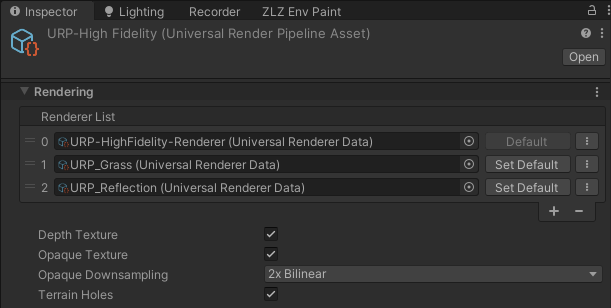

# Underwater

Dive below the surface and the whole world changes. The screen sinks into a murk the colour of that particular pond, the surface overhead becomes a rolling ceiling with a bright window in the middle that looks up into the world above, ringed by a dim mirrored rim, the floor below is dappled with dancing light, and small specks drift up past the camera.

The moment the camera **crosses the surface**, the whole image melts into streaks for about half a second — water sheeting off the lens on the way up, a churning plunge on the way down.

Underwater is **two halves driven by one switch**

- **The surface seen from below** — done inside the water shader itself (Snell's window, under the hood)
- **Full-screen murk + caustics on the floor + floating particles + the crossing melt** — done by the URP Renderer Feature `ZLZ Env Underwater`

## Showcase Underwater


---

## Setup

Three things have to be in place — miss any one of them and nothing shows at all.

1. **On the water material** — turn on the **Underwater** feature (the button grid at the top of the Inspector)
2. **On the water object** — the `ZLZ_EnvWater` component has to be there (water made from the Dashboard or the Base Prefab already has it)
3. **On the URP Renderer** — the Renderer Feature **`ZLZ Env Underwater`** has to be in the list

> **Step 3 is normally not yours to do** — the Dashboard installs the Renderer Feature during Setup. If it ever goes missing (deleted by hand), the Dashboard's **Underwater** section reports `⚠ Removed` with an **Install Underwater Feature** button to put it back.

### What the URP Asset Needs

- **Opaque Texture — required.** With it off, the surface seen from below is a blank ceiling (both the material Inspector and the water object's own Inspector warn you right where the settings are)
- **Depth Texture — required.** The murk and the floor caustics read distance from depth

> **One switch drives both halves.** The material's Underwater toggle turns on the surface underside *and* that pond's full-screen murk — one tick and you are done. Turning it on also flips the surface to **Cull Off** (both faces drawn) for you, because otherwise the surface simply is not there once you are below it.

---

## Settings Live in Two Places — With a Clean Split

| Where | What it controls | Shared? |
|---|---|---|
| **Material > Underwater** | how the **surface looks when seen from below** | every pond using that material |
| **Water object > Underwater Fog** | this pond's **murk** + floor caustics + particles + crossing melt | that one pond only |

The intent: a clear spring and a murky swamp can share one material and still each keep their own sense of how thick the water is.

---

## Water Object > Underwater Fog



This section sits on the **water object's own Inspector**, and only appears once the material has the Underwater feature on.

> **This one does not move to the Dashboard.** Unlike Shore Flow, which the Dashboard owns so the same list is never edited from two panels, the murk genuinely belongs to *this pond*, so it stays next to it — reachable there even when the water sits under a Dashboard. The Dashboard's Underwater section only reports the Renderer Feature's status.

### The Pond's Murk

- **Fog Color** (default a deep blue-green) — the murk the whole scene fades into
- **Visibility (m)** (default `12`) — metres of clear view under water before the fog takes over (~63% fogged at this distance). Low = murky swamp, high = clear spring
- **Depth Darken (m)** (default `8`) — metres below the surface at which the fog colour reaches its darkest. It dims as the camera dives, so depth reads as depth (the floor is about a quarter of the authored colour — it never goes pitch black)
- **Waterline Softness (m)** (default `0.2`) — softness of the on-screen waterline while the camera straddles the surface. Small = a crisp line, large = a soft blend
- **Max Depth (m)** (`2–100`, default `50`) — how deep this water body actually is. Past this depth the camera counts as being **beneath** the water body rather than inside it, and the murk fades back out over 2 metres. Set it comfortably deeper than the real floor

> **Why Max Depth exists.** Whether the camera is in the water is tested against the pond's XZ footprint, and a cave or a room under an elevated pond sits inside that same footprint — a camera down there would be called "30 m under water". This value is the line that says where the water's real volume ends.

### Underwater Detail — What the Camera Sees the Whole Time It Is Submerged

- **Floor Caustics** (`0–4`, default `0.8`) — the dancing light web on the floor. This is a **multiplier** on the material's Caustics Intensity, not a second absolute brightness — `1` = exactly as bright as the water shows it from above. `0` = off
- **Floating Particles** (`0–2`, default `0.35`) — small specks drifting up past the camera: the hanging particulate that sells being *inside* the water. `0` = off

### Surface Crossing

- **Melt Duration (s)** (`0–2`, default `0.6`) — seconds the full-screen melt takes to settle when the camera crosses the surface, in either direction. `0` = off, and the three values below **grey out together**
- **Melt Strength** (`0–2`, default `1`) — how hard the image is dragged and wobbled
- **Streaks** (`4–48`, default `24`) — how many streak columns the melt tears the screen into. Few = broad heavy sheets, many = a fine drizzle
- **Flash** (`0–0.5`, default `0.12`) — brightness of the froth flash right at the crossing instant. `0` = no flash

> **All of this belongs to the pond, not to the material.** Drop a sea and a swimming pool into one scene and each keeps its own murk and its own melt even while they share a material. The values ride Prefabs and Scenes like any other component field.

---

## Material > Underwater



This section only appears once the Underwater feature is on, and comes in three groups.

### Looking Up

Looking up from below, the whole world above compresses into a circle overhead. Outside that circle the surface mirrors the dark water back down at you, and the circle's edge is bent by the ripples the entire time — never a still, clean ring.

- **Sky View Tint** (HDR Color, default white) — multiplied over the world seen up through the surface. Use it to pull that view into the water's own tone
- **Rim Brightness** (`0–1`, default `0.35`) — how bright the dim rim around the circle gets. `0` = a near-black mirror rim, `1` = barely dimmed at all

### Surface Motion

- **Ripple Strength** (`0–3`, default `1`) — how wavy the surface reads from below. It shapes both the billowing edge of the circle and the light-and-dark banding across the ceiling
- **Refraction** (`0–0.15`, default `0.03`) — how far the world above swims about. Its own slider, separate from Ripple Strength, because "how sharply the rim is cut" and "how far the image swims" are two different looks
- **Sheen** (`0–1`, default `0.5`) — the dark and light bands running across the whole ceiling with the slope of the waves. Without it the surface reads as a still sheet from below, because the circle's edge only responds to ripples inside its own narrow band overhead

### Overlays — Borrowed From Other Features

These stay **greyed out** until their parent feature is on.

- **Surface Caustics (uses Caustics)** (`0–5`, default `0.5`) — the dancing light web on the surface itself, seen from below, strongest toward the window where the light comes through — needs the **Caustics** feature (the whole pattern comes from the Caustics section)
- **Foam & Rings (uses Foam Flow bake)** (`0–2`, default `0.8`) — shoreline foam and Ring Wave visible from below — needs **Foam** + **Foam Flow**, and a bake already done
- **Foam Width (m)** (`0.2–5`, default `1.5`) — the horizontal reach of the foam band as seen from below (the crisp inked line is a quarter of it)

> **Why the underside foam needs a bake.** From below, a view ray hits an object on its **silhouette**, not at its true contact with the water (the object's own belly hides that). Depth-driven foam therefore prints in the wrong place and slides with the camera. Reading the baked distance field instead puts the underwater foam **exactly where the player saw it before diving**.
>
> The price of that accuracy: the piece has to be in the baked Shore Flow list ([Water Ring Wave]({{ '/env/water/water-ring-wave/' | relative_url }})).
>
> **And why it has to be wider than the top side.** A submerged belly occludes the surface right around the true contact, so a band as thin as the top-side one hides entirely inside that annulus. The band still **starts at the true contact** — this value only reaches outward, past the occluder.

---

## Works With Other Features

### Caustics
It owns the whole pattern — both the web on the floor while diving and the web on the surface when you look up. Scale / Speed / Sharpness / Colour / Depth Fade all come from the material's Caustics section, so both sides are the same pattern exactly. **Switch the Caustics feature off and the underwater floor goes dark with it.**

The floor caustics project straight down, so they drape over everything submerged rather than the floor alone (rocks, posts and props get dappled too, which is how real caustics behave), and they fade with the depth of water above the spot according to Caustics Depth Fade.

### Foam / Foam Flow / Ring Wave
Shoreline foam, the inked waterline and Ring Wave are all visible from below through **Foam & Rings**, read from the same bake — nothing extra to run, but a bake does have to exist. See [Water Ring Wave]({{ '/env/water/water-ring-wave/' | relative_url }}).

### Waves (Shore Breath)
The level that decides "submerged or not" is the **live, moving** one, not the rest level, so a swell washing over a camera floating at the waterline really does change the view — and the fog's fade-in at the waterline exists precisely to keep that from flickering. See [Water Waves]({{ '/env/water/water-waves/' | relative_url }}).

### Reflection
The surface underside **does not use Planar Reflection**: a mirror image is an above-water concept. The dim rim seen from below comes from light reflecting back down inside the water, computed in the underside itself — so leaving Reflection on costs the underwater view nothing and changes nothing about it.

### Refraction
A different thing. Refraction is seeing through the water **from above**; Underwater has its own Refraction slider for seeing through it **from below**. They are tuned separately and never interfere.

### Water Interaction
Ripples from [Water Interaction]({{ '/env/water/water-interaction/' | relative_url }}) bend the real surface normal, so the surface seen from below moves with them too — the circle's edge, the banding on the ceiling and the image seen up through it all follow, with nothing extra to set up.

### Sunlight
The caustic tint and the floating particles are multiplied by the scene sun's colour and intensity (`RenderSettings.sun`), so everything dies down together at night.

---

## Limits

- **VR is not supported yet** — a fullscreen pass under stereo needs its own path, so while XR is enabled the whole thing switches itself off (the surface still draws, but there is no murk, no particles and no crossing melt)
- **Cameras rendering to a Render Texture are skipped**, as are preview cameras, reflection probes and the planar reflection's own mirror camera — so they can never overwrite the values the visible camera just published
- **The Scene view is allowed through.** Dive the scene camera and you see the murk and the caustics while tuning
- **`ZLZ_EnvWater` is required.** A bare water mesh wearing only the material has no known surface level, so the murk does nothing (the Dashboard adds the component for you when it finds a mesh already wearing a water material)
- **Several water bodies at once are supported.** The camera is inside the body whose surface level is vertically closest — a sea and a rooftop pool coexist in one scene without confusion
