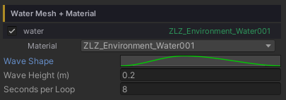
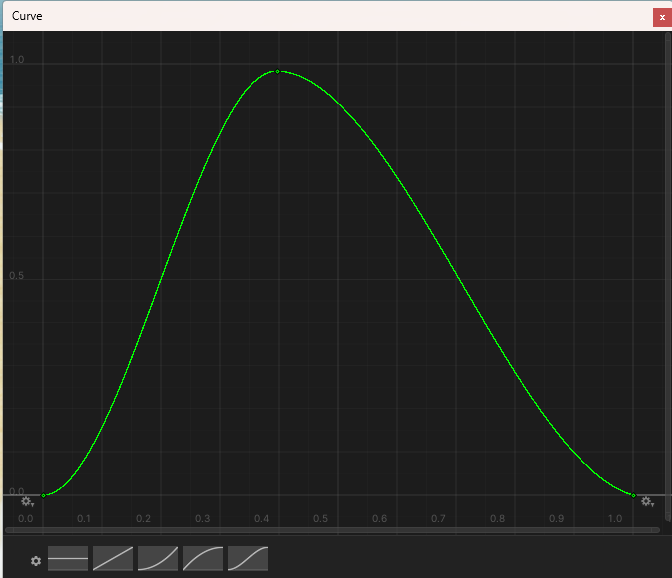

# Water Waves (Shore Breath)

The whole surface **rises and falls as one** to a rhythm you draw yourself, like the sea slowly breathing in and out. As the level climbs the water swallows more of the beach; as it drops the sand comes back. The foam along the shore and the shallow water colours follow the level on their own.

The lift has **no slope** — every point moves by the same amount, so there is no travelling swell. That is deliberate: the reflection, the Fresnel and the surface direction all hold perfectly steady while the level breathes. The small-scale life of the water stays with the scrolling ripple normal map.

## Showcase Water Waves


---

## Setup

Two things go together.

1. **On the water material** — turn on the **Waves** feature (the button grid at the top of the Inspector)
2. **On the water object** — tune the rhythm under **Dashboard > Water** (or straight on the water object's Inspector, if it does not sit under a Dashboard)

> **Why isn't this on the material?** The rhythm is an **AnimationCurve**, and a material cannot hold a curve. The values live on the `ZLZ_EnvWater` component instead — which works out nicely, because every pond gets its own rhythm even when they all share one material.

The material's Waves section has nothing to tune: it only points you to the Dashboard.

---

## Parameters

All three live under **Dashboard > Water**, and only appear once the material has the **Waves** feature on.

- **Wave Shape** (curve) — the rise and fall across one loop. X = 0 to 1 is the progress through the loop; Y = `0` is the lowest level and `1` the highest
- **Wave Height** (metres, default `0.2`) — how far the surface travels above and below its rest level. This is the distance **one way**: the full trough-to-crest range is twice this value
- **Seconds per Loop** (seconds, default `5`) — the time for one full pass of the curve, minimum `0.25`. Higher values give the slow, heavy rhythm of open sea

### Shape the Motion Freely with the Curve

- The curve **loops seamlessly** — the end joins back to the start on its own, so the seam never jumps
- Drag the keyframes however you like: a hard surge with a long retreat, or a still pond that swells once and settles
- Right-click the curve field to **Copy / Paste** it onto another pond. Undo is fully supported

---

## Animates in Edit Mode Too

**The surface rises and falls right in Edit Mode** — no need to press Play. The lift is computed in the shader's vertex stage, which runs on the shader clock, and that keeps ticking in the editor. Compose the scene knowing exactly how far the water reaches at high tide.

[Water Floater]({{ '/env/water/water-floater/' | relative_url }}), however, only runs in Play mode: the C# side has no clock that matches the shader's inside the editor. In Edit Mode it falls back to the rest level, which is the level you want to place props against anyway.

---

## Effects on Other Features

### Foam — Wave Fade
With Waves on, the **Foam** section gains one extra value: **Wave Fade** (`0–1`, default `1`). It does not appear at all while Waves is off.

- `1` = the clustered foam (Foam Noise) **washes out in the trough and comes in full on the crest**, like foam carried up the beach and dragged back
- `0` = the swell is ignored and the foam shows the same at all times

It only touches the **clustered foam**. The **Foam Line** (the crisp inked waterline) stays put throughout, so the shore never loses its edge at low tide.

### Reflection
The reflection is anchored to the **rest level**, not the moving one. The mirror camera renders against a fixed plane, so letting the reflection ride the surface would make the mirrored image slide up and down. This is handled for you — nothing to configure.

### Water Interaction
The **Surface Range** on `ZLZ_Env Water Interactor` automatically allows for Wave Height, so a character never falls out of the gate at the top of the swell.

### Water Floater
Floating objects ride the Shore Breath on their own, because the C# side reads the same curve, the same height and the same clock as the shader — so a boat or a barrel sits exactly on the surface the player sees.

---

## Good to Know

- Every point on the surface **moves together**. There is no travelling swell — for rings spreading out from a character, pair this with the **Interaction** feature
- It costs almost nothing: the work happens in the vertex stage and reads a baked 128×1 pixel curve texture
- Each water body keeps its own curve, height and loop time, even when they share a material
- The values ride Prefabs and Scenes like any other component field
- A material with Waves on but no `ZLZ_EnvWater` component on the object simply stays still (nothing breaks, nothing stutters) — there is no one to hand it the curve
- The waves honour `Time.timeScale`, so slow motion and pausing slow and stop the rhythm with the game
