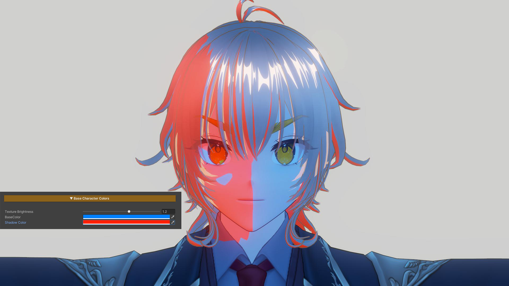
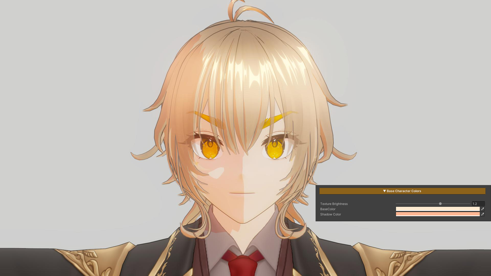

## Base Character Colors

  

    
  

  

    
  

  

  
Base Character Colors Example 1

  
Base Character Colors Example 2

This section is used to adjust the character’s base color tones. It is designed to allow direct visual tuning through the material, without the need to repeatedly modify texture assets.

### Parameters

- **Texture Brightness :** Adjusts the brightness of the main texture
- **Base Color :** Controls the overall color tone of the character
- **Shadow Color :** Adjusts the color and intensity of shadows to control the character’s mood and contrast

---
