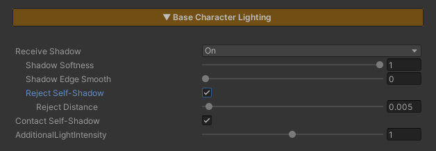
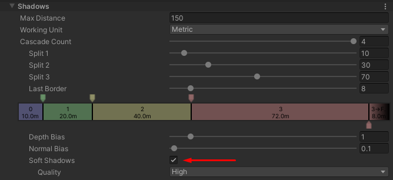

# Base Character Lighting

  

    
  

  

    
  

  

  
Realtime Lighting ReceiveShadow Off

  
Realtime Lighting ReceiveShadow On

  

    
  

  

    
  

  

  
Baked ShadowMask Point Light Off

  
Baked ShadowMask Point Light On

This section controls the character’s lighting and shadow behavior.

### Parameters

- **Receive Shadow** : Enables or disables receiving shadows cast by other objects
  - **When to Enable** = Allow environmental objects to cast shadows onto characters.
  - **When to Disable** = Characters that should not receive projected shadows from other objects.
- **Shadow Softness** : Controls the softness of Receive Shadows.
  - **Lower values** = softer and more blurred shadows
  - **Higher values** = sharper shadows
- **Shadow Edge Smooth** : Controls the softness of Receive Shadow edges.
  - **Lower values** = softer and more blurred shadow edges
  - **Higher values** = sharper shadow edges  
   

> Tip: For maximum effect, make sure Soft Shadows is enabled in the URP Renderer Asset. Without it, shadow softness may appear limited.  

   

- **Reject Self-Shadow** : Enable this option when you want the character to receive shadows from the environment while preventing shadows cast by the character itself.
- **Reject Self-Shadow Distance** : Controls the distance threshold used to remove self-shadowing.
  - Lower values = more self-shadows are preserved
  - Higher values = fewer self-shadows are visible, or they may be completely removed  
 
> Tip: Increase this value until unwanted self-shadows disappear while keeping shadows from other objects intact.  

   

- **Contact Self-Shadow** : Enables contact shadows cast by the character itself, commonly used to render hair shadows on the face.
- **Additional Light Intensity** : Controls the intensity of secondary lights such as Point Lights and Spot Lights; this value does not affect the main Directional Light in the scene
