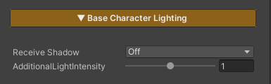

# Base Character Lighting

This section controls the character’s lighting and shadow behavior.

### Parameters

- **Receive Shadow** : Enables or disables receiving shadows cast by other objects *(disabling this option does **not** affect the character’s ability to cast shadows onto surrounding objects)*
- **Additional Light Intensity** : Controls the intensity of secondary lights such as Point Lights and Spot Lights; this value does not affect the main Directional Light in the scene

---
