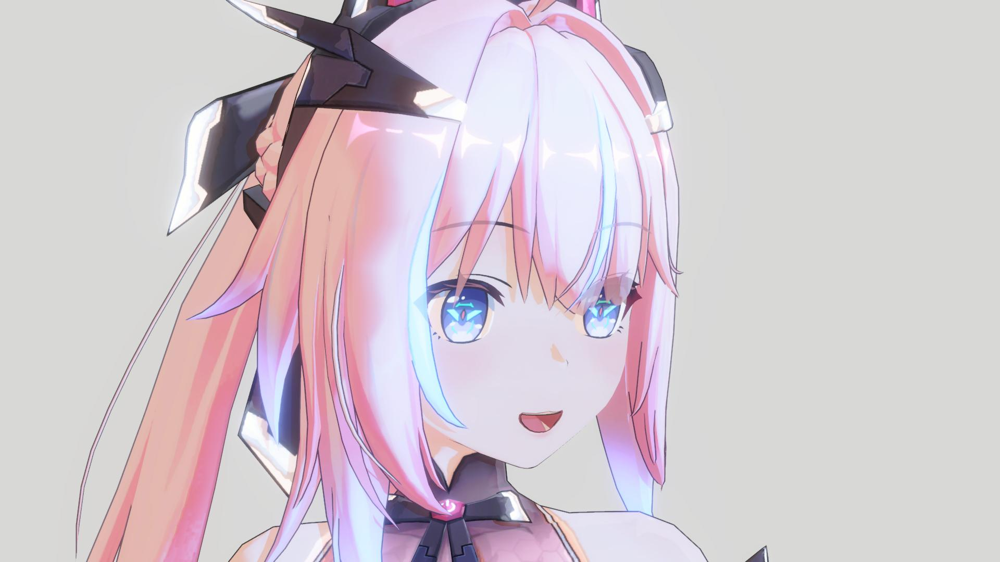
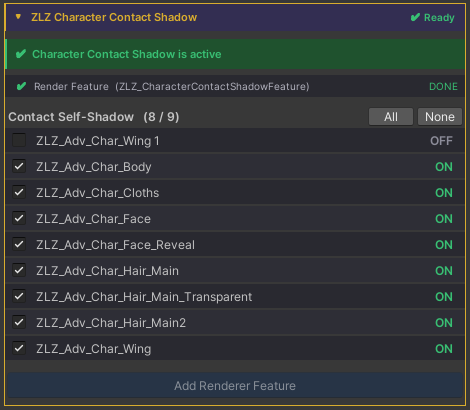
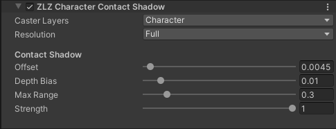

## Character Contact Shadow

A soft, short-range self-shadow for where one part of the character blocks the
light from another — hair onto the face, an arm onto the body. It keeps close-ups
looking grounded, with no real-time shadow map needed.

> When the shadow intensity is increased, this shadow area becomes darker as well.

  

    
  

  

    
  

  

  
ContactShadow Off

  
ContactShadow On

---

## Enable it

The Dashboard does the setup for you:

1. Open **ZLZ Character Dashboard → ZLZ Character Contact Shadow**.
2. Add Render Features.
3. Turn it **On**.

---

## Parameters

> Can be adjusted in the Render Feature settings.

**Look**
- **Strength** — overall darkness of the shadow. *(0–1)*
- **Offset** — how far the shadow reaches toward the light. Higher = longer.
- **Max Range** — only blockers closer than this (metres) cast, so it stays
  short and contact-like (e.g. hair → face).

**Setup & performance**
- **Caster Layers** — set to your character layer(s).
- **Resolution** — how detailed the depth buffer the effect uses is. Higher keeps
  contact edges crisp; lower uses less memory & bandwidth (edges get softer).
    - **Full** — full resolution
    - **Half** — 1/2 width & height (1/4 the pixels)
    - **Quarter** — 1/4 width & height (1/16 the pixels)
    - **Eighth** — 1/8 width & height (1/64 the pixels)
- **Depth Bias** — raise slightly if you see speckles on self-shadowed surfaces.
