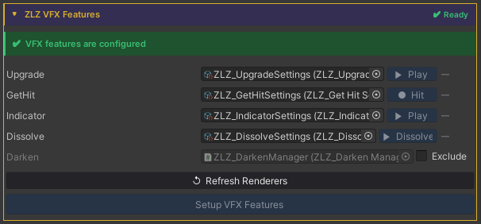
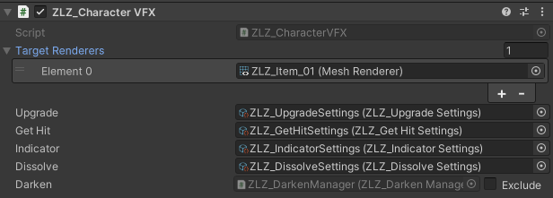
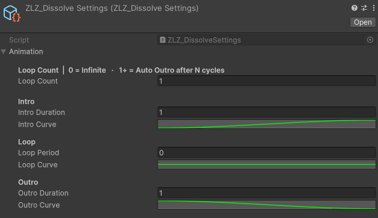
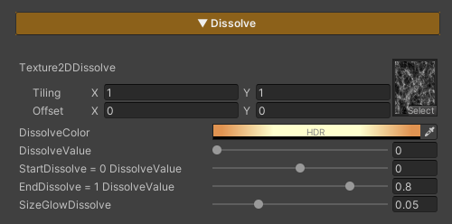

## Dissolve FX Runtine

### Demo Dissolve Runtime


---

### Auto Setup

Done in a single step, just click Setup VFX Features and Refresh Renderers.





Adjust Animation Curve



---

### Usage



Dissolve Character is used to gradually fade a character out of the scene. It is commonly applied when a character dies, warps, or is removed from the scene. The effect allows flexible control over the pattern, color, and timing of the dissolve.

### Parameters

- **Texture2DDissolve :** Uses a noise texture to define the dissolve pattern. *Tiling* can be adjusted to achieve the desired look
- **Dissolve Color :** Adjusts the color of the glow displayed along the dissolve edges
- **Dissolve Value :** Controls the dissolve state *(0 = disabled / 1 = fully dissolved and invisible)*
- **Start Dissolve :** Adjusts the starting point of the dissolve effect. *Lower this value if the effect starts too quickly or appears abrupt; increase it if the effect starts too late*
- **End Dissolve :** Adjusts the ending point of the dissolve effect. *Used to fix cases where the character is still partially visible when Dissolve Value reaches 1, or disappears too quickly*
- **SizeGlowDissolve :** Controls the size of the glow edge displayed during the dissolve

---

### Scripting

Add using ZLZ.AnimeShader; and get a reference to ZLZ_CharacterVFX, then access the Dissolve block:  

```
// Dissolve out (death / despawn) - plays 0 → 1, then holds  
vfx.Dissolve.Dissolve();  
vfx.Dissolve.Restore();    // optional: animate back to visible (1 → 0)  
  
// Spawn in - animates from dissolved (1) to visible (0)  
vfx.Dissolve.SetInstant(1f);    // pre-set fully dissolved  
vfx.Dissolve.Spawn();            // then fade in  
  
// Check state  
bool active = vfx.Dissolve.IsActive();  
```

Example - dissolve on death:  

```
void OnDeath(GameObject character)  
{  
    character.GetComponent<ZLZ_CharacterVFX>()?.Dissolve.Dissolve();  
}
```
  
Example - spawn a character into the scene:  

```
void SpawnCharacter(GameObject character)  
{  
    var vfx = character.GetComponent<ZLZ_CharacterVFX>();  
    if (vfx == null) return;  
    vfx.Dissolve.SetInstant(1f);   // hide instantly  
    vfx.Dissolve.Spawn();           // fade in  
}  
```

Example - teleport (dissolve out → move → spawn in):  

```
IEnumerator Teleport(GameObject character, Vector3 destination)  
{  
    var vfx = character.GetComponent<ZLZ_CharacterVFX>();  
    if (vfx == null) yield break;  
    vfx.Dissolve.Dissolve();  
    yield return new WaitForSeconds(1f);  
    character.transform.position = destination;  
    vfx.Dissolve.Spawn();  
}
```
