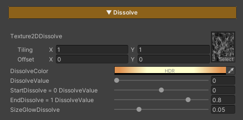

## Dissolve Character

Dissolve Character is used to gradually fade a character out of the scene. It is commonly applied when a character dies, warps, or is removed from the scene. The effect allows flexible control over the pattern, color, and timing of the dissolve.

### Parameters

- **Texture2DDissolve :** Uses a noise texture to define the dissolve pattern. *Tiling* can be adjusted to achieve the desired look
- **Dissolve Color :** Adjusts the color of the glow displayed along the dissolve edges
- **Dissolve Value :** Controls the dissolve state *(0 = disabled / 1 = fully dissolved and invisible)*
- **Start Dissolve :** Adjusts the starting point of the dissolve effect. *Lower this value if the effect starts too quickly or appears abrupt; increase it if the effect starts too late*
- **End Dissolve :** Adjusts the ending point of the dissolve effect. *Used to fix cases where the character is still partially visible when Dissolve Value reaches 1, or disappears too quickly*
- **SizeGlowDissolve :** Controls the size of the glow edge displayed during the dissolve
