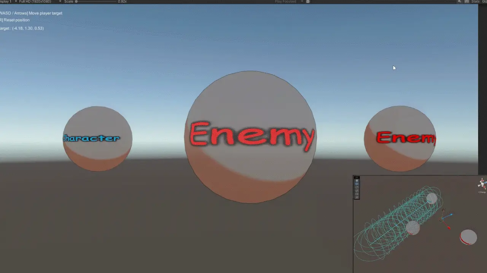
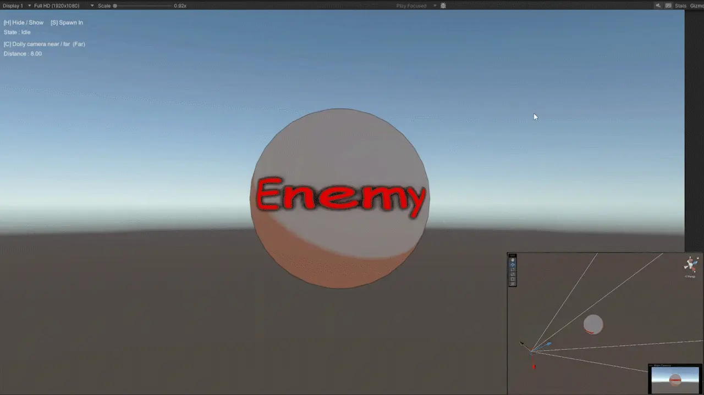
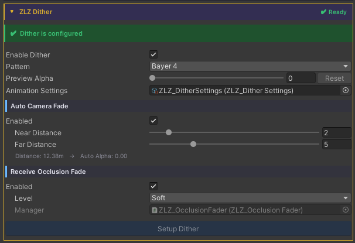
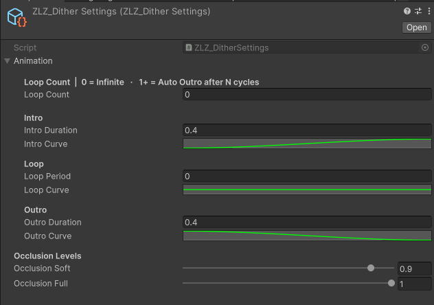

## Dither FX Runtime

### Demo Dither Occlusion Runtime


### Demo Dither Fade Camera Runtime


---

### Auto Setup

Done in a single step, just click Setup ZLZ Dither.



Adjust Animation Curve



---

### Usage

**Dither** is a pixel-stipple transparency effect built on Bayer ordered-dither patterns — a drop-in alternative to Alpha Blend with several advantages:
- Writes depth normally → Outline pass still works
- No draw-order sort → free of transparent sort artifacts
- Cheaper → no texture sample (Bayer is a constant lookup)
- Stylized → reads as intentional, fits Anime / Cartoon art

The feature contains three subsystems that compose freely:
- Hide / Show / Spawn - Manual API to fade a character out or in (stealth, teleport, spawn-in)
- Camera Near Fade - Auto fade when the camera gets close to the character
- Receive Occlusion Fade - Auto fade when the character blocks the camera-to-player line of sight

The final dither alpha is max(manual, occlusion, cameraNear) — all three subsystems can run at the same time without conflict.

### Parameters

Master
- **Enable Dither :** Toggles the whole feature (drives the _DITHER_ON keyword)
- **Animation Settings :** ScriptableObject holding Intro / Outro durations and Occlusion levels

Camera Near Fade (Main Character Only)
- **Enable :** Activates camera-distance auto-fade
- **Near Distance :** Distance at which the character is fully dithered (default 1 / max 20)
- **Far Distance :** Distance at which the dither begins (default 1.25 / max 20) Camera ≥ Far → no dither; ≤ Near → full dither; in between → smooth ramp.

> Camera Near Fade works automatically without requiring any script. Simply install the Character Dashboard on the character that needs Dither support.

Receive Occlusion Fade
- **Enable :** Opts this character in to dither out when it blocks the camera-to-target line
- **Level :** Maximum dither preset

> Soft (0.9 = faint silhouette remains)  
> Full (1.0 = fully clipped)  
> Requires a ZLZ_OcclusionFader in the scene with Target Transform pointing at the player — Setup Dither creates one automatically.  

---

### Scripting

> Camera Near Fade works automatically when using the Shader together with the Character Dashboard.

> Receive Occlusion Fade also works automatically at runtime, but the scene’s ZLZ_OcclusionFader needs a TargetTransform.
> If the player already exists in the scene, just drag it into the Inspector. If the player is spawned at runtime, use the snippet below.

If you want to drive Dither yourself, add using ZLZ.AnimeShader; and get a reference to ZLZ_CharacterVFX, then access the Dither block: 

```
// Manual API — Hide / Show / Spawn
vfx.Dither.Hide();          // Intro 0 → 1 — character fades out
vfx.Dither.Show();          // Outro 1 → 0 — character fades back in
vfx.Dither.Spawn();         // Outro only — spawn-in / teleport-in workflow

// Set immediately (bypass animation)
vfx.Dither.SetInstant(1f);  // fully dithered, no fade

// Check state
bool active = vfx.Dither.IsActive();
``` 
Example - toggle stealth on key press:  

```
void Update()
{
    var vfx = GetComponent<ZLZ_CharacterVFX>();
    if (Input.GetKeyDown(KeyCode.H))
    {
        if (vfx.Dither.IsActive()) vfx.Dither.Show();
        else                       vfx.Dither.Hide();
    }
}
```

Example - spawn an enemy with a fade-in:  

```
void SpawnEnemy(GameObject prefab, Vector3 position)
{
    var enemy = Instantiate(prefab, position, Quaternion.identity);
    var vfx   = enemy.GetComponent<ZLZ_CharacterVFX>();
    if (vfx != null)
    {
        vfx.Dither.SetInstant(1f);   // start fully invisible — no first-frame flicker
        vfx.Dither.Spawn();           // fade in (1 → 0)
    }
}
```

Example - cloak on item pickup:  

```
void OnPickupCloak(GameObject player)
{
    player.GetComponent<ZLZ_CharacterVFX>()?.Dither.Hide();
}

void OnCloakExpires(GameObject player)
{
    player.GetComponent<ZLZ_CharacterVFX>()?.Dither.Show();
}
```
