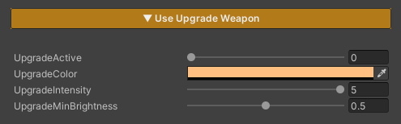

## Dither FX Runtime

### Demo Dither Occlusion Runtime


### Demo Dither Fade Camera Runtime


---

### Auto Setup

Done in a single step, just click Setup VFX Features and Refresh Renderers.


Adjust Animation Curve


---

### Usage



**Upgrade** is a feature used to visualize when a character or weapon is upgraded, providing clear visual feedback to convey progression and change to the player.

### Parameters

- **UpgradeActive :** Enables or disables the effect *(0 = off / 1 = on)*
- **Upgrade Color :** Sets the color of the effect when an upgrade occurs
- **Upgrade Intensity :** Controls the brightness of the effect
    
    *(higher values make the effect more pronounced)*
    
- **Upgrade Min Brightness :** Controls the minimum brightness of the effect
    
    *(higher values make the effect more visible / lower values reduce brightness, allowing the main texture to remain more visible)*

---

### Scripting

Add using ZLZ.AnimeShader; and get a reference to ZLZ_CharacterVFX, then access the Upgrade block:  

```
// Animated (recommended) - plays Intro → Loop → Outro  
vfx.Upgrade.Activate();  
vfx.Upgrade.Deactivate();  
vfx.Upgrade.ToggleUpgrade();  
  
// Check state  
bool active = vfx.Upgrade.IsActive();
``` 

Example - power-up on key press:  

```
void Update()  
{  
    if (Input.GetKeyDown(KeyCode.Q))  
    GetComponent<ZLZ_CharacterVFX>().Upgrade.ToggleUpgrade();  
}
```

Example - buff a player when they pick up a power-up:  

```
void OnPickupPowerUp(GameObject player)  
{  
    player.GetComponent<ZLZ_CharacterVFX>()?.Upgrade.Activate();  
}  
  
void OnPowerUpExpires(GameObject player)  
{  
    player.GetComponent<ZLZ_CharacterVFX>()?.Upgrade.Deactivate();  
}
```
