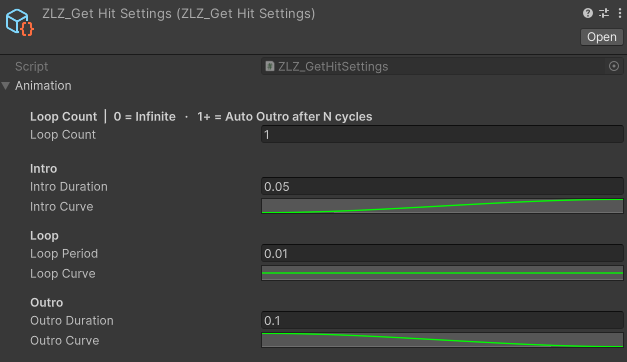
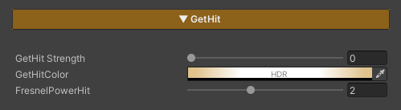

## GetHit FX Runtine

### Demo GetHit Runtime

---

### Auto Setup

Done in a single step, just click Setup VFX Features and Refresh Renderers.

Adjust Animation Curve

---

### Usage

**Get Hit** is a feature used to visualize when a character is attacked, providing immediate visual feedback so players can clearly recognize that a hit has occurred.

### Parameters

- **GetHit Strength :** Controls the Get Hit effect (0 = off / 1 = on)
- **GetHit Color :** Adjusts the color applied to the character when Get Hit is triggered
- **FreshnelPowerHit :** Controls the position and width of the edge effect around the character

*(higher values bring the effect closer to the silhouette edge)*

---

### Scripting

Add using ZLZ.AnimeShader; and get a reference to ZLZ_CharacterVFX, then access the GetHit block:  

> // Trigger the hit flash - plays Intro → Loop → Outro, auto-fades  
> vfx.GetHit.Hit();  
> vfx.GetHit.Deactivate();   // cancel mid-flash (rare)  
>   
> // Check state  
> bool active = vfx.GetHit.IsActive();  
  
Example - flash on taking damage:  
  
> void TakeDamage(int amount)  
> {  
>     health -= amount;  
>     GetComponent<ZLZ_CharacterVFX>().GetHit.Hit();  
> }  
  
Example - flash an enemy when hit by a player attack:  
  
> void DealDamage(GameObject enemy, int amount)  
> {  
>     enemy.GetComponent<ZLZ_CharacterVFX>()?.GetHit.Hit();  
> }  
