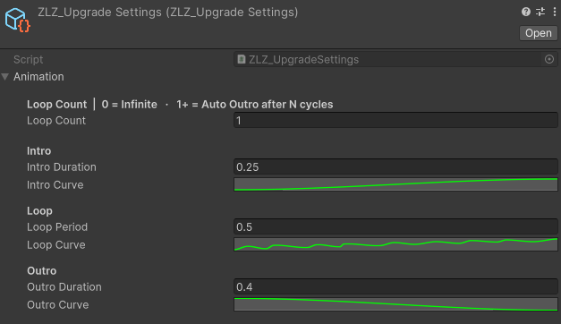

## GetHit

### Demo GetHit Runtime

---

### Auto Setup

Done in a single step, just click Setup VFX Features and Refresh Renderers.

Adjust Animation Curve

---

### Usage

**Get Hit** is a feature used to visualize when a character is attacked, providing immediate visual feedback so players can clearly recognize that a hit has occurred.

### Parameters

- **GetHit Strength :** Controls the Get Hit effect (0 = off / 1 = on)
- **GetHit Color :** Adjusts the color applied to the character when Get Hit is triggered
- **FreshnelPowerHit :** Controls the position and width of the edge effect around the character

*(higher values bring the effect closer to the silhouette edge)*

---

### Scripting

Add using ZLZ.AnimeShader; and get a reference to ZLZ_CharacterVFX, then access the Upgrade block:  

> // Animated (recommended) - plays Intro → Loop → Outro  
> vfx.Upgrade.Activate();  
> vfx.Upgrade.Deactivate();  
> vfx.Upgrade.ToggleUpgrade();  
>   
> // Check state  
> bool active = vfx.Upgrade.IsActive();  

Example - power-up on key press:  

> void Update()  
> {  
>     if (Input.GetKeyDown(KeyCode.Q))  
>         GetComponent<ZLZ_CharacterVFX>().Upgrade.ToggleUpgrade();  
> }  

Example - buff a player when they pick up a power-up:  

> void OnPickupPowerUp(GameObject player)  
> {  
>     player.GetComponent<ZLZ_CharacterVFX>()?.Upgrade.Activate();  
> }  
>   
> void OnPowerUpExpires(GameObject player)  
> {  
>     player.GetComponent<ZLZ_CharacterVFX>()?.Upgrade.Deactivate();  
> }  
