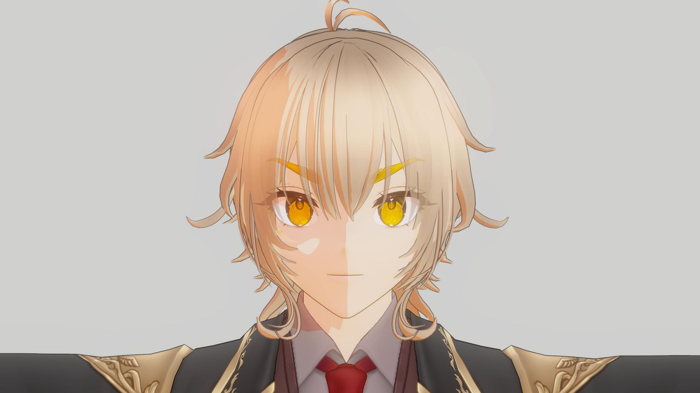
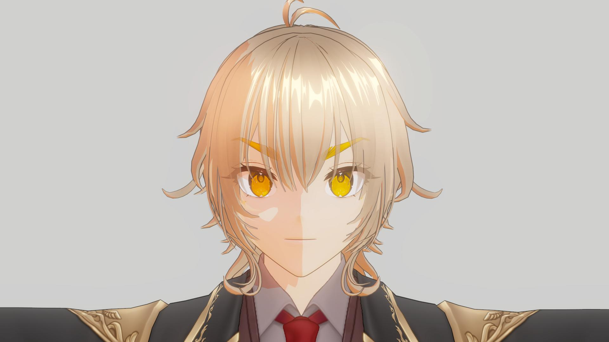
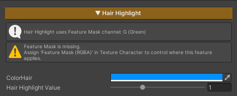

## Hair Highlight

  

    
  

  

    
  

  

  
HairHighlight Off

  
HairHighlight On

Hair Highlight is used to add light highlights to the character’s hair, with the highlight appearing only in areas that receive light.

When the hair is in shadow, the highlight will not be rendered, helping the hair appear more dimensional and improving shape readability.

This feature controls its active area through the Feature Mask (Green Channel).

If no mask is defined in this channel, the Hair Highlight will not be applied.

### Parameters

- **Color Hair :** Adjusts the color of the Hair Highlight
- **Hair Highlight Value :** Controls the brightness of the Hair Highlight
