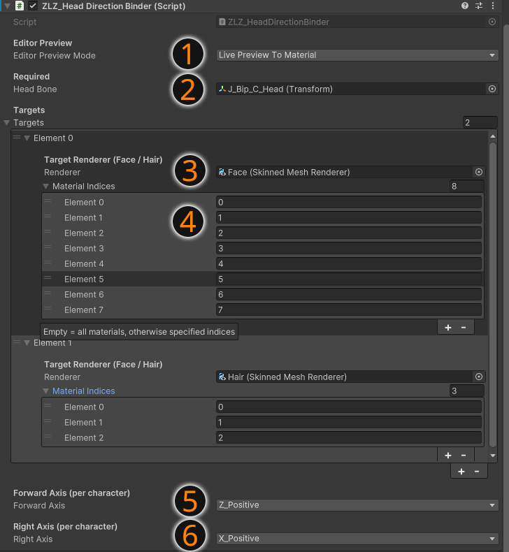

## ZLZ_HeadDirectionBinder (Required Script)

# Overview
ZLZ_HeadDirectionBinder is the core script used to control the direction of the Head Bone and send that data to the shader, ensuring that related features work correctly.

This script is required for all of the following features:
- Face Shadow
- Hair Transparent
- Hair Shadow

# What does it do
The script reads the position and direction of the Head Bone (in World Space) and passes this data to the material, such as:
- Head Center Position
- Head Forward Direction
- Head Right Direction

These values are then used in the shader to calculate lighting behavior and various visual effects on the face and hair.

# Why This Script Is Required

Features like Face Shadow and Hair Effects cannot rely on mesh data alone to determine correct directions,
because each character may have different axis setups and rig configurations.

Using the Head Bone as a reference helps ensure that:
- Facial shadows align correctly with the actual light direction
- Hair Transparent works properly based on the viewing angle
- Hair Shadow is positioned accurately

# If This Script Is Not Used

Features may not work correctly, such as:
- Face Shadow will not function
- Hair Transparent may render incorrectly (eyes and eyebrows may disappear)
- Hair Shadow will not align with the light direction

# Summary

ZLZ_HeadDirectionBinder is the core of the system.
Without this script, features that rely on head direction will not function correctly.

---

## Setup Script ZLZ_Head Direction Binder

# 1. Editor Preview
Used to preview results in the Editor

On: Displays results instantly in the Editor (recommended during setup)
Off: The script runs only at Runtime to reduce material changes in Version Control

💡 Recommended: Turn this off after setup is complete

# 2. Head Bone
Assign the character’s Head Bone

The Head Bone is used as the main reference for direction calculations,
ensuring features like Face Shadow and Hair Effects work correctly

# 3. Element → Renderer
Assign the Mesh Renderer that will receive data from the script

💡 Recommended:
- Face Mesh
- Hair Mesh

The script will send data to the materials used by this renderer

# 4. Element → Material Indices
Specify which Material Indices the script should send data to

You can find the indices in the Renderer (material order in the mesh)

💡 Recommended:
- Face material
- Hair material

# 5. Forward Axis
Define the axis of the Head Bone that points forward from the face

Examples:
- Z+
- -Z
- X+
⚠️ Must be set correctly, otherwise Face Shadow may appear inverted

# 6. Right Axis
Define the axis of the Head Bone that points to the character’s right side

Examples:
- X+
- -X
- Z+
⚠️ Used together with Forward Axis to ensure correct direction calculations

# Important Note

This script is a critical part of the system and is required for the following features:
- Face Shadow
- Hair Transparent
- Hair Shadow

If configured incorrectly, these features may not work as expected
