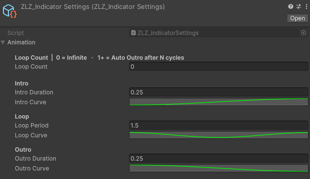
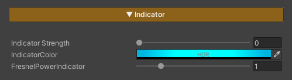

## Indicator FX Runtine

### Demo Indicator Runtime


---

### Auto Setup

Done in a single step, just click Setup VFX Features and Refresh Renderers.


Adjust Animation Curve



---

### Usage



**Indicator / Target Select** is a feature used to highlight characters that are currently selected as targets, such as characters being locked onto, selected for attack, or about to be affected by certain skills.

It helps players immediately recognize **“which character is about to be affected and how.”**

### Parameters

- **Indicator Strength :** Controls the Indicator / Target Select effect *(0 = off / 1 = on)*
- **Indicator Color :** Adjusts the color applied to the character affected by Indicator / Target Select
- **FreshnelPowerIndicator :** Controls the position and width of the edge effect around the character *(higher values bring the effect closer to the silhouette edge)*

---

### Scripting

Add using ZLZ.AnimeShader; and get a reference to ZLZ_CharacterVFX, then access the Indicator block:  

```
// Animated (recommended) - plays Intro → Loop → Outro  
vfx.Indicator.Activate();  
vfx.Indicator.Deactivate();  
vfx.Indicator.ToggleIndicator();  
  
// Check state  
bool active = vfx.Indicator.IsActive();  
```
 
Example - toggle aim mode on key press:  

```
void Update()  
{  
    if (Input.GetKeyDown(KeyCode.Q))  
    GetComponent<ZLZ_CharacterVFX>().Indicator.ToggleIndicator();  
}  
```

Example - highlight a target on lock-on:  

```
void LockOn(GameObject target)  
{
    target.GetComponent<ZLZ_CharacterVFX>()?.Indicator.Activate();  
}  
  
void Unlock(GameObject previous)  
{  
    previous.GetComponent<ZLZ_CharacterVFX>()?.Indicator.Deactivate();  
}
```
