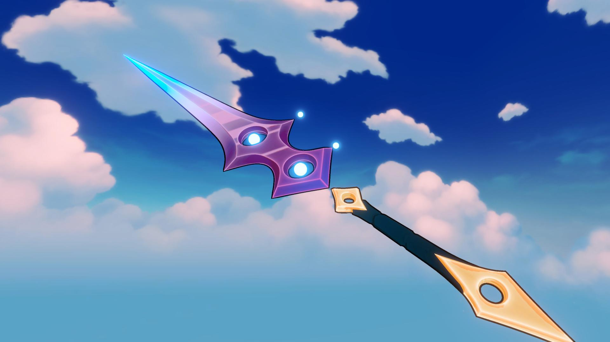
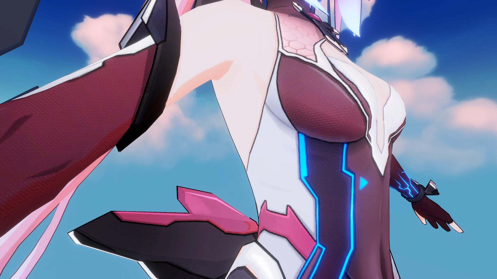
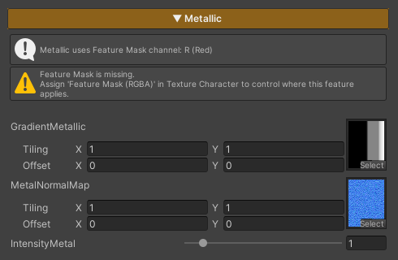

## Metallic

  

    
  

  

    
  

  

  
Metallic Off

  
Metallic On

Metallic is used for character parts made of metal materials, adding shine and surface depth.

If no **Feature Mask (Red Channel)** is assigned to define the active area, this feature will not be applied.

### Parameters

- **Gradient Metallic :** Uses the `T_Gradient_Metallic` texture to control the metallic reflection behavior. Adjusting Tiling and Offset is not recommended, in order to achieve results as intended by the design
- **MetalNormalMap :** Uses a normal texture to add surface detail to metallic areas. The default texture is `T_Normal`
    - **Lower *Tiling* values** (e.g. 0.05 × 0.05) produce a more toon-style look
    - **Higher *Tiling* values** (e.g. 30 × 30) produce a more semi-realistic look
- **Intensity Metal :** Controls the brightness of the metallic areas

---
