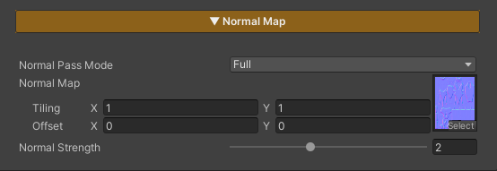

## Normal Map

  

    
  

  

    
  

  

  
Base Character Colors Example 1

  
Base Character Colors Example 2

This section is used to control the character’s Normal Map settings, adding more surface detail and improving the appearance of lighting and shadows.

### Parameters

- **Normal Pass Mode :** Two modes are available
1. Forward Only : Affects lighting only, making light and shadows look more natural and detailed
2. Full : Affects both lighting and surface depth, making the surface look more detailed and have more depth
- **Normal Strength :** Controls the intensity of the Normal Map and how strongly it affects the surface details

---
