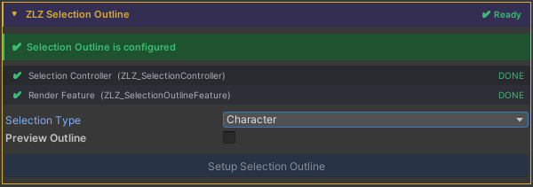
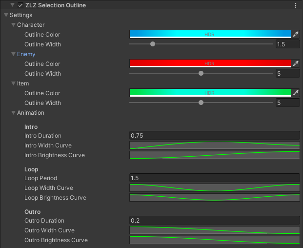

## Selection Outline

Give your players instant visual feedback - highlight characters, enemies, or items
with an animated outline that pulses and fades with style.

---

### Overview

Selection Outline is a URP Renderer Feature that draws an animated silhouette outline
around any GameObject at runtime. Designed for combat systems, lock-on targeting,
and interactive objects, works on both PC and Mobile.

- 3 built-in types : Character, Enemy, Item (each with its own color and HDR support)
- Adjustable outline color and width per type
- Smooth animation : Intro fade-in → Loop pulse → Outro fade-out
- One-click setup via Character Dashboard
- API-driven : call Select() and Deselect() from any script
- Supports Orthographic cameras

---

### Setup

1.Open the Character Dashboard in the Inspector → choose a Selection Type
(Character, Enemy, or Item)

2.Open Universal Renderer Data and find ZLZ Selection Outline → adjust color,
width, and Animation Curves here

---

### Scripting

Add `using ZLZ.AnimeShader;` and get a reference to `ZLZ_SelectionController`,
then call:

> // Animated (recommended) - plays Intro → Loop → Outro  
> ctrl.Select();  
> ctrl.Deselect();  
> ctrl.ToggleSelection();  
>   
> // Check state  
> bool active = ctrl.IsSelected();  

Example - highlight on click:  
> void OnMouseDown()  
> {  
>     GetComponent\<ZLZ_SelectionController\>().ToggleSelection();  
> }

Example - highlight on lock-on:

> void LockOn(GameObject target)  
> {  
>     target.GetComponent\<ZLZ_SelectionController\>()?.Select();  
> }  
>   
> void Unlock(GameObject previous)  
> {  
>     previous.GetComponent\<ZLZ_SelectionController\>()?.Deselect();  
> }
